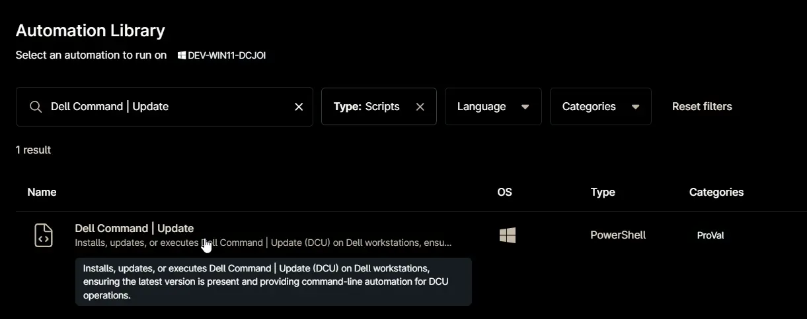
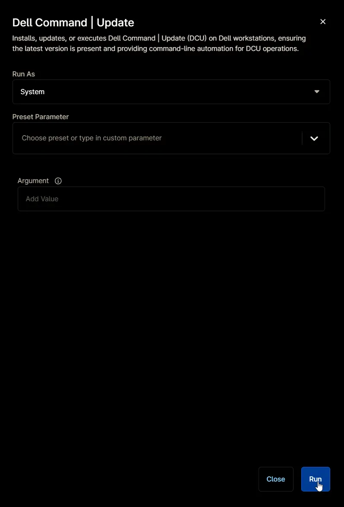
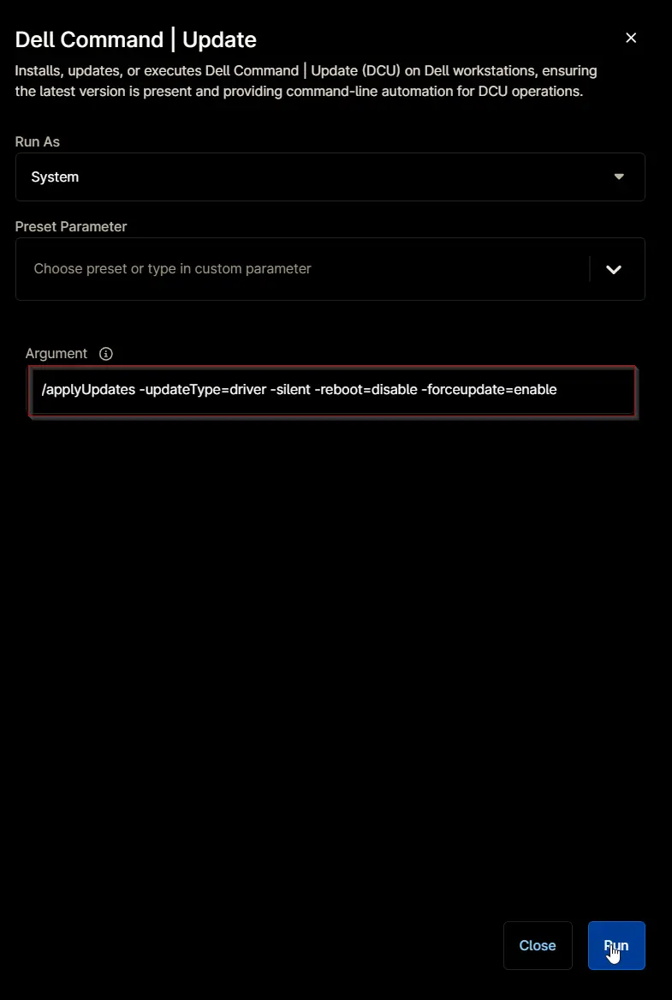
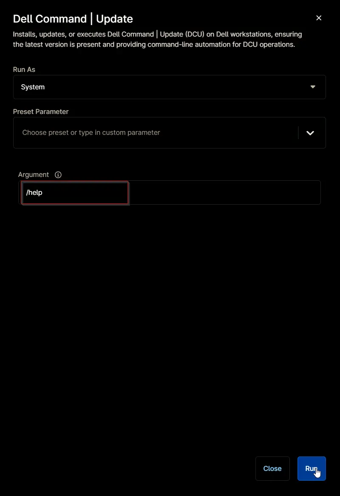
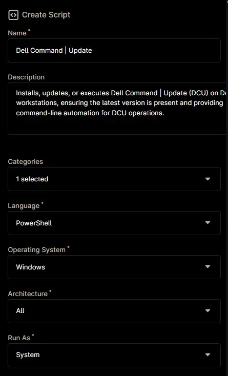
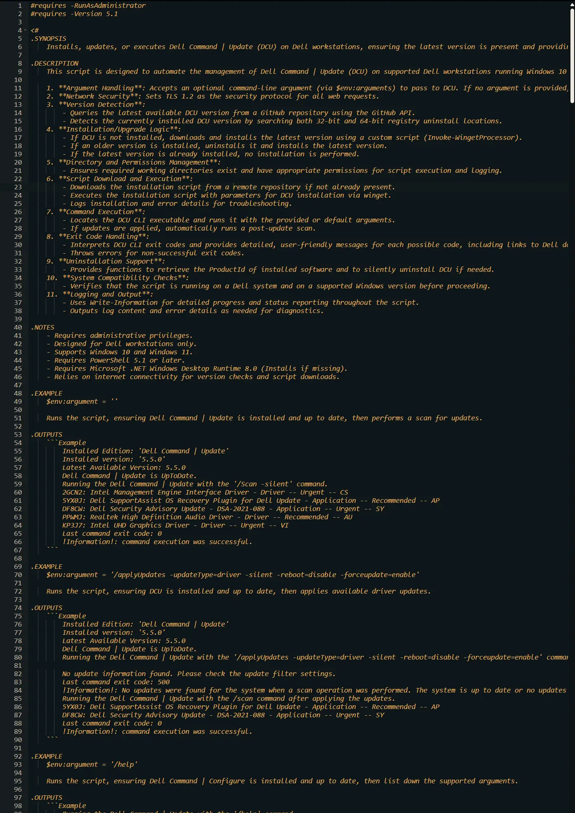
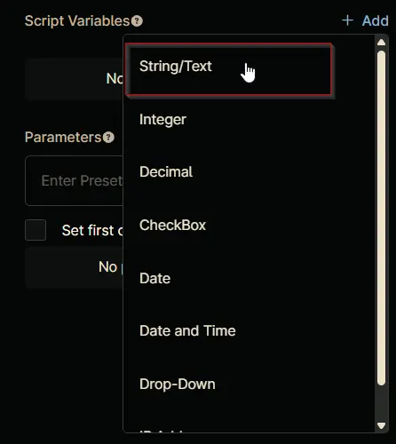
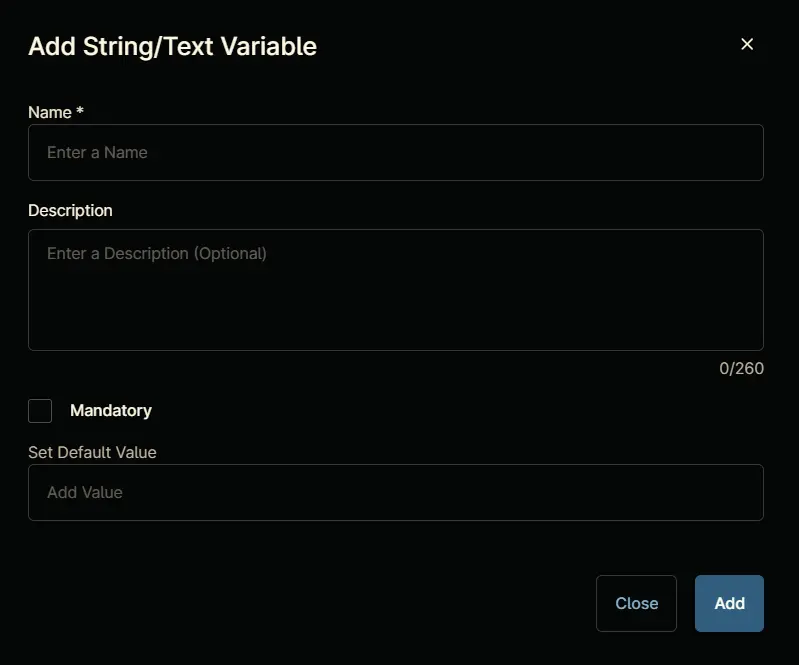
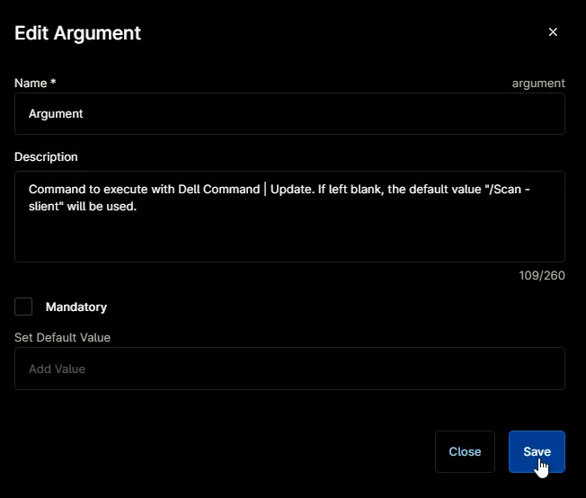
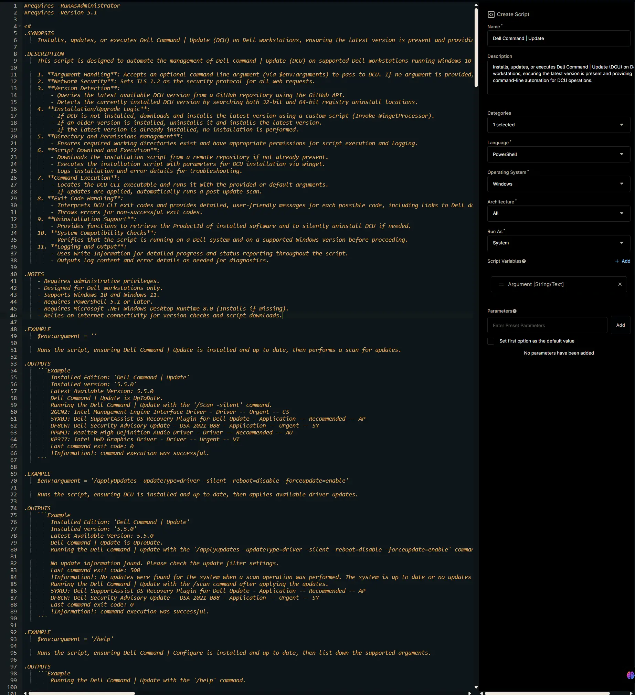

## Overview

Installs, updates, or executes Dell Command | Update (DCU) on Dell workstations, ensuring the latest version is present and providing command-line automation for DCU operations.

**Supported commands/arguments reference:**  
[Supported commands/arguments reference](https://www.dell.com/support/manuals/en-us/command-update/dcu_rg/dell-command-%7C-update-cli-commands?guid=guid-92619086-5f7c-4a05-bce2-0d560c15e8ed&lang=en-us)

## Sample Run

`Play Button` > `Run Automation` > `Script`  


Search and select `Dell Command | Update`


---

### Example 1

**Runs the script, ensuring Dell Command | Update is installed and up to date, then performs a scan for updates.**

- **Run As:** `System`  
- **Preset Parameter:**  `<Leave it blank>`  
- **Argument:**  `<Leave it blank>`



**Sample Output:**

```PlainText
Installed Edition: 'Dell Command | Update'
Installed version: '5.5.0'
Latest Available Version: 5.5.0
Dell Command | Update is UpToDate.
Running the Dell Command | Update with the '/Scan -silent' command.
2GCN2: Intel Management Engine Interface Driver - Driver -- Urgent -- CS
5YX0J: Dell SupportAssist OS Recovery Plugin for Dell Update - Application -- Recommended -- AP
DF8CW: Dell Security Advisory Update - DSA-2021-088 - Application -- Urgent -- SY
PPWMJ: Realtek High Definition Audio Driver - Driver -- Recommended -- AU
KP3J7: Intel UHD Graphics Driver - Driver -- Urgent -- VI
Last command exit code: 0
!Information!: command execution was successful.
```

---

### Example 2

**Runs the script, ensuring DCU is installed and up to date, then applies available driver updates.**

- **Run As:** `System`  
- **Preset Parameter:**  `<Leave it blank>`  
- **Argument:**  `/applyUpdates -updateType=driver -silent -reboot=disable -forceupdate=enable`



**Sample Output:**

```PlainText
Installed Edition: 'Dell Command | Update'
Installed version: '5.5.0'
Latest Available Version: 5.5.0
Dell Command | Update is UpToDate.
Running the Dell Command | Update with the '/applyUpdates -updateType=driver -silent -reboot=disable -forceupdate=enable' command.

No update information found. Please check the update filter settings.
Last command exit code: 500
!Information!: No updates were found for the system when a scan operation was performed. The system is up to date or no updates were found for the provided filters. Modify the filters and rerun the commands.
Running the Dell Command | Update with the /scan command after applying the updates.
5YX0J: Dell SupportAssist OS Recovery Plugin for Dell Update - Application -- Recommended -- AP
DF8CW: Dell Security Advisory Update - DSA-2021-088 - Application -- Urgent -- SY
Last command exit code: 0
!Information!: command execution was successful.
```

---

### Example 3

**Runs the script, ensuring Dell Command | Configure is installed and up to date, then list down the supported arguments.**

- **Run As:** `System`  
- **Preset Parameter:**  `<Leave it blank>`  
- **Argument:**  `/help`



**Sample Output:**

```PlainText
Running the Dell Command | Update with the '/help' command.

Dell Command | Update v5.5.0
Usage:

dcu-cli.exe /<command> [-<option1>=<value1>] [-<option2>=<value2>]...

Commands:
    /help - Displays usage information.
    /? - Displays usage information.

    /scan - Performs a system scan to determine the updates for the current system configuration.
    This command supports the following options: -catalogLocation, -defaultSourceLocation, -updateSeverity,
        -updateType, -updateDeviceCategory, -report, -silent, -outputLog

    /applyUpdates - Applies all updates for the current system configuration.
    This command supports the following options: -catalogLocation, -defaultSourceLocation, -updateSeverity,
        -updateType, -updateDeviceCategory, -reboot, -silent, -outputLog, -autoSuspendBitLocker, -encryptionKey,
        -encryptedPassword, -encryptedPasswordFile, -forceUpdate

    /driverInstall - Installs all base drivers for the current system configuration on a freshly installed
        operating system.
    This command supports the following options: -driverLibraryLocation, -reboot, -silent, -outputLog

    /configure - Allows configuration of Dell Command | Update based on settings provided in the supported
        options.
    This command supports the following options: -importSettings, -exportSettings, -lockSettings,
        -biosPassword,-secureBiosPassword, -advancedDriverRestore, -driverLibraryLocation, -catalogLocation,
        -defaultSourceLocation, -allowXML, -updatesNotification, -downloadLocation, -updateSeverity, -updateType,
        -updateDeviceCategory, -customProxy, -proxyAuthentication, -proxyHost, -proxyPort,
        -proxyFallbackToDirectConnection, -proxyUsername, -proxyPassword,-secureProxyPassword, -silent, -outputLog,
        -scheduleAction, -scheduleDaily, -scheduleWeekly, -scheduleMonthly, -scheduleManual, -scheduleAuto,
        -systemRestartDeferral -deferralRestartInterval -deferralRestartCount, -installationDeferral
        -deferralInstallInterval -deferralInstallCount, -restoreDefaults, -autoSuspendBitLocker, -maxRetry,
        -delayDays, -forcerestart, -ringdeployment

    /generateEncryptedPassword - Generates an encrypted BIOS password.
    This command supports the following options: -encryptionKey,-secureEncryptionKey, -password,-securePassword,
        -outputPath

    /customnotification - Allows configuration of custom notifications
    This command supports the following options: -heading, -body , -timestamp. NOTE: For customnotification, all
        the three options -heading, -body, -timestamp are mandatory

    /version - Displays the version.


The following options are available to use with the commands:

    -help - Displays usage information.
    -? - Displays usage information.

    -report - Allows the user to create an XML report of the applicable updates.
    Expected value(s): <folder path>
    Ex: > dcu-cli /scan -report=C:\Temp\

    -silent - Allows the user to hide status and progress information on the console.
    Expected value(s): None
    Ex: > dcu-cli /scan -silent

    -outputLog - Allows the user to log the status and progress information of a command execution in a given log
        path.
    Expected value(s): <file path> with .log extension
    Ex: > dcu-cli /scan -outputLog=C:\Temp\scanOutput.log

    -reboot - Reboot the system automatically (if required).
    Expected value(s): <enable|disable>
    Ex:> dcu-cli /applyUpdates -reboot=enable

    -forceUpdate - Set the forceUpdate option to override pause
    Expected value(s): enable/disable
    Ex: > dcu-cli /applyupdates -forceUpdate=enable/disable

    -catalogLocation - Allows the user to set the repository/catalog file location. If used with /applyUpdates,
        only one path may be specified.
    Expected value(s): <file path(s)>
    Ex: > dcu-cli /configure -catalogLocation=C:\catalog.xml;C:\catalog2.cab
    Ex: > dcu-cli /applyUpdates -catalogLocation=C:\catalog.xml;C:\catalog2.cab

    -driverLibraryLocation - Allows the user to set the system driver catalog location. If this option is not
        specified, the driver library shall be downloaded from Dell.com. NOTE: Requires functional networking
        components.
    Expected value(s): <file path>
    Ex: > dcu-cli /configure -driverLibraryLocation=C:\Temp\DriverLibrary.cab

    -advancedDriverRestore - Allows the user to enable or disable the Advanced Driver Restore feature in the UI.
    Expected value(s): <enable|disable>
    Ex: > dcu-cli /configure -advancedDriverRestore=disable

    -updateSeverity - Allows the user to filter updates based on severity.
    Expected value(s): (security,critical,recommended,optional)
    Ex: > dcu-cli /configure -updateSeverity=recommended,optional

    -updateType - Allows the user to filter updates based on update type.
    Expected value(s): (bios,firmware,driver,application,utility,others)
    Ex: > dcu-cli /configure -updateType=bios

    -updateDeviceCategory - Allows the user to filter updates based on device type.
    Expected value(s): (audio,video,network,storage,input,chipset,others)
    Ex: > dcu-cli /configure -updateDeviceCategory=network,storage

    -importSettings - Allows the user to import application settings file. NOTE: This option cannot be used with
        any other options except -outputLog and -silent.
    Expected value(s): <file path>
    Ex: > dcu-cli /configure -importSettings=C:\Temp\Settings.xml

    -lockSettings - Allows the user to lock all the settings in the UI. NOTE: This option cannot be used with any
        other options except -outputLog and -silent.
    Expected value(s): <enable|disable>
    Ex: > dcu-cli /configure -lockSettings=enable

    -exportSettings - Allows the user to export application settings to the specified folder path. NOTE: This
        option cannot be used with any other options except -outputLog and -silent.
    Expected value(s): <folder path>
    Ex: > dcu-cli /configure -exportSettings=C:\Temp\

    -biosPassword - Allows the user to provide the unencrypted BIOS password. The password will be cleared if a
        password is not provided or "" is supplied. NOTE: The value needs to be enclosed in double quotes.
    Expected value(s): <password|"">
    Ex: > dcu-cli /configure -biosPassword="Test1234"

    -secureBiosPassword - Allows the user to provide the secured BIOS password which is masked when entered on
        the input prompt. The password will be cleared if a password is not provided or "" is supplied. NOTE: The
        value needs to be enclosed in double quotes.
    Expected value(s): <password|"">
    Ex: > dcu-cli /configure -secureBiosPassword
    Enter the password:"Test1234"- Displayed as ********

    -downloadLocation - Allows the user to specify the location to override the default application download
        path.
    Expected value(s): <folder path>
    Ex: > dcu-cli /configure -downloadLocation=C:\Temp\AppDownload

    -customProxy - Allows the user to enable or disable the use of custom proxy. NOTE: Setting this option to
        enable will cause validation of all custom proxy settings.
    Expected value(s): <enable|disable>
    Ex: > dcu-cli /configure -customProxy=enable

    -proxyHost - Allows the user to specify the proxy host. Giving an empty string as the value to this option
        clears proxy host. NOTE: Changing this option will cause validation of all custom proxy settings.
    Expected value(s): <FQDN|IP address|"">
    Ex: > dcu-cli /configure -proxyHost=proxy.com
    Ex: > dcu-cli /configure -proxyHost=""

    -proxyPort - Allows the user to specify the proxy port. Giving an empty string as the value to this option
        clears proxy port. NOTE: Changing this option will cause validation of all custom proxy settings.
    Expected value(s): <port|"">
    Ex: > dcu-cli /configure -proxyPort=8080
    Ex: > dcu-cli /configure -proxyPort=""

    -proxyFallbackToDirectConnection - Allows the user to enable or disable the use of internet connection if
        proxy fails. NOTE: Changing this option will cause validation of all custom proxy settings.
    Expected value(s): <enable|disable>
    Ex: > dcu-cli /configure -proxyFallbackToDirectConnection=enable

    -proxyAuthentication - Allows the user to enable or disable the use of proxy authentication. NOTE: Changing
        this option will cause validation of all custom proxy settings.
    Expected value(s): <enable|disable>
    Ex: > dcu-cli /configure -proxyAuthentication=enable

    -proxyUsername - Allows the user to specify the proxy username. Giving an empty string as the value to this
        option clears proxy username. NOTE: Changing this option will cause validation of all custom proxy settings.
    Expected value(s): <username|"">
    Ex: > dcu-cli /configure -proxyUsername="john doe"
    Ex: > dcu-cli /configure -proxyUsername=""

    -proxyPassword - Allows the user to specify the proxy password. Giving an empty string as the value to this
        option clears proxy password. NOTE: Changing this option will cause validation of all custom proxy settings.
        The value needs to be enclosed in double quotes
    Expected value(s): <password|"">
    Ex: > dcu-cli /configure -proxyPassword="my password"
    Ex: > dcu-cli /configure -proxyPassword=""

    -secureProxyPassword - Allows the user to specify the proxy password. Giving an empty string as the value to
        this option clears proxy password. NOTE: Changing this option will cause validation of all custom proxy
        settings. The value needs to be enclosed in double quotes
    Expected value(s): <password|"">
    Ex: > dcu-cli /configure -secureProxyPassword
    Ex: > Enter the password:"my password"- Displayed as ********
    Ex: > Enter the password:""- Displayed as *

    -scheduleAction - Allows the user to specify the action to perform when updates are found.
    Expected value(s): <NotifyAvailableUpdates | DownloadAndNotify | DownloadInstallAndNotify>
    Ex: > dcu-cli /configure -scheduleAction=NotifyAvailableUpdates

    -scheduleDaily - Allows the user to specify the time on which to schedule an update. NOTE: This option cannot
        be used with -scheduleManual, -scheduleAuto, -scheduleMonthly, -scheduleWeekly.
    Expected value(s): Time[00:00(24 hr format, 15 mins increment)]
    Ex: > dcu-cli /configure -scheduleDaily=23:45

    -scheduleWeekly - Allows the user to specify the day of the week and time on which to schedule an update.
        NOTE: This option cannot be used with -scheduleManual, -scheduleAuto, -scheduleMonthly, -scheduleDaily.
    Expected value(s): Day [< Sun | Mon | Tue | Wed | Thu | Fri | Sat >],Time[00:00(24 hr format, 15 mins
        increment)]
    Ex: > dcu-cli /configure -scheduleWeekly=Mon,23:45

    -scheduleMonthly - Allows the user to specify schedule values in two format to schedule an update. First
        format allows user to specify the day of the month and time. Second format allows user to specify the week,
        day and time of month. If the scheduled day is greater than the last day of the month, the update will be
        performed on the last day of that month. NOTE: This option cannot be used with -scheduleManual,
        -scheduleAuto, -scheduleWeekly, -scheduleDaily
    Expected value(s) for first format: Date of month [1 - 31],Time[00:00(24 hr format, 15 mins increment)]
    Expected value(s) for second format: Week [< first | second | third | fourth | last >],Day [< Sun | Mon | Tue
        | Wed | Thu | Fri | Sat >],Time[00:00(24 hr format, 15 mins increment)]
    Ex: > dcu-cli /configure -scheduleMonthly=28,00:45
    Ex: > dcu-cli /configure -scheduleMonthly=second,Fri,00:45

    -scheduleManual - Allows the user to disable the automatic schedule and enable only manual updates. NOTE:
        This option cannot be used with -scheduleAuto, -scheduleWeekly, -scheduleMonthly, -scheduleDaily
    Expected value(s): None
    Ex: > dcu-cli /configure -scheduleManual

    -scheduleAuto - Allows the user to enable the default automatic update schedule. NOTE: Automatic updates
        execute every 3 days. Also, this option cannot be used with -scheduleManual, -scheduleWeekly,
        -scheduleMonthly, -scheduleDaily
    Expected value(s): None
    Ex: > dcu-cli /configure -scheduleAuto

    -restoreDefaults - Allows the user to restore default settings.
    Expected value(s): None
    Ex: > dcu-cli /configure -restoreDefaults

    -autoSuspendBitLocker - Allows the user to enable or disable the automatic suspension of BitLocker, when
        applying BIOS updates.
    Expected value(s): <enable|disable>
    Ex: > dcu-cli /configure -autoSuspendBitLocker=enable

    -defaultSourceLocation - Enable or Disable the default source location (dell.com).
    Expected value(s): <enable|disable>
    Ex: > dcu-cli /configure -defaultSourceLocation=enable

    -allowXML - Allows the user to Enable or Disable XML Catalog file.
    Expected value(s): <enable|disable>
    Ex: > dcu-cli /configure -allowXML=enable
    Ex: > dcu-cli /configure -allowXML=enable -catalogLocation=C:\catalog.xml
    Ex: > dcu-cli /configure -catalogLocation=C:\catalog.xml -allowXML=enable

    -updatesNotification - Enable or Disable toast Notifications
    Expected value(s): <enable|disable>
    Ex: > dcu-cli /configure -updatesNotification=enable

    -systemRestartDeferral - Allows the user to Enable or Disable system restart deferral options. Note:
        -deferralRestartInterval and -deferralRestartCount is required to be specified along with Enable option.
    Expected value(s): <enable|disable>
    -deferralRestartInterval -Allows the user to set the deferral restart interval
    Expected value(s):  <1-99>
    -deferralRestartCount -Allows the user to set the deferral restart count
    Expected value(s):  <1-9>
    Ex: > dcu-cli /configure -systemRestartDeferral=enable -deferralRestartInterval=1 -deferralRestartCount=2
    Ex: > dcu-cli /configure -systemRestartDeferral=disable

    -installationDeferral - Allows the user to Enable or Disable deferral install options. Note:
        -deferralInstallInterval and -deferralInstallCount is required to be specified along with Enable option.
    Expected value(s): <enable|disable>
    -deferralInstallInterval -Allows the user to set the deferral install interval
    Expected value(s):  <1-99>
    -deferralInstallCount -Allows the user to set the deferral install count
    Expected value(s):  <1-9>
    Ex: > dcu-cli.exe /configure -installationDeferral=enable -deferralInstallInterval=1 -deferralInstallCount=2
    Ex: > dcu-cli.exe /configure -installationDeferral=disable

    -maxRetry - Set the maximum retry attempts to install failed updates upon reboot. By default, the value is
        set to 2.
    Expected value(s): <1|2|3>
    Ex: > dcu-cli /configure -maxRetry=2

    -delayDays - Allow users to set the delay for updates.. By default, the value is set to 0.
    Expected value(s): 0 to 45
    Ex: > dcu-cli /configure -delayDays=2

    -forceRestart - Allows the user to Enable or Disable Force Restart during scheduled operation.
    Expected value(s): <enable|disable>
    Ex: > dcu-cli /configure -forceRestart=enable

    -ringdeployment - Allows the user to enable or disable the Ring deployment.
    Expected value(s): <enable|disable>
    Ex: > dcu-cli /configure -ringdeployment=enable

    -encryptedPassword - Allows the user to pass the encrypted password in-line along with the encryption key
        that was used to generate it. NOTE: -encryptionKey is required to be specified along with this option. Also,
        this value needs to be enclosed in double quotes.
    Expected value(s): <encrypted password>
    Ex: > dcu-cli /applyUpdates -encryptedPassword="myEncryptedPassword" -encryptionKey="myEncryptionKey"

    -secureEncryptedPassword - Allows the user to pass the encrypted password on input prompt along with the
        secure encryption key that was used to generate it. NOTE: -securedEncryptionKey is required to be specified
        along with this option. Also, this value needs to be enclosed in double quotes.
    Expected value(s): <secure encrypted password>
    Ex: > dcu-cli /applyUpdates -secureEncryptedPassword -secureEncryptionKey
    Ex: > Enter the password:"myEncryptedPassword"- Displayed as *******************
    Ex: > Enter the encryptionkey:"myEncryptionKey"- Displayed as ***************

    -encryptionKey - Allows the user to specify the encryption key used to encrypt the password. NOTE: The key
        provided must be at least six nonwhitespace characters and include an uppercase letter, a lowercase letter,
        and a digit. Also, this value needs to be enclosed in double quotes.
    Expected value(s): <encryption key>
    Ex: > dcu-cli /applyUpdates -encryptedPassword="myEncryptedPassword" -encryptionKey="myEncryptionKey"
    Ex: > dcu-cli /generateEncryptedPassword -encryptionKey="myEncryptionKey" -password="myPassword"
        -outputPath=C:\Temp

    -secureEncryptionKey - Allows the user to specify the secured encryption key used to encrypt the secured
        password. NOTE: The key provided must be at least six nonwhitespace characters and include an uppercase
        letter, a lowercase letter, and a digit. Also, this value needs to be enclosed in double quotes.
    Expected value(s): <secure encryption key>
    Ex: > dcu-cli /applyUpdates -secureEncryptedPassword -secureEncryptionKey
    Ex: > Enter the password:"myEncryptedPassword"- Displayed as *******************
    Ex: > Enter the encryptionkey:"myEncryptionKey"- Displayed as ***************
    Ex: > dcu-cli /generateEncryptedPassword -secureEncryptionKey -securePassword -outputPath=C:\Temp
    Ex: > Enter the encryptionkey:"myEncryptionKey"- Displayed as ***************
    Ex: > Enter the password:"myEncryptedPassword"- Displayed as *******************

    -encryptedPasswordFile - Allows the user to pass the encrypted password via file. NOTE: -encryptionKey is
        required to be specified along with this option.
    Expected value(s): <file path>
    Ex: > dcu-cli /applyUpdates -encryptedPasswordFile=C:\Temp\encryptedPassword.txt
        -encryptionKey="myEncryptionKey"

    -password - Allows the user to specify the password to be encrypted. NOTE: -encryptionKey is required to be
        specified along with this option. Also, this value needs to be enclosed in double quotes.
    Expected value(s): <password>
    Ex: > dcu-cli /generateEncryptedPassword -encryptionKey="myEncryptionKey" -password="myPassword"

    -securePassword - Allows the user to input the secured password to be encrypted. NOTE: -secureEncryptionKey
        is required to be specified along with this option. Also, this value needs to be enclosed in double quotes.
    Expected value(s): <securePassword>
    Ex: > dcu-cli /generateEncryptedPassword -secureEncryptionKey -securePassword
    Ex: > Enter the encryptionkey:"myEncryptionKey"- Displayed as ***************
    Ex: > Enter the password:"myEncryptedPassword"- Displayed as *******************

    -outputPath - Allows the user to specify the folder path to which encrypted password file is saved.
    Expected value(s): <folder path>
    Ex: > dcu-cli /generateEncryptedPassword -encryptionKey="myEncryptionKey" -password="myPassword"
        -outputPath=C:\Temp

    -heading -Allows the user to set the heading for the notification.
    Expected value(s): text for heading of the notification.The maximum length of the heading is 80 characters.
    -body -Allows the user to set the content/body for the notification.
    Expected value(s): text for content of the notification.The maximum length of the body is 750 characters.
    -timestamp -Allows the user to set the timestamp for the notification.
    Expected value(s): future date and time to schedule the notification.
    Ex: > dcu-cli.exe /customnotification -heading="I am heading" -body="I am body" -timestamp=9/19/2022,00:46

Note: The folders listed below are reserved for system use and are restricted for user level access:
    C:\Windows
    C:\Program Files
    C:\Program Files (x86)
    C:\Users\Public
    C:\ProgramData
    C:\ProgramData\UpdateService\Clients

Note: C:\ProgramData and all it's subfolders are restricted for user level access except for Dell subfolder -
C:\ProgramData\Dell

    The sub-folders, "Microsoft" and "Windows", under the following System folders are restricted for user level
        access:
    C:\Users\<UserName>\AppData\Roaming
    C:\Users\<UserName>\AppData\Local
    C:\Users\<UserName>

    Application logs (files with extension ".log") can be stored under C:\ProgramData\Dell.


The program exited with return code: 0
Last command exit code: 0
!Information!: command execution was successful.
```

---

**Run Automation:** `Yes`  


---

## Parameters

| Name | Example | Accepted Values | Required | Default | Type | Description |
| ---- | ------- | --------------- | -------- | ------- | ---- | ----------- |
| Argument | <ul><li>`/version`</li><li>`/scan -silent`</li><li>`/scan -updateType=bios,firmware,driver -silent`</li><li>`/applyUpdates -updateType=bios,firmware -silent -reboot=disable`</li><li>`/applyUpdates -updateType=driver -silent -reboot=disable -forceupdate=enable`</li><li>`/driverInstall -silent -reboot=disable`</li><li>`/help`</li></ul> | | False | `/Scan -silent` | Strin/Text | Command to execute with `Dell Command \| Update`. If left blank, the default value `/Scan` will be used. |

## Automation Setup/Import

### Step 1

Navigate to `Administration` > `Library` > `Automation`  


### Step 2

Locate the `Add` button on the right-hand side of the screen, click on it and click the `New Script` button.  


The scripting window will open.  


### Step 3

Configure the `Create Script` section as follows:

- **Name:** `Dell Command | Update`  
- **Description:**  `Installs, updates, or executes Dell Command | Update (DCU) on Dell workstations, ensuring the latest version is present and providing command-line automation for DCU operations.`  
- **Categories:** `ProVal`  
- **Language:**  `PowerShell`  
- **Operating System:** `Windows`  
- **Architecture:** `All`  
- **Run As:** `System`



## Step 4

Paste the following powershell script in the scripting section:  

```PowerShell
#requires -RunAsAdministrator
#requires -Version 5.1

<#
.SYNOPSIS
    Installs, updates, or executes Dell Command | Update (DCU) on Dell workstations, ensuring the latest version is present and providing command-line automation for DCU operations.

.DESCRIPTION
    This script is designed to automate the management of Dell Command | Update (DCU) on supported Dell workstations running Windows 10 or Windows 11. It performs the following actions:

    1. **Argument Handling**: Accepts an optional command-line argument (via $env:arguments) to pass to DCU. If no argument is provided, defaults to '/Scan'.
    2. **Network Security**: Sets TLS 1.2 as the security protocol for all web requests.
    3. **Version Detection**:
        - Queries the latest available DCU version from a GitHub repository using the GitHub API.
        - Detects the currently installed DCU version by searching both 32-bit and 64-bit registry uninstall locations.
    4. **Installation/Upgrade Logic**:
        - If DCU is not installed, downloads and installs the latest version using a custom script (Invoke-WingetProcessor).
        - If an older version is installed, uninstalls it and installs the latest version.
        - If the latest version is already installed, no installation is performed.
    5. **Directory and Permissions Management**:
        - Ensures required working directories exist and have appropriate permissions for script execution and logging.
    6. **Script Download and Execution**:
        - Downloads the installation script from a remote repository if not already present.
        - Executes the installation script with parameters for DCU installation via winget.
        - Logs installation and error details for troubleshooting.
    7. **Command Execution**:
        - Locates the DCU CLI executable and runs it with the provided or default arguments.
        - If updates are applied, automatically runs a post-update scan.
    8. **Exit Code Handling**:
        - Interprets DCU CLI exit codes and provides detailed, user-friendly messages for each possible code, including links to Dell documentation for further reference.
        - Throws errors for non-successful exit codes.
    9. **Uninstallation Support**:
        - Provides functions to retrieve the ProductId of installed software and to silently uninstall DCU if needed.
    10. **System Compatibility Checks**:
        - Verifies that the script is running on a Dell system and on a supported Windows version before proceeding.
    11. **Logging and Output**:
        - Uses Write-Information for detailed progress and status reporting throughout the script.
        - Outputs log content and error details as needed for diagnostics.

.NOTES
    - Requires administrative privileges.
    - Designed for Dell workstations only.
    - Supports Windows 10 and Windows 11.
    - Requires PowerShell 5.1 or later.
    - Requires Microsoft .NET Windows Desktop Runtime 8.0 (Installs if missing).
    - Relies on internet connectivity for version checks and script downloads.

.EXAMPLE
    $env:argument = ''

    Runs the script, ensuring Dell Command | Update is installed and up to date, then performs a scan for updates.

.OUTPUTS
    `Example
        Installed Edition: 'Dell Command | Update'
        Installed version: '5.5.0'
        Latest Available Version: 5.5.0
        Dell Command | Update is UpToDate.
        Running the Dell Command | Update with the '/Scan -silent' command.
        2GCN2: Intel Management Engine Interface Driver - Driver -- Urgent -- CS
        5YX0J: Dell SupportAssist OS Recovery Plugin for Dell Update - Application -- Recommended -- AP
        DF8CW: Dell Security Advisory Update - DSA-2021-088 - Application -- Urgent -- SY
        PPWMJ: Realtek High Definition Audio Driver - Driver -- Recommended -- AU
        KP3J7: Intel UHD Graphics Driver - Driver -- Urgent -- VI
        Last command exit code: 0
        !Information!: command execution was successful.
    `

.EXAMPLE
    $env:argument = '/applyUpdates -updateType=driver -silent -reboot=disable -forceupdate=enable'

    Runs the script, ensuring DCU is installed and up to date, then applies available driver updates.

.OUTPUTS
    `Example
        Installed Edition: 'Dell Command | Update'
        Installed version: '5.5.0'
        Latest Available Version: 5.5.0
        Dell Command | Update is UpToDate.
        Running the Dell Command | Update with the '/applyUpdates -updateType=driver -silent -reboot=disable -forceupdate=enable' command.

        No update information found. Please check the update filter settings.
        Last command exit code: 500
        !Information!: No updates were found for the system when a scan operation was performed. The system is up to date or no updates were found for the provided filters. Modify the filters and rerun the commands.
        Running the Dell Command | Update with the /scan command after applying the updates.
        5YX0J: Dell SupportAssist OS Recovery Plugin for Dell Update - Application -- Recommended -- AP
        DF8CW: Dell Security Advisory Update - DSA-2021-088 - Application -- Urgent -- SY
        Last command exit code: 0
        !Information!: command execution was successful.
    `

.EXAMPLE
    $env:argument = '/help'

    Runs the script, ensuring Dell Command | Configure is installed and up to date, then list down the supported arguments.

.OUTPUTS
    `Example
        Running the Dell Command | Update with the '/help' command.

        Dell Command | Update v5.5.0
        Usage:

        dcu-cli.exe /<command> [-<option1>=<value1>] [-<option2>=<value2>]...

        Commands:
            /help - Displays usage information.
            /? - Displays usage information.

            /scan - Performs a system scan to determine the updates for the current system configuration.
            This command supports the following options: -catalogLocation, -defaultSourceLocation, -updateSeverity,
                -updateType, -updateDeviceCategory, -report, -silent, -outputLog

            /applyUpdates - Applies all updates for the current system configuration.
            This command supports the following options: -catalogLocation, -defaultSourceLocation, -updateSeverity,
                -updateType, -updateDeviceCategory, -reboot, -silent, -outputLog, -autoSuspendBitLocker, -encryptionKey,
                -encryptedPassword, -encryptedPasswordFile, -forceUpdate

            /driverInstall - Installs all base drivers for the current system configuration on a freshly installed
                operating system.
            This command supports the following options: -driverLibraryLocation, -reboot, -silent, -outputLog

            /configure - Allows configuration of Dell Command | Update based on settings provided in the supported
                options.
            This command supports the following options: -importSettings, -exportSettings, -lockSettings,
                -biosPassword,-secureBiosPassword, -advancedDriverRestore, -driverLibraryLocation, -catalogLocation,
                -defaultSourceLocation, -allowXML, -updatesNotification, -downloadLocation, -updateSeverity, -updateType,
                -updateDeviceCategory, -customProxy, -proxyAuthentication, -proxyHost, -proxyPort,
                -proxyFallbackToDirectConnection, -proxyUsername, -proxyPassword,-secureProxyPassword, -silent, -outputLog,
                -scheduleAction, -scheduleDaily, -scheduleWeekly, -scheduleMonthly, -scheduleManual, -scheduleAuto,
                -systemRestartDeferral -deferralRestartInterval -deferralRestartCount, -installationDeferral
                -deferralInstallInterval -deferralInstallCount, -restoreDefaults, -autoSuspendBitLocker, -maxRetry,
                -delayDays, -forcerestart, -ringdeployment

            /generateEncryptedPassword - Generates an encrypted BIOS password.
            This command supports the following options: -encryptionKey,-secureEncryptionKey, -password,-securePassword,
                -outputPath

            /customnotification - Allows configuration of custom notifications
            This command supports the following options: -heading, -body , -timestamp. NOTE: For customnotification, all
                the three options -heading, -body, -timestamp are mandatory

            /version - Displays the version.


        The following options are available to use with the commands:

            -help - Displays usage information.
            -? - Displays usage information.

            -report - Allows the user to create an XML report of the applicable updates.
            Expected value(s): <folder path>
            Ex: > dcu-cli /scan -report=C:\Temp\

            -silent - Allows the user to hide status and progress information on the console.
            Expected value(s): None
            Ex: > dcu-cli /scan -silent

            -outputLog - Allows the user to log the status and progress information of a command execution in a given log
                path.
            Expected value(s): <file path> with .log extension
            Ex: > dcu-cli /scan -outputLog=C:\Temp\scanOutput.log

            -reboot - Reboot the system automatically (if required).
            Expected value(s): <enable|disable>
            Ex:> dcu-cli /applyUpdates -reboot=enable

            -forceUpdate - Set the forceUpdate option to override pause
            Expected value(s): enable/disable
            Ex: > dcu-cli /applyupdates -forceUpdate=enable/disable

            -catalogLocation - Allows the user to set the repository/catalog file location. If used with /applyUpdates,
                only one path may be specified.
            Expected value(s): <file path(s)>
            Ex: > dcu-cli /configure -catalogLocation=C:\catalog.xml;C:\catalog2.cab
            Ex: > dcu-cli /applyUpdates -catalogLocation=C:\catalog.xml;C:\catalog2.cab

            -driverLibraryLocation - Allows the user to set the system driver catalog location. If this option is not
                specified, the driver library shall be downloaded from Dell.com. NOTE: Requires functional networking
                components.
            Expected value(s): <file path>
            Ex: > dcu-cli /configure -driverLibraryLocation=C:\Temp\DriverLibrary.cab

            -advancedDriverRestore - Allows the user to enable or disable the Advanced Driver Restore feature in the UI.
            Expected value(s): <enable|disable>
            Ex: > dcu-cli /configure -advancedDriverRestore=disable

            -updateSeverity - Allows the user to filter updates based on severity.
            Expected value(s): (security,critical,recommended,optional)
            Ex: > dcu-cli /configure -updateSeverity=recommended,optional

            -updateType - Allows the user to filter updates based on update type.
            Expected value(s): (bios,firmware,driver,application,utility,others)
            Ex: > dcu-cli /configure -updateType=bios

            -updateDeviceCategory - Allows the user to filter updates based on device type.
            Expected value(s): (audio,video,network,storage,input,chipset,others)
            Ex: > dcu-cli /configure -updateDeviceCategory=network,storage

            -importSettings - Allows the user to import application settings file. NOTE: This option cannot be used with
                any other options except -outputLog and -silent.
            Expected value(s): <file path>
            Ex: > dcu-cli /configure -importSettings=C:\Temp\Settings.xml

            -lockSettings - Allows the user to lock all the settings in the UI. NOTE: This option cannot be used with any
                other options except -outputLog and -silent.
            Expected value(s): <enable|disable>
            Ex: > dcu-cli /configure -lockSettings=enable

            -exportSettings - Allows the user to export application settings to the specified folder path. NOTE: This
                option cannot be used with any other options except -outputLog and -silent.
            Expected value(s): <folder path>
            Ex: > dcu-cli /configure -exportSettings=C:\Temp\

            -biosPassword - Allows the user to provide the unencrypted BIOS password. The password will be cleared if a
                password is not provided or "" is supplied. NOTE: The value needs to be enclosed in double quotes.
            Expected value(s): <password|"">
            Ex: > dcu-cli /configure -biosPassword="Test1234"

            -secureBiosPassword - Allows the user to provide the secured BIOS password which is masked when entered on
                the input prompt. The password will be cleared if a password is not provided or "" is supplied. NOTE: The
                value needs to be enclosed in double quotes.
            Expected value(s): <password|"">
            Ex: > dcu-cli /configure -secureBiosPassword
            Enter the password:"Test1234"- Displayed as ********

            -downloadLocation - Allows the user to specify the location to override the default application download
                path.
            Expected value(s): <folder path>
            Ex: > dcu-cli /configure -downloadLocation=C:\Temp\AppDownload

            -customProxy - Allows the user to enable or disable the use of custom proxy. NOTE: Setting this option to
                enable will cause validation of all custom proxy settings.
            Expected value(s): <enable|disable>
            Ex: > dcu-cli /configure -customProxy=enable

            -proxyHost - Allows the user to specify the proxy host. Giving an empty string as the value to this option
                clears proxy host. NOTE: Changing this option will cause validation of all custom proxy settings.
            Expected value(s): <FQDN|IP address|"">
            Ex: > dcu-cli /configure -proxyHost=proxy.com
            Ex: > dcu-cli /configure -proxyHost=""

            -proxyPort - Allows the user to specify the proxy port. Giving an empty string as the value to this option
                clears proxy port. NOTE: Changing this option will cause validation of all custom proxy settings.
            Expected value(s): <port|"">
            Ex: > dcu-cli /configure -proxyPort=8080
            Ex: > dcu-cli /configure -proxyPort=""

            -proxyFallbackToDirectConnection - Allows the user to enable or disable the use of internet connection if
                proxy fails. NOTE: Changing this option will cause validation of all custom proxy settings.
            Expected value(s): <enable|disable>
            Ex: > dcu-cli /configure -proxyFallbackToDirectConnection=enable

            -proxyAuthentication - Allows the user to enable or disable the use of proxy authentication. NOTE: Changing
                this option will cause validation of all custom proxy settings.
            Expected value(s): <enable|disable>
            Ex: > dcu-cli /configure -proxyAuthentication=enable

            -proxyUsername - Allows the user to specify the proxy username. Giving an empty string as the value to this
                option clears proxy username. NOTE: Changing this option will cause validation of all custom proxy settings.
            Expected value(s): <username|"">
            Ex: > dcu-cli /configure -proxyUsername="john doe"
            Ex: > dcu-cli /configure -proxyUsername=""

            -proxyPassword - Allows the user to specify the proxy password. Giving an empty string as the value to this
                option clears proxy password. NOTE: Changing this option will cause validation of all custom proxy settings.
                The value needs to be enclosed in double quotes
            Expected value(s): <password|"">
            Ex: > dcu-cli /configure -proxyPassword="my password"
            Ex: > dcu-cli /configure -proxyPassword=""

            -secureProxyPassword - Allows the user to specify the proxy password. Giving an empty string as the value to
                this option clears proxy password. NOTE: Changing this option will cause validation of all custom proxy
                settings. The value needs to be enclosed in double quotes
            Expected value(s): <password|"">
            Ex: > dcu-cli /configure -secureProxyPassword
            Ex: > Enter the password:"my password"- Displayed as ********
            Ex: > Enter the password:""- Displayed as *

            -scheduleAction - Allows the user to specify the action to perform when updates are found.
            Expected value(s): <NotifyAvailableUpdates | DownloadAndNotify | DownloadInstallAndNotify>
            Ex: > dcu-cli /configure -scheduleAction=NotifyAvailableUpdates

            -scheduleDaily - Allows the user to specify the time on which to schedule an update. NOTE: This option cannot
                be used with -scheduleManual, -scheduleAuto, -scheduleMonthly, -scheduleWeekly.
            Expected value(s): Time[00:00(24 hr format, 15 mins increment)]
            Ex: > dcu-cli /configure -scheduleDaily=23:45

            -scheduleWeekly - Allows the user to specify the day of the week and time on which to schedule an update.
                NOTE: This option cannot be used with -scheduleManual, -scheduleAuto, -scheduleMonthly, -scheduleDaily.
            Expected value(s): Day [< Sun | Mon | Tue | Wed | Thu | Fri | Sat >],Time[00:00(24 hr format, 15 mins
                increment)]
            Ex: > dcu-cli /configure -scheduleWeekly=Mon,23:45

            -scheduleMonthly - Allows the user to specify schedule values in two format to schedule an update. First
                format allows user to specify the day of the month and time. Second format allows user to specify the week,
                day and time of month. If the scheduled day is greater than the last day of the month, the update will be
                performed on the last day of that month. NOTE: This option cannot be used with -scheduleManual,
                -scheduleAuto, -scheduleWeekly, -scheduleDaily
            Expected value(s) for first format: Date of month [1 - 31],Time[00:00(24 hr format, 15 mins increment)]
            Expected value(s) for second format: Week [< first | second | third | fourth | last >],Day [< Sun | Mon | Tue
                | Wed | Thu | Fri | Sat >],Time[00:00(24 hr format, 15 mins increment)]
            Ex: > dcu-cli /configure -scheduleMonthly=28,00:45
            Ex: > dcu-cli /configure -scheduleMonthly=second,Fri,00:45

            -scheduleManual - Allows the user to disable the automatic schedule and enable only manual updates. NOTE:
                This option cannot be used with -scheduleAuto, -scheduleWeekly, -scheduleMonthly, -scheduleDaily
            Expected value(s): None
            Ex: > dcu-cli /configure -scheduleManual

            -scheduleAuto - Allows the user to enable the default automatic update schedule. NOTE: Automatic updates
                execute every 3 days. Also, this option cannot be used with -scheduleManual, -scheduleWeekly,
                -scheduleMonthly, -scheduleDaily
            Expected value(s): None
            Ex: > dcu-cli /configure -scheduleAuto

            -restoreDefaults - Allows the user to restore default settings.
            Expected value(s): None
            Ex: > dcu-cli /configure -restoreDefaults

            -autoSuspendBitLocker - Allows the user to enable or disable the automatic suspension of BitLocker, when
                applying BIOS updates.
            Expected value(s): <enable|disable>
            Ex: > dcu-cli /configure -autoSuspendBitLocker=enable

            -defaultSourceLocation - Enable or Disable the default source location (dell.com).
            Expected value(s): <enable|disable>
            Ex: > dcu-cli /configure -defaultSourceLocation=enable

            -allowXML - Allows the user to Enable or Disable XML Catalog file.
            Expected value(s): <enable|disable>
            Ex: > dcu-cli /configure -allowXML=enable
            Ex: > dcu-cli /configure -allowXML=enable -catalogLocation=C:\catalog.xml
            Ex: > dcu-cli /configure -catalogLocation=C:\catalog.xml -allowXML=enable

            -updatesNotification - Enable or Disable toast Notifications
            Expected value(s): <enable|disable>
            Ex: > dcu-cli /configure -updatesNotification=enable

            -systemRestartDeferral - Allows the user to Enable or Disable system restart deferral options. Note:
                -deferralRestartInterval and -deferralRestartCount is required to be specified along with Enable option.
            Expected value(s): <enable|disable>
            -deferralRestartInterval -Allows the user to set the deferral restart interval
            Expected value(s):  <1-99>
            -deferralRestartCount -Allows the user to set the deferral restart count
            Expected value(s):  <1-9>
            Ex: > dcu-cli /configure -systemRestartDeferral=enable -deferralRestartInterval=1 -deferralRestartCount=2
            Ex: > dcu-cli /configure -systemRestartDeferral=disable

            -installationDeferral - Allows the user to Enable or Disable deferral install options. Note:
                -deferralInstallInterval and -deferralInstallCount is required to be specified along with Enable option.
            Expected value(s): <enable|disable>
            -deferralInstallInterval -Allows the user to set the deferral install interval
            Expected value(s):  <1-99>
            -deferralInstallCount -Allows the user to set the deferral install count
            Expected value(s):  <1-9>
            Ex: > dcu-cli.exe /configure -installationDeferral=enable -deferralInstallInterval=1 -deferralInstallCount=2
            Ex: > dcu-cli.exe /configure -installationDeferral=disable

            -maxRetry - Set the maximum retry attempts to install failed updates upon reboot. By default, the value is
                set to 2.
            Expected value(s): <1|2|3>
            Ex: > dcu-cli /configure -maxRetry=2

            -delayDays - Allow users to set the delay for updates.. By default, the value is set to 0.
            Expected value(s): 0 to 45
            Ex: > dcu-cli /configure -delayDays=2

            -forceRestart - Allows the user to Enable or Disable Force Restart during scheduled operation.
            Expected value(s): <enable|disable>
            Ex: > dcu-cli /configure -forceRestart=enable

            -ringdeployment - Allows the user to enable or disable the Ring deployment.
            Expected value(s): <enable|disable>
            Ex: > dcu-cli /configure -ringdeployment=enable

            -encryptedPassword - Allows the user to pass the encrypted password in-line along with the encryption key
                that was used to generate it. NOTE: -encryptionKey is required to be specified along with this option. Also,
                this value needs to be enclosed in double quotes.
            Expected value(s): <encrypted password>
            Ex: > dcu-cli /applyUpdates -encryptedPassword="myEncryptedPassword" -encryptionKey="myEncryptionKey"

            -secureEncryptedPassword - Allows the user to pass the encrypted password on input prompt along with the
                secure encryption key that was used to generate it. NOTE: -securedEncryptionKey is required to be specified
                along with this option. Also, this value needs to be enclosed in double quotes.
            Expected value(s): <secure encrypted password>
            Ex: > dcu-cli /applyUpdates -secureEncryptedPassword -secureEncryptionKey
            Ex: > Enter the password:"myEncryptedPassword"- Displayed as *******************
            Ex: > Enter the encryptionkey:"myEncryptionKey"- Displayed as ***************

            -encryptionKey - Allows the user to specify the encryption key used to encrypt the password. NOTE: The key
                provided must be at least six nonwhitespace characters and include an uppercase letter, a lowercase letter,
                and a digit. Also, this value needs to be enclosed in double quotes.
            Expected value(s): <encryption key>
            Ex: > dcu-cli /applyUpdates -encryptedPassword="myEncryptedPassword" -encryptionKey="myEncryptionKey"
            Ex: > dcu-cli /generateEncryptedPassword -encryptionKey="myEncryptionKey" -password="myPassword"
                -outputPath=C:\Temp

            -secureEncryptionKey - Allows the user to specify the secured encryption key used to encrypt the secured
                password. NOTE: The key provided must be at least six nonwhitespace characters and include an uppercase
                letter, a lowercase letter, and a digit. Also, this value needs to be enclosed in double quotes.
            Expected value(s): <secure encryption key>
            Ex: > dcu-cli /applyUpdates -secureEncryptedPassword -secureEncryptionKey
            Ex: > Enter the password:"myEncryptedPassword"- Displayed as *******************
            Ex: > Enter the encryptionkey:"myEncryptionKey"- Displayed as ***************
            Ex: > dcu-cli /generateEncryptedPassword -secureEncryptionKey -securePassword -outputPath=C:\Temp
            Ex: > Enter the encryptionkey:"myEncryptionKey"- Displayed as ***************
            Ex: > Enter the password:"myEncryptedPassword"- Displayed as *******************

            -encryptedPasswordFile - Allows the user to pass the encrypted password via file. NOTE: -encryptionKey is
                required to be specified along with this option.
            Expected value(s): <file path>
            Ex: > dcu-cli /applyUpdates -encryptedPasswordFile=C:\Temp\encryptedPassword.txt
                -encryptionKey="myEncryptionKey"

            -password - Allows the user to specify the password to be encrypted. NOTE: -encryptionKey is required to be
                specified along with this option. Also, this value needs to be enclosed in double quotes.
            Expected value(s): <password>
            Ex: > dcu-cli /generateEncryptedPassword -encryptionKey="myEncryptionKey" -password="myPassword"

            -securePassword - Allows the user to input the secured password to be encrypted. NOTE: -secureEncryptionKey
                is required to be specified along with this option. Also, this value needs to be enclosed in double quotes.
            Expected value(s): <securePassword>
            Ex: > dcu-cli /generateEncryptedPassword -secureEncryptionKey -securePassword
            Ex: > Enter the encryptionkey:"myEncryptionKey"- Displayed as ***************
            Ex: > Enter the password:"myEncryptedPassword"- Displayed as *******************

            -outputPath - Allows the user to specify the folder path to which encrypted password file is saved.
            Expected value(s): <folder path>
            Ex: > dcu-cli /generateEncryptedPassword -encryptionKey="myEncryptionKey" -password="myPassword"
                -outputPath=C:\Temp

            -heading -Allows the user to set the heading for the notification.
            Expected value(s): text for heading of the notification.The maximum length of the heading is 80 characters.
            -body -Allows the user to set the content/body for the notification.
            Expected value(s): text for content of the notification.The maximum length of the body is 750 characters.
            -timestamp -Allows the user to set the timestamp for the notification.
            Expected value(s): future date and time to schedule the notification.
            Ex: > dcu-cli.exe /customnotification -heading="I am heading" -body="I am body" -timestamp=9/19/2022,00:46

        Note: The folders listed below are reserved for system use and are restricted for user level access:
            C:\Windows
            C:\Program Files
            C:\Program Files (x86)
            C:\Users\Public
            C:\ProgramData
            C:\ProgramData\UpdateService\Clients

        Note: C:\ProgramData and all it's subfolders are restricted for user level access except for Dell subfolder -
        C:\ProgramData\Dell

            The sub-folders, "Microsoft" and "Windows", under the following System folders are restricted for user level
                access:
            C:\Users\<UserName>\AppData\Roaming
            C:\Users\<UserName>\AppData\Local
            C:\Users\<UserName>

            Application logs (files with extension ".log") can be stored under C:\ProgramData\Dell.


        The program exited with return code: 0
        Last command exit code: 0
        !Information!: command execution was successful.
    `

.LINK
    Dell Command | Update CLI Reference:
    https://www.dell.com/support/manuals/en-us/command-update/dcu_rg/dell-command-%7C-update-cli-commands?guid=guid-92619086-5f7c-4a05-bce2-0d560c15e8ed&lang=en-us

    Dell Command | Update Exit Codes:
    https://www.dell.com/support/manuals/en-aw/command-update/dcu_rg/command-line-interface-error-codes?guid=guid-fbb96b06-4603-423a-baec-cbf5963d8948&lang=en-us
#>

Begin {
    ### Global Variables ###
    $ProgressPreference = 'SilentlyContinue'
    $ConfirmPreference = 'None'
    [Net.ServicePointManager]::SecurityProtocol = [Enum]::ToObject([Net.SecurityProtocolType], 3072)

    ### Arguments ###
    $argument = '{0}' -f $env:argument
    if ($null -eq $argument) {
        $argument = @('/Scan', '-silent')
    } elseif ( $argument.length -lt 2 ) {
        $argument = @('/Scan', '-silent')
    } else {
        $argument = $argument -replace '\s{1,}', ' '
        $pattern = '(?:[^\s"]|"[^"]*")+'
        $argument = ([regex]::matches($argument, $pattern)).Value
    }

    ### Installed Version ###
    $regPath = @(
        'HKLM:\SOFTWARE\Microsoft\Windows\CurrentVersion\Uninstall',
        'HKLM:\SOFTWARE\Wow6432Node\Microsoft\Windows\CurrentVersion\Uninstall'
    )
    $dcuInfo = Get-ChildItem -Path $regPath | Get-ItemProperty | Where-Object { $_.DisplayName -match [regex]::Escape('Dell Command | Update') } | Sort-Object -Property DisplayVersion -Descending | Select-Object -First 1
    $softwareName = $dcuInfo.DisplayName
    $version = $dcuInfo.DisplayVersion
    $dcuWingetPackageId = if (!$dcuInfo.DisplayName) {
        'Dell.CommandUpdate'
    } elseif ($dcuInfo.DisplayName -match 'Universal') {
        'Dell.CommandUpdate.Universal'
    } else {
        'Dell.CommandUpdate'
    }
    if ($dcuInfo) {
        Write-Information ('Installed Edition: ''{0}''' -f $dcuInfo.DisplayName) -InformationAction Continue
        Write-Information ('Installed version: ''{0}''' -f $dcuInfo.DisplayVersion) -InformationAction Continue
    }

    ### Latest Available Version ###
    $apiUri = 'https://api.github.com/repositories'
    $repoId = '197275551'
    $what = 'contents'
    $where = 'manifests'
    if ($dcuWingetPackageId -eq 'Dell.CommandUpdate.Universal') {
        $finalDirectory = 'd/Dell/CommandUpdate/Universal'
    } else {
        $finalDirectory = 'd/Dell/CommandUpdate'
    }

    $versionUri = '{0}/{1}/{2}/{3}/{4}' -f $apiUri, $repoId, $what, $where, $finalDirectory

    try {
        $maxVersion = (
            (Invoke-RestMethod -Method Get -Uri $versionUri -ErrorAction Stop) | `
                    Select-Object @{n = 'Version'; e = { [version]$_.name } } | `
                    Sort-Object Version -Descending | `
                    Select-Object -First 1 -ExpandProperty Version
        ).ToString()
        if ($maxVersion) {
            Write-Information "Latest Available Version: $maxVersion" -InformationAction Continue
        }
    } catch {
        Write-Information ('Unable to reach ''{0}'' to fetch the latest available version. Reason: {1}' -f $versionUri, $Error[0].Exception.Message) -InformationAction Continue
    }

    ### Install Function ###
    function Install-DCU {
        <#
        .SYNOPSIS
            Installs or updates Dell Command | Update using a remote script and winget.
        .DESCRIPTION
            Downloads and executes a remote script to install or update Dell Command | Update via winget.
            Handles directory creation, permissions, and logging.
        .EXAMPLE
            Install-DCU -DCUPackageId 'Dell.CommandUpdate'
        #>
        [CmdletBinding()]
        Param(
            [Parameter(Mandatory)]
            [String]$DCUPackageId
        )
        ## Variables ##
        $projectName = 'Invoke-WingetProcessor'
        $workingDirectory = "C:\ProgramData\_Automation\Script\$projectName"
        $logPath = "$workingDirectory\$projectName-log.txt"
        $errorLogPath = "$workingDirectory\$projectName-error.txt"
        $BaseURL = 'https://file.provaltech.com/repo'
        $PS1URL = "$BaseURL/script/$ProjectName.ps1"
        $PS1Path = "$WorkingDirectory\$ProjectName.ps1"

        ## Directory ##
        if ( !(Test-Path -Path $WorkingDirectory) ) {
            try {
                New-Item -Path $WorkingDirectory -ItemType Directory -Force -ErrorAction Stop | Out-Null
            } catch {
                throw "!ERROR!: Failed to Create $WorkingDirectory. Reason: $($Error[0].Exception.Message)"
            }
        }

        if (-not ( ( ( Get-Acl -Path $WorkingDirectory ).Access | Where-Object { $_.IdentityReference -Match 'EveryOne' } ).FileSystemRights -Match 'FullControl' ) ) {
            $Acl = Get-Acl -Path $WorkingDirectory
            $AccessRule = New-Object System.Security.AccessControl.FileSystemAccessRule('Everyone', 'FullControl', 'ContainerInherit, ObjectInherit', 'none', 'Allow')
            $Acl.AddAccessRule($AccessRule)
            Set-Acl -Path $WorkingDirectory -AclObject $Acl -ErrorAction SilentlyContinue
        }

        ## Parameters ##
        $Parameters = @{
            Install = $True
            PackageId = $DCUPackageId
            Source = 'winget'
            AllowUpdate = $True
        }

        ## Script Download ##
        mkdir -Path $WorkingDirectory -ErrorAction SilentlyContinue | Out-Null
        $response = Invoke-WebRequest -Uri $PS1URL -UseBasicParsing
        if (($response.StatusCode -ne 200) -and (!(Test-Path -Path $PS1Path))) {
            throw "No pre-downloaded script exists and the script '$PS1URL' failed to download. Exiting."
        } elseif ($response.StatusCode -eq 200) {
            Remove-Item -Path $PS1Path -ErrorAction SilentlyContinue
            [System.IO.File]::WriteAllLines($PS1Path, $response.Content)
        }
        if (!(Test-Path -Path $PS1Path)) {
            throw 'An error occurred and the script was unable to be downloaded. Exiting.'
        }

        ## Execute Script ##
        Set-ExecutionPolicy -Scope Process -ExecutionPolicy RemoteSigned -ErrorAction SilentlyContinue
        & $PS1Path @Parameters

        if ( !(Test-Path -Path $logPath ) ) {
            throw 'Script Failed to install Dell Command | Update. A security application seems to have interrupted the installation.'
        } else {
            $content = Get-Content -Path $logPath
            $logContent = $content[ $($($content.IndexOf($($content -match "$($ProjectName)$")[-1])) + 1)..$($Content.length - 1) ]
            Write-Information ('Log Content: {0}' -f ($logContent | Out-String)) -InformationAction Continue
        }

        if ( (Test-Path -Path $errorLogPath) ) {
            throw "Error log Content: $(Get-Content -Path $errorLogPath -ErrorAction SilentlyContinue)"
        }
    }

    ## Exit Code Validation Function ##
    function Convert-ExitCode {
        <#
        .SYNOPSIS
            Converts Dell Command | Update exit codes to human-readable messages.
        .DESCRIPTION
            Maps exit codes from DCU CLI to descriptive messages and throws on errors.
        .PARAMETER ExitCode
            The exit code returned by DCU CLI.
        .EXAMPLE
            Convert-ExitCode -ExitCode 0
        #>
        ## Parameter ##
        [CmdletBinding()]
        Param(
            [Parameter(Mandatory = $true)][int]$ExitCode
        )
        Write-Information "`nLast command exit code: $ExitCode" -InformationAction Continue
        ## Exit Codes ##
        $Message = Switch ($ExitCode) {
            0 { '!Information!: command execution was successful.' }
            1 { '!Warning!: A reboot was required from the execution of an operation. Reboot the system to complete the operation.' }
            2 { '!ERROR!: An unknown application error has occurred.' }
            3 { '!ERROR!: The current system manufacturer is not Dell. Dell Command | Update can only be run on Dell systems.' }
            4 { '!ERROR!: The CLI was not launched with administrative privilege. Invoke the Dell Command | Update CLI with administrative privileges.' }
            5 { '!Warning!: A reboot was pending from a previous operation. Reboot the system to complete the operation.' }
            6 { '!ERROR!: Another instance of the same application (UI or CLI) is already running. Close any running instance of Dell Command | Update UI or CLI and retry the operation.' }
            7 { '!ERROR!: The application does not support the current system model. Contact your administrator if the current system model in not supported by the catalog.' }
            8 { '!ERROR!: No update filters have been applied or configured. Supply at least one update filter.' }
            100 { '!ERROR!: While evaluating the command line parameters, no parameters were detected. A command must be specified on the command line.' }
            101 { "!ERROR!: While evaluating the command line parameters, no commands were detected. Provide a valid command and options. `nSee Command line interface reference section for more information:`n https://www.dell.com/support/manuals/en-aw/command-update/dellcommandupdate_rg/command-line-interface-reference?guid=guid-92619086-5f7c-4a05-bce2-0d560c15e8ed&lang=en-us" }
            102 { "!ERROR!: While evaluating the command line parameters, invalid commands were detected. Provide a command along with the supported options for that command. `nSee Command line interface reference section for more information:`n https://www.dell.com/support/manuals/en-aw/command-update/dellcommandupdate_rg/command-line-interface-reference?guid=guid-92619086-5f7c-4a05-bce2-0d560c15e8ed&lang=en-us" }
            103 { "!ERROR!: While evaluating the command line parameters, duplicate commands were detected. Remove any duplicate commands and rerun the command. `nSee Command line interface reference section for more information:`n https://www.dell.com/support/manuals/en-aw/command-update/dellcommandupdate_rg/command-line-interface-reference?guid=guid-92619086-5f7c-4a05-bce2-0d560c15e8ed&lang=en-us" }
            104 { "!ERROR!: While evaluating the command line parameters, the command syntax was incorrect. Ensure that you follow the command syntax: /<command name>. `nSee Command line interface reference section for more information:`n https://www.dell.com/support/manuals/en-aw/command-update/dellcommandupdate_rg/command-line-interface-reference?guid=guid-92619086-5f7c-4a05-bce2-0d560c15e8ed&lang=en-us" }
            105 { "!ERROR!: While evaluating the command line parameters, the option syntax was incorrect. Ensure that you follow the option syntax: -<option name>. `nSee Command line interface reference section for more information:`n https://www.dell.com/support/manuals/en-aw/command-update/dellcommandupdate_rg/command-line-interface-reference?guid=guid-92619086-5f7c-4a05-bce2-0d560c15e8ed&lang=en-us" }
            106 { "!ERROR!: While evaluating the command line parameters, invalid options were detected. Ensure to provide all required or only supported options. `nSee Command line interface reference section for more information:`n https://www.dell.com/support/manuals/en-aw/command-update/dellcommandupdate_rg/command-line-interface-reference?guid=guid-92619086-5f7c-4a05-bce2-0d560c15e8ed&lang=en-us" }
            107 { "!ERROR!: While evaluating the command line parameters, one or more values provided to the specific option was invalid. Provide an acceptable value. `nSee Command line interface reference section for more information:`n https://www.dell.com/support/manuals/en-aw/command-update/dellcommandupdate_rg/command-line-interface-reference?guid=guid-92619086-5f7c-4a05-bce2-0d560c15e8ed&lang=en-us" }
            108 { "!ERROR!: While evaluating the command line parameters, all mandatory options were not detected. If a command requires mandatory options to run, provide them. `nSee Command line interface reference section for more information:`n https://www.dell.com/support/manuals/en-aw/command-update/dellcommandupdate_rg/command-line-interface-reference?guid=guid-92619086-5f7c-4a05-bce2-0d560c15e8ed&lang=en-us" }
            109 { "!ERROR!: While evaluating the command line parameters, invalid combination of options were detected. Remove any mutually exclusive options and rerun the command. `nSee Command line interface reference section for more information:`n https://www.dell.com/support/manuals/en-aw/command-update/dellcommandupdate_rg/command-line-interface-reference?guid=guid-92619086-5f7c-4a05-bce2-0d560c15e8ed&lang=en-us" }
            110 { '!ERROR!: While evaluating the command line parameters, multiple commands were detected. Except for /help and /version, only one command can be specified in the command line.' }
            111 { "!ERROR!: While evaluating the command line parameters, duplicate options were detected. Remove any duplicate options and rerun the command. `nSee Command line interface reference section for more information:`n https://www.dell.com/support/manuals/en-aw/command-update/dellcommandupdate_rg/command-line-interface-reference?guid=guid-92619086-5f7c-4a05-bce2-0d560c15e8ed&lang=en-us" }
            112 { "!ERROR!: An invalid catalog was detected. Ensure that the file path provided exists, has a valid extension type, is a valid SMB, UNC, or URL, does not have invalid characters, does not exceed 255 characters and has required permissions. `nSee Command line interface reference section for more information:`n https://www.dell.com/support/manuals/en-aw/command-update/dellcommandupdate_rg/command-line-interface-reference?guid=guid-92619086-5f7c-4a05-bce2-0d560c15e8ed&lang=en-us" }
            113 { "!ERROR!: While evaluating the command line parameters, one or more values provided exceeds the length limit. Ensure to provide the values of the options within the length limit. `nSee Dell Command | Update CLI commands section for more information:`n https://www.dell.com/support/manuals/en-aw/command-update/dellcommandupdate_rg/dell-command-%7C-update-cli-commands?guid=guid-92619086-5f7c-4a05-bce2-0d560c15e8ed&lang=en-us" }
            500 { '!Information!: No updates were found for the system when a scan operation was performed. The system is up to date or no updates were found for the provided filters. Modify the filters and rerun the commands.' }
            501 { '!ERROR!: An error occurred while determining the available updates for the system, when a scan operation was performed. Retry the operation.' }
            502 { '!ERROR!: The cancellation was initiated, Hence, the scan operation is canceled. Retry the operation.' }
            503 { '!ERROR!: An error occurred while downloading a file during the scan operation. Check your network connection, ensure there is Internet connectivity and Retry the command.' }
            1000 { '!ERROR!: An error occurred when retrieving the result of the apply updates operation. Retry the operation.' }
            1001 { '!ERROR!: The cancellation was initiated, Hence, the apply updates operation is canceled. Retry the operation.' }
            1002 { '!ERROR!: An error occurred while downloading a file during the apply updates operation. Check your network connection, ensure there is Internet connectivity, and retry the command.' }
            1505 { '!ERROR!: An error occurred while exporting the application settings. Verify that the folder exists or have permissions to write to the folder.' }
            1506 { '!ERROR!: An error occurred while importing the application settings. Verify that the imported file is valid.' }
            2000 { '!ERROR!: An error occurred when retrieving the result of the Advanced Driver Restore operation. Retry the operation.' }
            2001 { '!ERROR!: The Advanced Driver Restore process failed. Retry the operation.' }
            2002 { '!ERROR!: Multiple driver CABs were provided for the Advanced Driver Restore operation. Ensure that you provide only one driver CAB file.' }
            2003 { "!ERROR!: An invalid path for the driver CAB was provided as in input for the driver install command. Ensure that the file path provided exists, has a valid extension type, is a valid SMB, UNC, or URL, does not have invalid characters, does not exceed 255 characters and has required permissions. `nSee Command line interface reference section for more information:`n https://www.dell.com/support/manuals/en-aw/command-update/dellcommandupdate_rg/command-line-interface-reference?guid=guid-92619086-5f7c-4a05-bce2-0d560c15e8ed&lang=en-us" }
            2004 { '!ERROR!: The cancellation was initiated, Hence, the driver install operation is canceled. Retry the operation.' }
            2005 { '!ERROR!: An error occurred while downloading a file during the driver install operation. Check your network connection, ensure there is Internet connectivity, and retry the command.' }
            2006 { '!ERROR!: Indicates that the Advanced Driver Restore feature is disabled. Enable the feature using ''/configure -advancedDriverRestore=enable''' }
            2007 { '!ERROR!: Indicates that the Advanced Diver Restore feature is not supported. Disable FIPS mode on the system.' }
            2500 { '!ERROR!: An error occurred while encrypting the password during the generate encrypted password operation. Retry the operation.' }
            2501 { '!ERROR!: An error occurred while encrypting the password with the encryption key provided. Provide a valid encryption key and Retry the operation. `nSee Command line interface reference section for more information:`n https://www.dell.com/support/manuals/en-aw/command-update/dellcommandupdate_rg/command-line-interface-reference?guid=guid-92619086-5f7c-4a05-bce2-0d560c15e8ed&lang=en-us' }
            2502 { '!ERROR!: The encrypted password provided does not match the current encryption method. The provided encrypted password used an older encryption method. Reencrypt the password.' }
            3000 { '!ERROR!: The Dell Client Management Service is not running. Start the Dell Client Management Service in the Windows services if stopped.' }
            3001 { '!ERROR!: The Dell Client Management Service is not installed. Download and install the Dell Client Management Service from the Dell support site.' }
            3002 { '!ERROR!: The Dell Client Management Service is disabled. Enable the Dell Client Management Service from Windows services if disabled.' }
            3003 { '!ERROR!: The Dell Client Management Service is busy. Wait until the service is available to process new requests.' }
            3004 { '!ERROR!: The Dell Client Management Service has initiated a self-update install of the application. Wait until the service is available to process new requests.' }
            3005 { '!ERROR!: The Dell Client Management Service is installing pending updates. Wait until the service is available to process new requests.' }
            Default { '!ERROR!: Unknown exit code.' }
        }

        if ( $Message -match '!ERROR' ) {
            throw $Message
        } else {
            Write-Information $Message -InformationAction Continue
        }
    }

    ## Execute Command Function ##
    function Invoke-Argument {
        <#
        .SYNOPSIS
            Executes the Dell Command | Update CLI with provided arguments.
        .DESCRIPTION
            Locates the DCU CLI executable and runs it with the specified arguments.
            Handles directory creation, permissions, and post-update scan if needed.
        .PARAMETER argument
            Arguments to pass to the DCU CLI.
        .EXAMPLE
            Invoke-Argument -Argument '/Scan'
        #>
        ## Parameter ##
        [CmdletBinding()]
        Param(
            [Parameter(Mandatory = $false)][String[]]$Argument
        )

        ## Variables ##
        $projectName = 'DCU-CLI'
        $workingDirectory = "C:\ProgramData\_Automation\Script\$projectName"

        ## Directory ##
        if ( !(Test-Path $WorkingDirectory) ) {
            try {
                New-Item -Path $WorkingDirectory -ItemType Directory -Force -ErrorAction Stop | Out-Null
            } catch {
                throw "!ERROR!: Failed to Create $WorkingDirectory. Reason: $($Error[0].Exception.Message)"
            }
        }

        if (-not ( ( ( Get-Acl -Path $WorkingDirectory ).Access | Where-Object { $_.IdentityReference -Match 'EveryOne' } ).FileSystemRights -Match 'FullControl' ) ) {
            $Acl = Get-Acl -Path $WorkingDirectory
            $AccessRule = New-Object System.Security.AccessControl.FileSystemAccessRule('Everyone', 'FullControl', 'ContainerInherit, ObjectInherit', 'none', 'Allow')
            $Acl.AddAccessRule($AccessRule)
            Set-Acl -Path $WorkingDirectory -AclObject $Acl -ErrorAction SilentlyContinue
        }

        ## Exe Path ##
        if ( Test-Path -Path 'C:\Program Files (x86)\Dell\CommandUpdate\dcu-cli.exe' ) {
            $exePath = 'C:\Program Files (x86)\Dell\CommandUpdate\dcu-cli.exe'
        } elseif ( Test-Path -Path 'C:\Program Files\Dell\CommandUpdate\dcu-cli.exe' ) {
            $exePath = 'C:\Program Files\Dell\CommandUpdate\dcu-cli.exe'
        } else {
            throw 'Executable for the Dell Command | Update is missing.'
        }

        ## Execute Process ##
        try {
            if ($argument) {
                Write-Information "Running the Dell Command | Update with the '$($argument -join ' ')' command." -InformationAction Continue
                & $exePath $argument
                Convert-ExitCode -ExitCode $LASTEXITCODE
                if ( $argument -match 'ApplyUpdate' ) {
                    Write-Information 'Running the Dell Command | Update with the /scan command after applying the updates.' -InformationAction Continue
                    & $exePath /scan -silent
                    Convert-ExitCode -ExitCode $LASTEXITCODE
                }
            } else {
                Write-Information 'Running the Dell Command | Update with the /scan command.' -InformationAction Continue
                & $exePath /scan -silent
                Convert-ExitCode -ExitCode $LASTEXITCODE
            }
        } catch {
            throw "Failed to execute DCU-Cli. Reason: $($Error[0].Exception.Message)"
        }
    }

    ### Function Get ProductId ###
    function Get-ProductId {
        <#
        .SYNOPSIS
        Retrieves the MSI ProductId for a specified installed software.

        .DESCRIPTION
        Searches Windows registry uninstall keys for the given software name and returns its MSI ProductId (PSChildName), which is required for uninstallation.
        .PARAMETER SoftwareName
        The display name of the software to search for.
        #>
        [CmdletBinding()]
        param (
            [Parameter(Mandatory)][String]$SoftwareName
        )
        $uninstallPaths = @(
            'HKLM:\SOFTWARE\Microsoft\Windows\CurrentVersion\Uninstall',
            'HKLM:\SOFTWARE\Wow6432Node\Microsoft\Windows\CurrentVersion\Uninstall'
        )
        $uninstallInfo = Get-ChildItem $uninstallPaths -ErrorAction SilentlyContinue | Get-ItemProperty | Where-Object { $_.DisplayName -match [Regex]::Escape($SoftwareName) }
        if ($uninstallInfo) {
            return $uninstallInfo.PSChildName
        } else {
            return $null
        }
    }

    ### Function Uninstall Software ###
    Function Uninstall-Software {
        <#
        .SYNOPSIS
        Uninstalls software using its MSI ProductId.

        .DESCRIPTION
        Runs msiexec.exe with the provided ProductId to silently uninstall the specified software. Waits for the process to complete and returns the process information.
        .PARAMETER ProductId
        The MSI ProductId of the software to uninstall.
        #>
        [CmdletBinding()]
        param (
            [Parameter(Mandatory)][String]$ProductId
        )
        $argumentList = @(
            '/x',
            $ProductId,
            '/quiet',
            '/norestart'
        )
        $UninstallProcess = Start-Process 'msiexec.exe' -ArgumentList $argumentList -Wait -PassThru
        Start-Sleep -Seconds 5
        return $UninstallProcess
    }
} Process {
    if ( (Get-CimInstance -ClassName Win32_ComputerSystem).manufacturer -notmatch 'Dell' ) {
        throw 'Unsupported Device. The script is designed to work for Dell Workstations.'
    }
    if ( (Get-CimInstance -ClassName Win32_OperatingSystem).Name -notmatch 'Windows 1[01]' ) {
        throw 'Unsupported Operating System. The script is designed to work for Windows 10 and Windows 11.'
    }
    if ( !$Version ) {
        Write-Information 'Dell Command | Update is not installed. Installing...' -InformationAction Continue
        Install-DCU -DCUPackageId $dcuWingetPackageId
    } elseif (!$maxVersion -and [version]$version -lt '5.0') {
        Write-Information 'Unable to retrieve the latest available version. The installed version is older than 5; proceeding to update the application to the most recent available version.' -InformationAction Continue
        Install-DCU -DCUPackageId $dcuWingetPackageId
    } elseif ( [Version]$version -lt [version]$maxVersion ) {
        Write-Information "Dell Command | Update is outdated. Upgrading to $maxVersion..." -InformationAction Continue
        Write-Information 'Uninstalling the existing version' -InformationAction Continue
        foreach ($software in $softwareName) {
            $productId = Get-ProductId -SoftwareName $software
            if ($productId) {
                $uninstallProcessInfo = Uninstall-Software -ProductId $productId
                if (!(Get-ProductId -SoftwareName $software)) {
                    Write-Information ('{0} uninstalled successfully.' -f $software) -InformationAction Continue
                } else {
                    Write-Information ('{0} uninstall failed. Uninstallation Process Exit Code: ''{1}''' -f $software, $uninstallProcessInfo.ExitCode) -InformationAction Continue
                }
            } else {
                Write-Information ('{0} is not installed.' -f $software) -InformationAction Continue
            }
        }
        if ( $LASTEXITCODE -ne 0 ) {
            Write-Information 'Failed to remove the existing version of the application. Still attempting to install the latest version.' -InformationAction Continue
        }
        Install-DCU -DCUPackageId $dcuWingetPackageId
    } elseif ([Version]$version -ge [version]$maxVersion) {
        Write-Information 'Dell Command | Update is UpToDate.' -InformationAction Continue
    } else {
        Write-Information 'Could not verify if the installed version is the latest. Proceeding to execute the command.' -InformationAction Continue
    }
    Invoke-Argument -Argument $argument
} End {}
```



## Script Variables

### Argument

Click the `Add` button next to `Script Variables`.  


Select the `String/Text` option.  


The `Add String/Text Variable` window will open.  


In the box, fill in the following details and select `Add` to create the script variable.  

- **Name:** `Argument`  
- **Description:** `Command to execute with Dell Command | Update. If left blank, the default value "/Scan -silent" will be used.`  
- **Mandatory:** `<Leave it Unchecked>`  
- **Set Default Value:** `<Leave it blank>`



## Saving the Automation

Click the Save button in the top-right corner of the screen to save your automation.  


You will be prompted to enter your MFA code. Provide the code and press the Continue button to finalize the process.  


## Completed Automation



## Output

- Activity Details  
