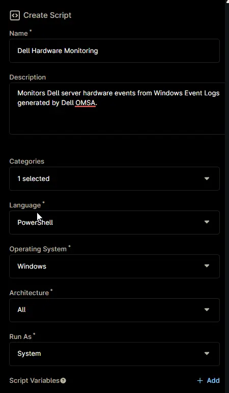
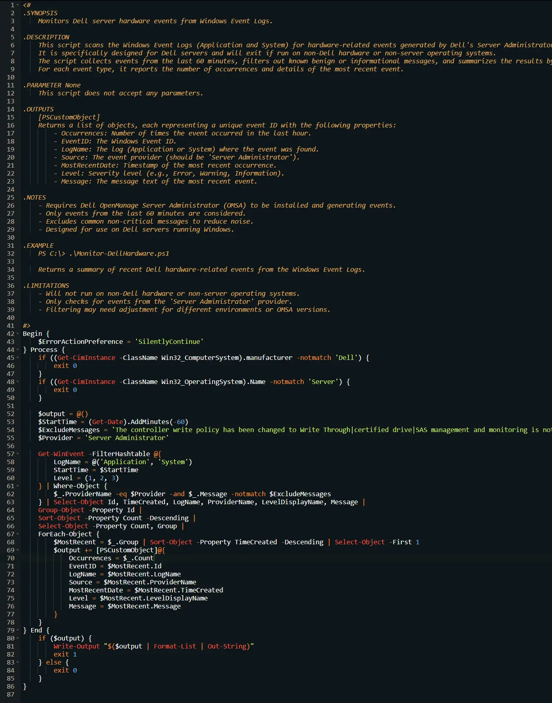
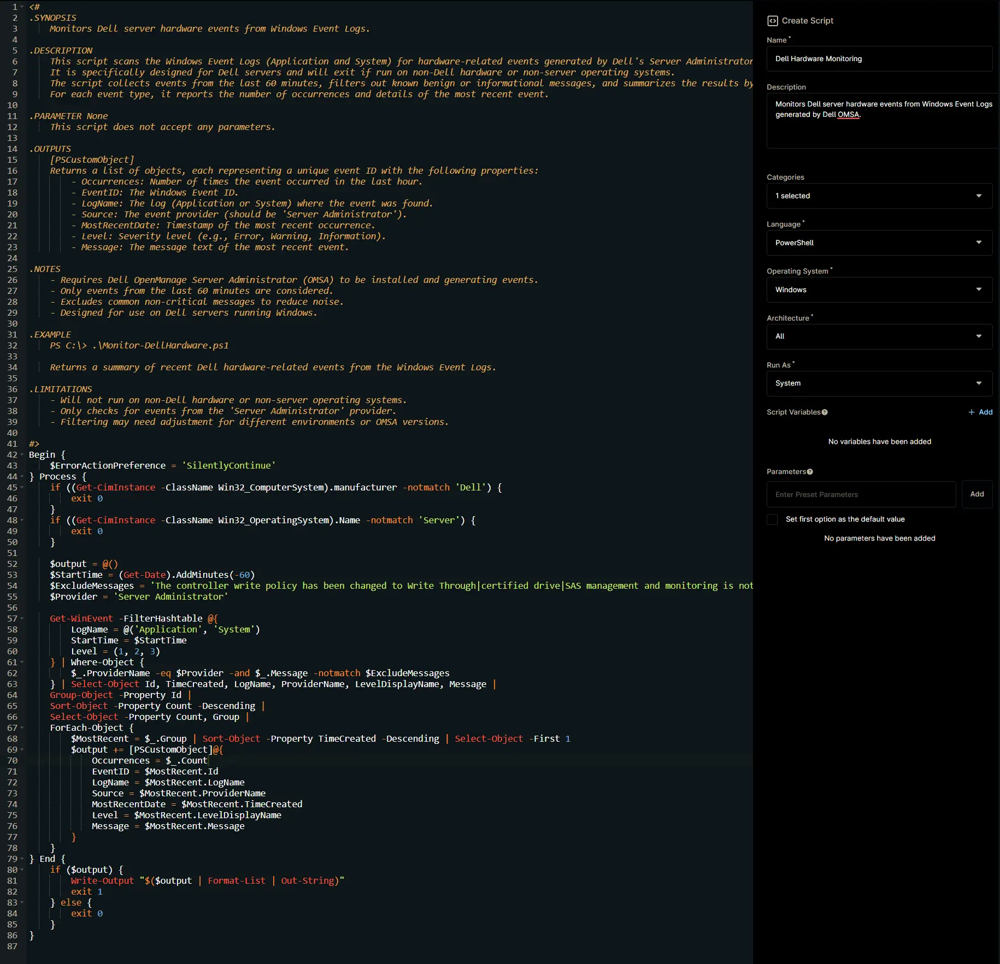

## Overview

This automation monitors Dell server hardware events by scanning Windows Event Logs generated by Dell OMSA. It identifies Critical, Error, and Warning events, while ignoring logs that contain any of the following strings:

- `The controller write policy has been changed to Write Through`
- `Certified drive`
- `SAS management and monitoring is not possible`
- `older than the required <Version> version`

**Note:**

- The script should be run from the [Dell OMSA Alerts](/docs/2bff6ade-58ff-4cbf-addc-067b90da09e9) condition.

## Dependencies

- [Condition - Dell OMSA Alerts](/docs/2bff6ade-58ff-4cbf-addc-067b90da09e9)
- [CW Manage - Ticket Template - Dell Hardware Monitoring](/docs/c1c2c40f-3a63-4eb8-8460-9f90000337aa)
- [Solution - Dell Hardware Monitoring](/docs/9980ae21-5d47-4b76-b5ad-0e6600e0c304)

## Automation Setup/Import

### Step 1

Navigate to `Administration` > `Library` > `Automation`  


### Step 2

Locate the `Add` button on the right-hand side of the screen, click on it and click the `New Script` button.  


The scripting window will open.  


### Step 3

Configure the `Create Script` section as follows:

- **Name:** `Dell Hardware Monitoring`  
- **Description:** `Monitors Dell server hardware events from Windows Event Logs generated by Dell OMSA.`  
- **Categories:** `ProVal`  
- **Language:** `PowerShell`  
- **Operating System:** `Windows`  
- **Architecture:** `All`  
- **Run As:** `System`



## Step 4

Paste the following powershell script in the scripting section:  

```PowerShell
<#
.SYNOPSIS
    Monitors Dell server hardware events from Windows Event Logs.

.DESCRIPTION
    This script scans the Windows Event Logs (Application and System) for hardware-related events generated by Dell's Server Administrator.
    It is specifically designed for Dell servers and will exit if run on non-Dell hardware or non-server operating systems.
    The script collects events from the last 60 minutes, filters out known benign or informational messages, and summarizes the results by event ID.
    For each event type, it reports the number of occurrences and details of the most recent event.

.PARAMETER None
    This script does not accept any parameters.

.OUTPUTS
    [PSCustomObject]
    Returns a list of objects, each representing a unique event ID with the following properties:
        - Occurrences: Number of times the event occurred in the last hour.
        - EventID: The Windows Event ID.
        - LogName: The log (Application or System) where the event was found.
        - Source: The event provider (should be 'Server Administrator').
        - MostRecentDate: Timestamp of the most recent occurrence.
        - Level: Severity level (e.g., Error, Warning, Information).
        - Message: The message text of the most recent event.

.NOTES
    - Requires Dell OpenManage Server Administrator (OMSA) to be installed and generating events.
    - Only events from the last 60 minutes are considered.
    - Excludes common non-critical messages to reduce noise.
    - Designed for use on Dell servers running Windows.

.EXAMPLE
    PS C:\> .\Monitor-DellHardware.ps1

    Returns a summary of recent Dell hardware-related events from the Windows Event Logs.

.LIMITATIONS
    - Will not run on non-Dell hardware or non-server operating systems.
    - Only checks for events from the 'Server Administrator' provider.
    - Filtering may need adjustment for different environments or OMSA versions.

#>
Begin {
    $ErrorActionPreference = 'SilentlyContinue'
} Process {
    if ((Get-CimInstance -ClassName Win32_ComputerSystem).manufacturer -notmatch 'Dell') {
        exit 0
    }
    if ((Get-CimInstance -ClassName Win32_OperatingSystem).Name -notmatch 'Server') {
        exit 0
    }

    $output = @()
    $StartTime = (Get-Date).AddMinutes(-60)
    $ExcludeMessages = 'The controller write policy has been changed to Write Through|certified drive|SAS management and monitoring is not possible|older than the required .* version'
    $Provider = 'Server Administrator'

    Get-WinEvent -FilterHashtable @{
        LogName = @('Application', 'System')
        StartTime = $StartTime
        Level = (1, 2, 3)
    } | Where-Object {
        $_.ProviderName -eq $Provider -and $_.Message -notmatch $ExcludeMessages
    } | Select-Object Id, TimeCreated, LogName, ProviderName, LevelDisplayName, Message |
    Group-Object -Property Id |
    Sort-Object -Property Count -Descending |
    Select-Object -Property Count, Group |
    ForEach-Object {
        $MostRecent = $_.Group | Sort-Object -Property TimeCreated -Descending | Select-Object -First 1
        $output += [PSCustomObject]@{
            Occurrences = $_.Count
            EventID = $MostRecent.Id
            LogName = $MostRecent.LogName
            Source = $MostRecent.ProviderName
            MostRecentDate = $MostRecent.TimeCreated
            Level = $MostRecent.LevelDisplayName
            Message = $MostRecent.Message
        }
    }
} End {
    if ($output) {
        Write-Output "$($output | Format-List | Out-String)"
        exit 1
    } else {
        exit 0
    }
}
```



## Saving the Automation

Click the Save button in the top-right corner of the screen to save your automation.  


You will be prompted to enter your MFA code. Provide the code and press the Continue button to finalize the process.  


## Completed Automation



## Output

- Activity Details
