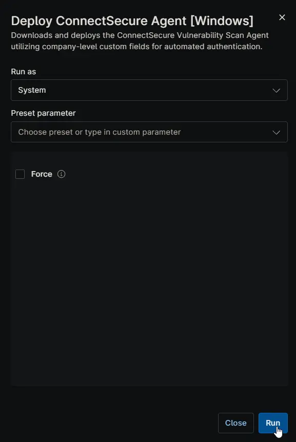

## Overview

Downloads and deploys the ConnectSecure Vulnerability Scan Agent utilizing company-level custom fields for automated authentication.

## Sample Run

## Dependencies

- [Custom Field - cPVAL Connect Secure Company ID](/docs/c104e227-d5f3-432b-90fa-f31186536181)
- [Custom Field - cPVAL Connect Secure Tenant ID](/docs/3d1a16b3-688c-4911-a92d-835a578254a9)
- [Custom Field - cPVAL Connect Secure User Secret](/docs/af99dc24-6b08-4e0a-880e-05ccc755fc6f)
- [Solution - ConnectSecure Agent Deployment](/docs/0e33b1a2-5539-4451-b49d-2ba9b7f904dd)

## Custom Field

| Field Label                      | Required      | Accepted Values | Scope   | Description |
|----------------------------------|------------------------------|-----------------|---------|-------------|
| cPVAL Connect Secure Company ID  | True  | **Secure** | Company | The unique identifier mapped to the specific company within the ConnectSecure portal. |
| cPVAL Connect Secure Tenant ID   | True  | **Secure** | Company | The top-level tenant identifier for the ConnectSecure environment. |
| cPVAL Connect Secure User Secret | True  | **Secure** | Company | The authentication secret/token required to register the agent to the portal. |

> For instructions on obtaining the required IDs for running the script, refer to the *[Instructions section of this article](https://cybercns.atlassian.net/wiki/spaces/CVB/pages/2103410891/How+To+Install+ConnectSecure+Agent#Instructions)*.

## Parameters

| Name | Example | Accepted Values | Required | Default | Type | Description |
| ---- | ------- | --------------- | -------- | ------- | ---- | ----------- |
| Force | | | False | False | Checkbox | This forces a re-download and re-installation of the agent even if the CyberCnsAgent service is already detected on the endpoint. |

## Automation Setup/Import

[Automation Configuration](https://github.com/ProVal-Tech/ninjarmm/blob/main/scripts/deploy-connectsecure-agent-windows.ps1)

## Output

- Activity Details

## Changelog

### 2026-03-16

- Introduced the `Force` parameter to allow explicit installation when required.
- Updated the script to retrieve the user secret from a custom field instead of using a hardcoded value.
- Removed the forced uninstallation behavior, as rerunning the installer now properly updates existing installations.
- Updated the detection logic to rely on a service-based check.
- Renamed the script for improved clarity and consistency.

### 2025-12-10

- Initial version of the document
