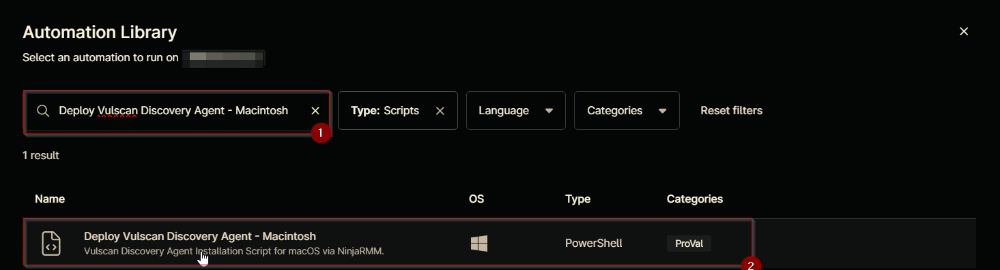
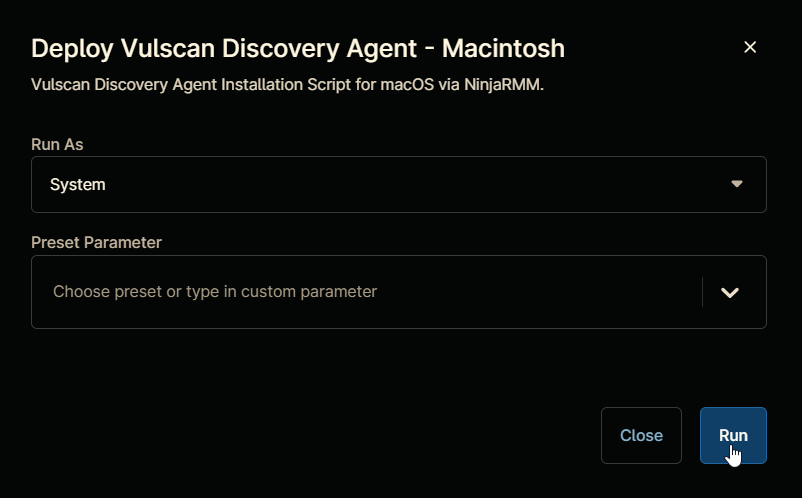
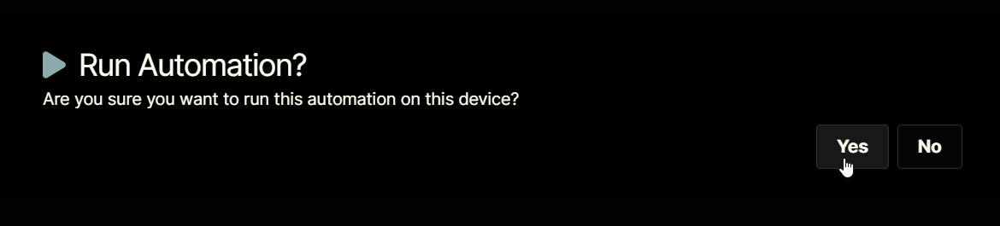
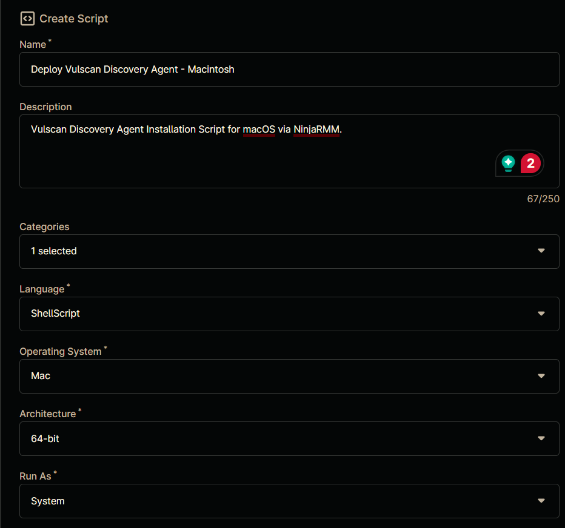
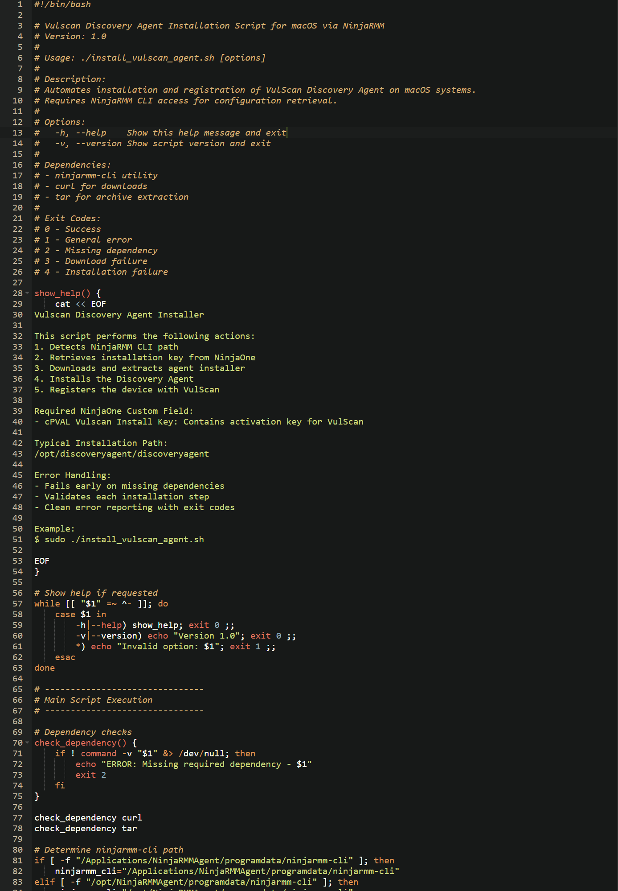
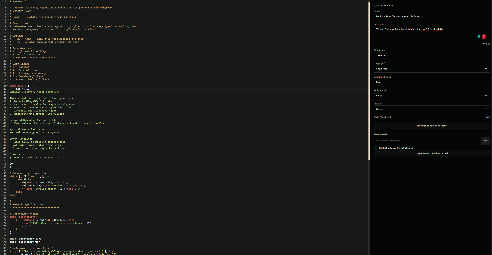

## Overview

Vulscan Discovery Agent Installation Script for macOS via NinjaRMM.

**Reference:** [VulScan_Discovery_Agents_Install_Guide.pdf](https://www2.rapidfiretools.com/nd/VulScan_Discovery_Agents_Install_Guide.pdf)

## Sample Run

`Play Button` > `Run Automation` > `Script`  


Search and select `Deploy Vulscan Discovery Agent - Macintosh`


Click the `Run` button to run the script.  
**Run As:** `System`  
**Preset Parameter:** `<Leave it Blank>`  


**Run Automation:** `Yes`  


## Dependencies

- [cPVAL Vulscan Install Key](/docs/ea08b033-7c1f-48e4-a58d-1851ea84932e)

## Automation Setup/Import

### Step 1

Navigate to `Administration` > `Library` > `Automation`  


### Step 2

Locate the `Add` button on the right-hand side of the screen, click on it and click the `New Script` button.  


The scripting window will open.  


### Step 3

Configure the `Create Script` section as follows:

**Name:** `Deploy Vulscan Discovery Agent - Macintosh`  
**Description:** `Vulscan Discovery Agent Installation Script for macOS via NinjaRMM.`  
**Categories:** `ProVal`  
**Language:** `ShellScript`  
**Operating System:** `Mac`  
**Architecture:** `64-bit`  
**Run As:** `System`  


## Step 4

Paste the following Shell script in the scripting section:  

```bash
#!/bin/bash

# Vulscan Discovery Agent Installation Script for macOS via NinjaRMM
# Version: 1.0
# 
# Usage: ./install_vulscan_agent.sh [options]
# 
# Description:
# Automates installation and registration of VulScan Discovery Agent on macOS systems.
# Requires NinjaRMM CLI access for configuration retrieval.
#
# Options:
#   -h, --help    Show this help message and exit
#   -v, --version Show script version and exit
#
# Dependencies:
# - ninjarmm-cli utility
# - curl for downloads
# - tar for archive extraction
#
# Exit Codes:
# 0 - Success
# 1 - General error
# 2 - Missing dependency
# 3 - Download failure
# 4 - Installation failure

show_help() {
    cat << EOF
Vulscan Discovery Agent Installer

This script performs the following actions:
1. Detects NinjaRMM CLI path
2. Retrieves installation key from NinjaOne
3. Downloads and extracts agent installer
4. Installs the Discovery Agent
5. Registers the device with VulScan

Required NinjaOne Custom Field:
- cPVAL Vulscan Install Key: Contains activation key for VulScan

Typical Installation Path:
/opt/discoveryagent/discoveryagent

Error Handling:
- Fails early on missing dependencies
- Validates each installation step
- Clean error reporting with exit codes

Example:
$ sudo ./install_vulscan_agent.sh

EOF
}

# Show help if requested
while [[ "$1" =~ ^- ]]; do
    case $1 in
        -h|--help) show_help; exit 0 ;;
        -v|--version) echo "Version 1.0"; exit 0 ;;
        *) echo "Invalid option: $1"; exit 1 ;;
    esac
done

# -------------------------------
# Main Script Execution
# -------------------------------

# Dependency checks
check_dependency() {
    if ! command -v "$1" &> /dev/null; then
        echo "ERROR: Missing required dependency - $1"
        exit 2
    fi
}

check_dependency curl
check_dependency tar

# Determine ninjarmm-cli path
if [ -f "/Applications/NinjaRMMAgent/programdata/ninjarmm-cli" ]; then
    ninjarmm_cli="/Applications/NinjaRMMAgent/programdata/ninjarmm-cli"
elif [ -f "/opt/NinjaRMMAgent/programdata/ninjarmm-cli" ]; then
    ninjarmm_cli="/opt/NinjaRMMAgent/programdata/ninjarmm-cli"
else
    echo "ERROR: ninjarmm-cli not found on this system"
    exit 1
fi

# Retrieve VulScan Install Key
installKey="$($ninjarmm_cli get "cpvalVulscanInstallKey")"

# Validate Install Key
if [ -z "$installKey" ]; then
    echo "Error: Missing installKey key. Configure in NinjaOne field 'cPVAL Vulscan Install Key'"
    exit 1
fi

# Define script location and source URL
installerPath="/tmp/discoveryagent-install-osx.tar.gz"
executablePath="/tmp/discoveryagent-install-osx"
installerUrl="https://download.rapidfiretools.com/download/discoveryagentinstall-osx.tar.gz"

# Download installer
if ! curl -sf -o "$installerPath" "$installerUrl"; then
    echo "ERROR: Failed to download Vulscan Discovery Agent."
    exit 1
fi

# Extract and run the installer
echo "Extracting installation package..."
if ! tar -xzf "$installerPath" -C /tmp; then
    echo "ERROR: Failed to extract installation package"
    exit 1
fi

# Make executable and install
chmod +x "$executablePath"
if ! "$executablePath" --install; then
    echo "ERROR: Installation failed"
    exit 1
fi

# Register Device (path corrected to common installation location)
registerPath="/opt/discoveryagent/discoveryagent"
if [ -f "$registerPath" ]; then
    if ! "$registerPath" -register -installkey "$installKey"; then
        echo "ERROR: Device registration failed"
        exit 1
    fi
else
    echo "ERROR: Discovery Agent not found at $registerPath"
    exit 1
fi

echo "Installation and registration completed successfully"
```



## Saving the Automation

Click the `Save` button in the top-right corner of the screen to save your automation.  


You will be prompted to enter your MFA code. Provide the code and press the Continue button to finalize the process.  


## Completed Automation



## Output

- Activity Details