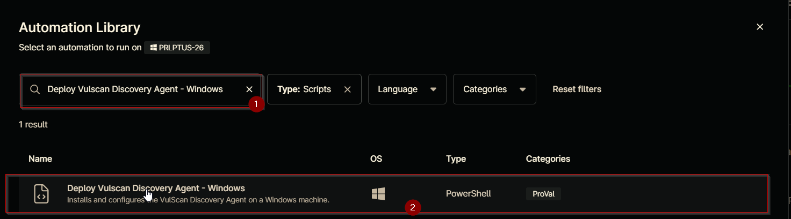
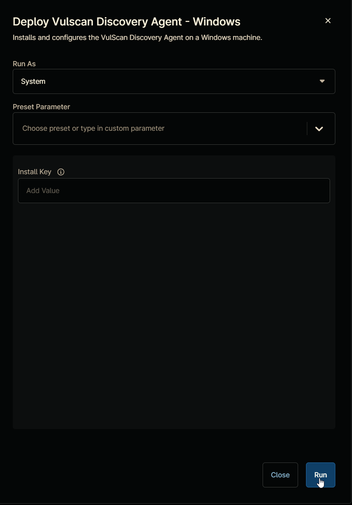
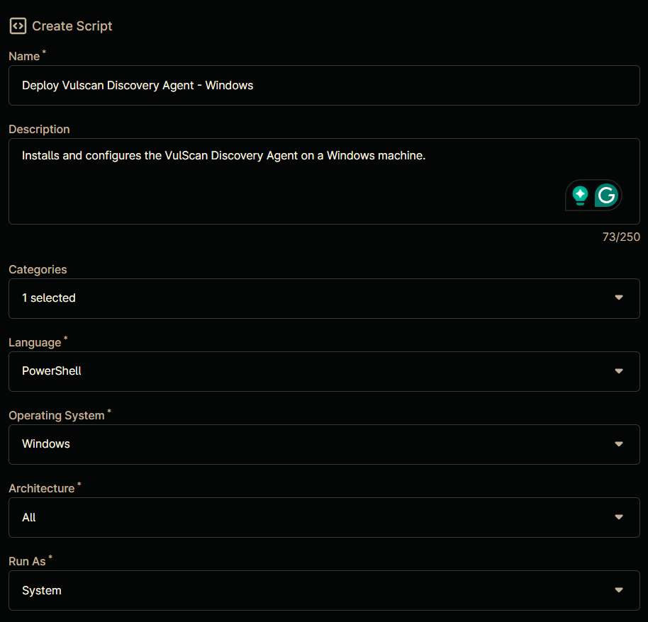
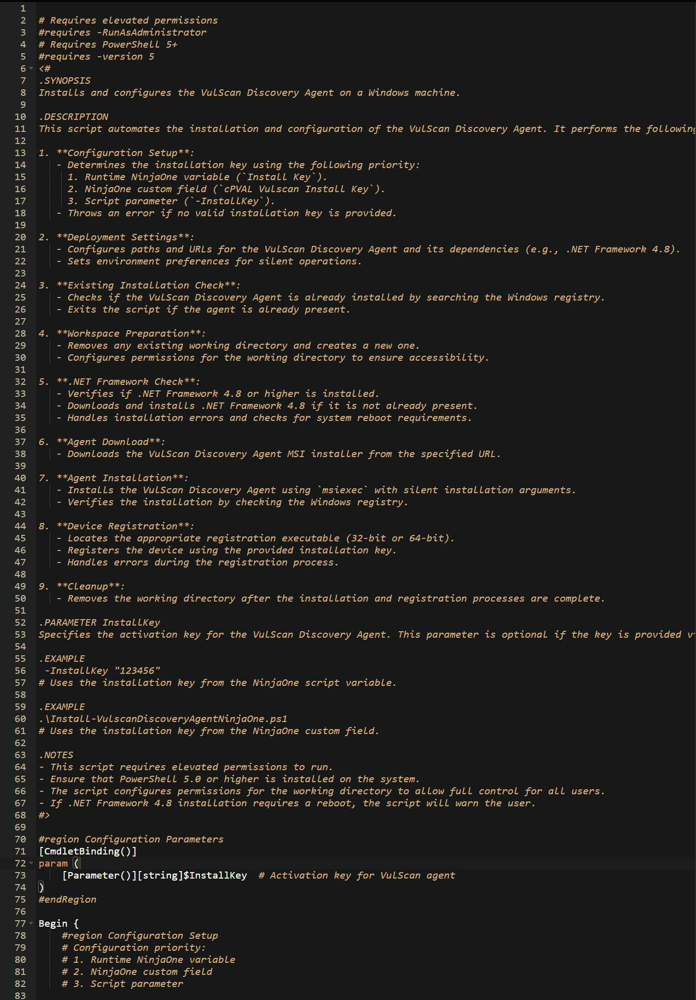
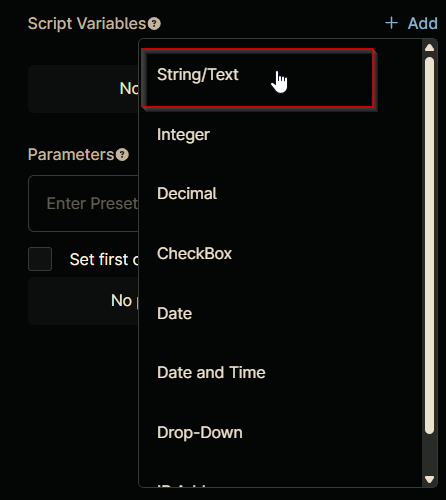
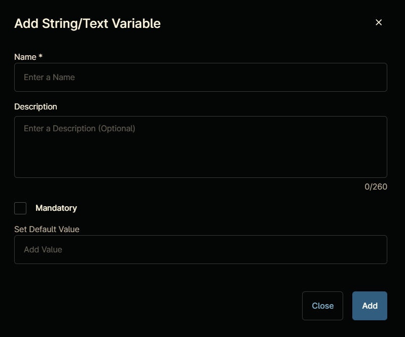
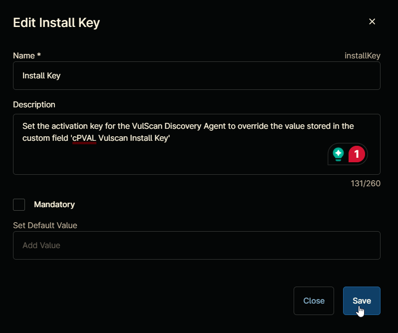
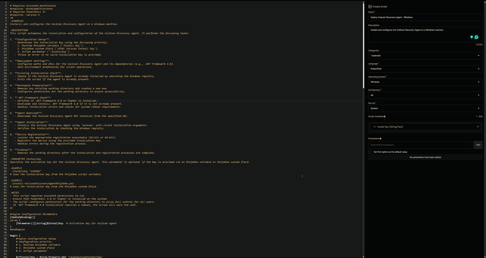

## Overview

Installs and configures the VulScan Discovery Agent on a Windows machine.

**Reference:** [VulScan_Discovery_Agents_Install_Guide.pdf](https://www2.rapidfiretools.com/nd/VulScan_Discovery_Agents_Install_Guide.pdf)

## Sample Run

`Play Button` > `Run Automation` > `Script`  


Search and select `Deploy Vulscan Discovery Agent - Windows`


Set the required arguments and click the `Run` button to run the script.  
**Run As:** `System`  
**Preset Parameter:** `<Leave it Blank>`  
**Install Key:** `Set the activation key for the VulScan Discovery Agent to override the value stored in the custom field 'cPVAL Vulscan Install Key'`  


**Run Automation:** `Yes`  


## Dependencies

- [cPVAL Vulscan Install Key](/docs/ea08b033-7c1f-48e4-a58d-1851ea84932e)

## Parameters

| Name | Required | Accepted Values | Default | Type | Description |
| ---- | -------- | --------------- | ------- | ---- | ----------- |
| Install Key | False | | | String/Text | Set the activation key for the VulScan Discovery Agent to override the value stored in the custom field [cPVAL Vulscan Install Key](/docs/ea08b033-7c1f-48e4-a58d-1851ea84932e) |

## Automation Setup/Import

### Step 1

Navigate to `Administration` > `Library` > `Automation`  


### Step 2

Locate the `Add` button on the right-hand side of the screen, click on it and click the `New Script` button.  


The scripting window will open.  


### Step 3

Configure the `Create Script` section as follows:

**Name:** `Deploy Vulscan Discovery Agent - Windows`  
**Description:** `Installs and configures the VulScan Discovery Agent on a Windows machine.`  
**Categories:** `ProVal`  
**Language:** `PowerShell`  
**Operating System:** `Windows`  
**Architecture:** `All`  
**Run As:** `System`  


## Step 4

Paste the following powershell script in the scripting section:  

```PowerShell

# Requires elevated permissions
#requires -RunAsAdministrator
# Requires PowerShell 5+
#requires -version 5
<#
.SYNOPSIS
Installs and configures the VulScan Discovery Agent on a Windows machine.

.DESCRIPTION
This script automates the installation and configuration of the VulScan Discovery Agent. It performs the following tasks:

1. **Configuration Setup**:
   - Determines the installation key using the following priority:
     1. Runtime NinjaOne variable (`Install Key`).
     2. NinjaOne custom field (`cPVAL Vulscan Install Key`).
     3. Script parameter (`-InstallKey`).
   - Throws an error if no valid installation key is provided.

2. **Deployment Settings**:
   - Configures paths and URLs for the VulScan Discovery Agent and its dependencies (e.g., .NET Framework 4.8).
   - Sets environment preferences for silent operations.

3. **Existing Installation Check**:
   - Checks if the VulScan Discovery Agent is already installed by searching the Windows registry.
   - Exits the script if the agent is already present.

4. **Workspace Preparation**:
   - Removes any existing working directory and creates a new one.
   - Configures permissions for the working directory to ensure accessibility.

5. **.NET Framework Check**:
   - Verifies if .NET Framework 4.8 or higher is installed.
   - Downloads and installs .NET Framework 4.8 if it is not already present.
   - Handles installation errors and checks for system reboot requirements.

6. **Agent Download**:
   - Downloads the VulScan Discovery Agent MSI installer from the specified URL.

7. **Agent Installation**:
   - Installs the VulScan Discovery Agent using `msiexec` with silent installation arguments.
   - Verifies the installation by checking the Windows registry.

8. **Device Registration**:
   - Locates the appropriate registration executable (32-bit or 64-bit).
   - Registers the device using the provided installation key.
   - Handles errors during the registration process.

9. **Cleanup**:
   - Removes the working directory after the installation and registration processes are complete.

.PARAMETER InstallKey
Specifies the activation key for the VulScan Discovery Agent. This parameter is optional if the key is provided via an NinjaOne variable or NinjaOne custom field.

.EXAMPLE
 -InstallKey "123456"
# Uses the installation key from the NinjaOne script variable.

.EXAMPLE
.\Install-VulscanDiscoveryAgentNinjaOne.ps1
# Uses the installation key from the NinjaOne custom field.

.NOTES
- This script requires elevated permissions to run.
- Ensure that PowerShell 5.0 or higher is installed on the system.
- The script configures permissions for the working directory to allow full control for all users.
- If .NET Framework 4.8 installation requires a reboot, the script will warn the user.
#>

#region Configuration Parameters
[CmdletBinding()]
param (
    [Parameter()][string]$InstallKey  # Activation key for VulScan agent
)
#endRegion

Begin {
    #region Configuration Setup
    # Configuration priority:
    # 1. Runtime NinjaOne variable
    # 2. NinjaOne custom field
    # 3. Script parameter

    $cfInstallKey = Ninja-Property-Get 'cpvalVulscanInstallKey'
    $installKey = if ($env:InstallKey) {
        $env:InstallKey
    } elseif ($cfInstallKey) {
        $cfInstallKey
    } elseif ($InstallKey) {
        $InstallKey
    } else {
        throw 'Error: Missing activation key. Configure in NinjaOne field ''cPVAL Vulscan Install Key'' or provide runtime variable ''InstallKey''.'
    }
    #endRegion

    #region Deployment Settings
    $appName = 'VulScanDiscoveryAgent'
    $workingDirectory = "C:\ProgramData\_automation\app\$appName"
    $appPath = "$workingDirectory\$appName.msi"
    $softwareName = 'Discovery Agent'
    $appDownloadUrl = 'https://download.rapidfiretools.com/download/DiscoveryAgent.msi'
    $installArgs = "/i `"$appPath`" /qn /norestart"
    $msiExecPath = 'C:\Windows\System32\msiexec.exe'

    # Registration paths
    $x64RegisterPath = 'C:\Program Files\DiscoveryAgent\Agent\bin\register-device.exe'
    $x86RegisterPath = 'C:\Program Files (x86)\DiscoveryAgent\Agent\bin\register-device.exe'
    $registerArgs = "-installkey $InstallKey"

    # .NET 4.8 Settings
    $dotNetAppName = 'DotNet48'
    $dotNetAppPath = "$workingDirectory\$dotNetAppName.exe"
    $dotNetDownloadUrl = 'https://download.visualstudio.microsoft.com/download/pr/714a99a2-db28-432e-9a39-4345ba11e73f/5108686aec021898cec3de2cc4d9fd3c/ndp48-devpack-enu.exe'
    $dotNetInstallArgs = '/install /quiet /norestart'

    # Environment configuration
    $ProgressPreference = 'SilentlyContinue'
    $ConfirmPreference = 'None'
    [Net.ServicePointManager]::SecurityProtocol = [Net.SecurityProtocolType]::Tls12
    #endRegion

    #region Existing Installation Check
    $uninstallPaths = @(
        'HKLM:\SOFTWARE\Microsoft\Windows\CurrentVersion\Uninstall',
        'HKLM:\SOFTWARE\Wow6432Node\Microsoft\Windows\CurrentVersion\Uninstall'
    )

    if (Get-ChildItem $uninstallPaths -ErrorAction SilentlyContinue |
            Get-ItemProperty |
            Where-Object { $_.DisplayName -eq $softwareName }) {
        return 'Info: VulScan Discovery Agent already present'
    }
    #endRegion

    #region Prepare Workspace
    Remove-Item $workingDirectory -Recurse -Force -ErrorAction SilentlyContinue

    if (-not (Test-Path $workingDirectory)) {
        try {
            New-Item -Path $workingDirectory -ItemType Directory -Force | Out-Null
        } catch {
            throw "Error: Directory creation failed - $($_.Exception.Message)"
        }
    }

    # Configure permissions
    if (-not ((Get-Acl $workingDirectory).Access |
                Where-Object { $_.IdentityReference -match 'Everyone' -and $_.FileSystemRights -match 'FullControl' })) {
        $acl = Get-Acl $workingDirectory
        $acl.AddAccessRule(
            [System.Security.AccessControl.FileSystemAccessRule]::new(
                'Everyone',
                'FullControl',
                'ContainerInherit, ObjectInherit',
                'None',
                'Allow'
            )
        )
        Set-Acl $workingDirectory $acl
    }
    #endRegion
}

Process {
    #region .NET Framework Check
    $netFrameworkRelease = (Get-ItemProperty 'HKLM:\SOFTWARE\Microsoft\NET Framework Setup\NDP\v4\Full' -ErrorAction SilentlyContinue).Release

    if ($netFrameworkRelease -ge 528040) {
        Write-Information 'Info: .NET 4.8+ detected' -InformationAction Continue
    } else {
        Write-Information 'Info: Installing .NET 4.8 prerequisite' -InformationAction Continue

        # Download .NET installer
        try {
            Invoke-WebRequest $dotNetDownloadUrl -OutFile $dotNetAppPath -UseBasicParsing
        } catch {
            throw "Error: .NET download failed - $($_.Exception.Message)"
        }

        # Install .NET
        Unblock-File $dotNetAppPath
        $exitCode = (Start-Process $dotNetAppPath $dotNetInstallArgs -Wait -PassThru).ExitCode

        # Verify installation
        switch ($exitCode) {
            0 { Write-Information 'Info: .NET 4.8 installed' -InformationAction Continue }
            3010 { return 'Warning: System reboot required to complete .NET installation' }
            default { throw "Error: .NET installation failed (Code: $exitCode)" }
        }
    }
    #endRegion

    #region Download Agent
    try {
        Invoke-WebRequest $appDownloadUrl -OutFile $appPath -UseBasicParsing
    } catch {
        throw "Error: Agent download failed - $($_.Exception.Message)"
    }
    #endRegion

    #region Install Agent
    Unblock-File $appPath
    Write-Information 'Info: Starting agent installation' -InformationAction Continue
    $exitCode = (Start-Process $msiExecPath -ArgumentList $installArgs -Wait -PassThru).ExitCode
    #endRegion

    #region Verify Installation
    $timeout = 300  # 5-minute timeout
    $stopwatch = [System.Diagnostics.Stopwatch]::StartNew()

    do {
        Start-Sleep -Seconds 5
        $installed = Get-ChildItem $uninstallPaths -ErrorAction SilentlyContinue |
            Get-ItemProperty |
            Where-Object { $_.DisplayName -eq $softwareName }
    } until ($installed -or $stopwatch.Elapsed.TotalSeconds -gt $timeout)

    if ($installed) {
        Write-Information 'Info: Installation successful' -InformationAction Continue
    } else {
        throw "Error: Installation failed (Code: $exitCode)"
    }
    #endRegion

    #region Device Registration
    $registerExe = if (Test-Path $x86RegisterPath) {
        $x86RegisterPath
    } elseif (Test-Path $x64RegisterPath) {
        $x64RegisterPath
    } else {
        throw "Error: Registration tool not found in [$x86RegisterPath] or [$x64RegisterPath]"
    }

    try {
        Write-Information 'Info: Registering device' -InformationAction Continue
        Start-Process $registerExe $registerArgs -Wait -ErrorAction Stop
    } catch {
        throw "Error: Registration failed - $($_.Exception.Message)"
    }
    #endRegion
}

End {
    #region Cleanup
    if (Test-Path $workingDirectory) {
        Remove-Item $workingDirectory -Recurse -Force
    }
    #endRegion
}
```



## Script Variables

### Install Key

Click the `Add` button next to `Script Variables`.  


Select the `String/Text` option.  


The `Add String/Text Variable` window will open.  


In the box, fill in the following details and select `Add` to create the script variable.  

**Name:** `Install Key`  
**Description:** `Set the activation key for the VulScan Discovery Agent to override the value stored in the custom field 'cPVAL Vulscan Install Key'`  
**Mandatory:** `<Leave it Unchecked>`  
**Set Default Value:** `<Leave it blank>`



## Saving the Automation

Click the `Save` button in the top-right corner of the screen to save your automation.  


You will be prompted to enter your MFA code. Provide the code and press the Continue button to finalize the process.  


## Completed Automation



## Output

- Activity Details
