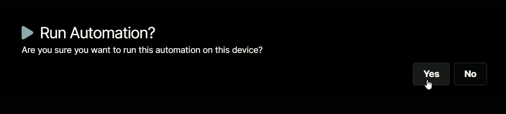

## Overview
This Automation checks for recent DFS Replication errors or warnings within the last hour and reports the current replication state to identify potential sync or replication issues.

## Sample Run

`Play Button` > `Run Automation` > `Script`  

Search and select `DFS Replication Health Check`

Set the required arguments and click the `Run` button to run the script.  
**Run As:** `System`  
**Preset Parameter:** `<Leave it Blank>`  

**Run Automation:** `Yes`  

## Dependencies
- [Solution - DFS Replication Health Check](/docs/9fd6046b-e670-4204-b140-b84c268aefe7)
- [Compound Condition - DFS Replication Health Check](/docs/0fab1e4b-7bbb-4939-87e1-792cdcea49e4)
- [CW Manage Ticket Template - P2 - Major](/docs/6e35ca8b-0400-40ec-b33b-d5f642979258)

## Automation Setup/Import

[Automation Configuration](https://github.com/ProVal-Tech/ninjarmm/blob/main/scripts/dfs-replication-health-check.ps1)
