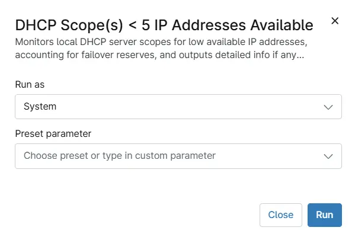

## Overview

The script retrieves information about DHCP server scopes and their corresponding IP address statistics. It filters out inactive scopes and focuses only on active ones. The script then checks the number of available IP addresses within each active scope and identifies those with 5 or fewer available IP addresses.

In other words, it detects the DHCP servers having any active DHCP scope with less than 5 IP addresses available.

## Sample Run

`Play Button` > `Run Automation` > `Script`  

## Automation Setup/Import

[Automation Configuration](https://github.com/ProVal-Tech/ninjarmm/blob/main/scripts/dhcp-scopes-less-than-5-ips-available.ps1)

## Output

- Activity Details

## Changelog

### 2026-07-28

- Initial version of the document