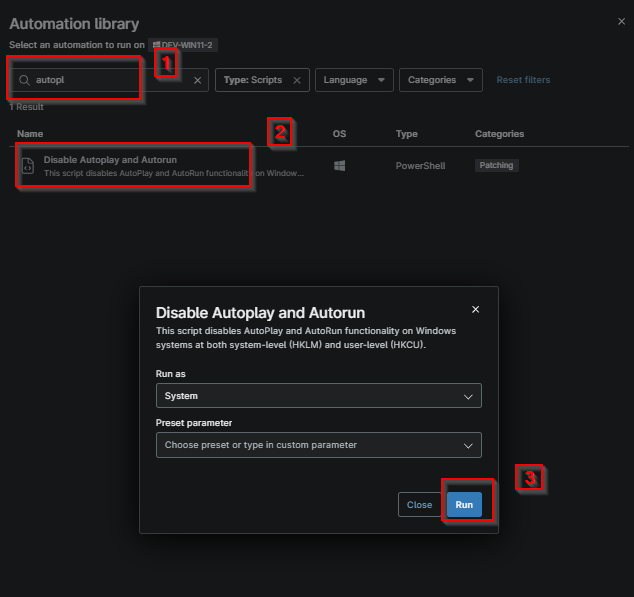
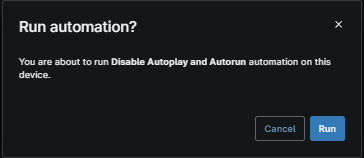

## Overview

This script disables AutoPlay and AutoRun functionality on Windows systems at both system-level (HKLM) and user-level (HKCU).

## Sample Run

- Search for the `Disable Autoplay and Autorun`
- Select the script `Disable Autoplay and Autorun`
- Click Run

- Click Run again 

## Dependencies

- [Solution - Disable Autoplay and Autorun](/docs/19b3d384-3d3d-42fc-80ab-1deef3f8af09)

## Custom Fields

| Field Name | Type | Mandatory | Scope | Description |
| ---------- | ---- | --------- | ----- | ----------- |
| cpvalDisableAutoplayAndAutorun | Checkbox | False | `Organization` | Select this Custom Field to apply settings that disable AutoRun and AutoPlay policies across the client's Windows devices. |
| cpvalAutoplayAndAutorunDisabled | Checkbox | False | `Device` | This custom field is checked by the automation script, where AutoPlay and Autorun are set to disabled for all users and the system. |

## Automation Setup/Import

[Automation Configuration](https://github.com/ProVal-Tech/ninjarmm/blob/main/scripts/disable-autoplay-and-autorun.ps1)

## Output

- Activity Details  
- Custom Field

## Changelog

### 2026-10-06

- Initial version of the document