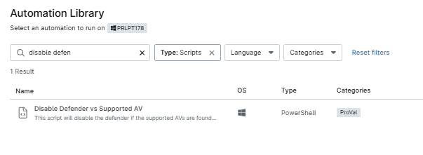
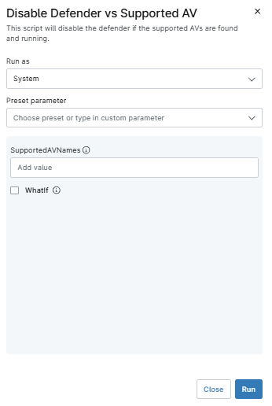
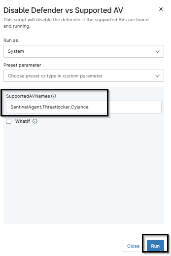
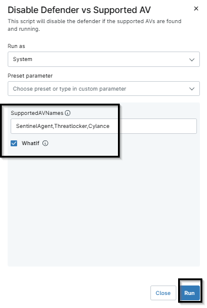
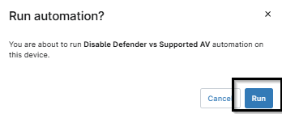

## Overview

This script will disable the defender if the supported AVs are found and running.

## Sample Run

`Play Button` > `Run Automation` > `Script`  

- Search for `disable defender` and select `Disable Defender vs Supported AV` script.

- If the `SupportedAVServices` value is defined from the [Custom field - cPVAL Supported AV Services](/docs/f0bef227-5f8b-4c6e-bfd4-9940fde736c8), and you want it to run the value from that, run the script without putting anything in the script variables.

- If you want to run on demand, feel free to provide the script variable `SupportedAVNames` with the AV list to validate and stop Defender if the AV is found and running.

- If you want to just simulate the process of checking for AV and disabling Defender without making any changes, run with `WhatIf` checked

- After clicking on run by choosing any above method, the script will ask to confirm run again. Click `Run`

## Dependencies

- [Custom field - cPVAL Supported AV Services](/docs/f0bef227-5f8b-4c6e-bfd4-9940fde736c8)
- [Solution - Disable Defender](/docs/496a399f-7746-4cc6-9c31-476193d5ee9e)

## Parameters

| Name | Example | Required | Default | Type | Description |
| ---- | ------- | -------- | ------- | ---- | ----------- |
| SupportedAVNames | SentinelAgent,Cylance |   False |  |String/Text | This accepts the AV names that need to be checked for running and active, and if found, then disables the defender. |
| WhatIf | 1 or 0 |  False |  | Checkbox | If this is checked, then the script will just simulate the process of checking for SentinelAgent and disabling Defender without making any changes. |

## Automation Setup/Import

[Automation Configuration](https://github.com/ProVal-Tech/ninjarmm/blob/main/scripts/disable-defender-vs-supported-av.ps1)

## Output

- Activity Details 
- Log file

## Changelog

### 2026-06-17

- Initial version of the document