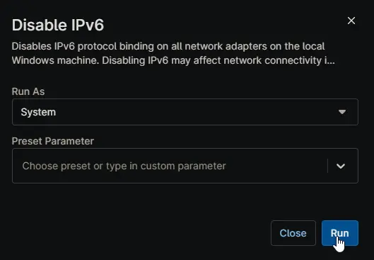

## Overview

Disables IPv6 protocol binding on all network adapters on the local Windows machine. Disabling IPv6 may affect network connectivity in some environments. This script is executed as automation script from [Disable IPv6 Windows Workstation](/docs/2471a88f-d339-497b-a9c2-1f30f83bcdd9) and [Disable IPv6 Windows Server](/docs/79b177eb-4421-48b2-b47c-9163ceebcf78) compound conditions.

## Sample Run

## Dependencies

- [Custom Field - cPVAL Disable IPv6](/docs/060ad5d8-ee1d-4ee2-a92d-7dbc14121bc6)
- [Solution - Disable IPv6](/docs/1e9dee40-965f-4b6c-a9cf-4cb45162d5ac)
- [Solution - Device Standards](/docs/a0c383d4-699a-4bb8-af7f-c2a007747182)

## Automation Setup/Import

[Automation Configuration](https://github.com/ProVal-Tech/ninjarmm/blob/main/scripts/disable-ipv6.ps1)

## Output

- Activity Details  
