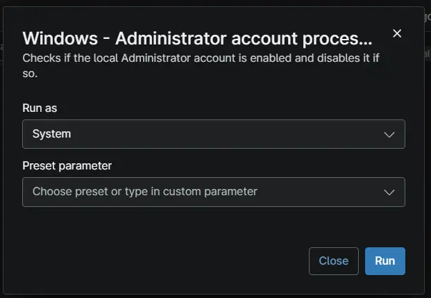

## Overview

Checks whether the built-in local Administrator account is enabled and disables it if necessary, ensuring the account remains inactive unless it is specifically required for administrative use.

## Dependencies

- [Solution - Disable Local Administrator](/docs/c3553e8f-bacf-4b6c-a53f-87cd615d0260)

## Sample Run

## Automation Setup/Import

[Automation Configuration](https://github.com/ProVal-Tech/ninjarmm/blob/main/scripts/disable-local-administrator.ps1)

## Output

- Activity Details  

## Changelog

### 2026-10-01

- Initial Version of the document.