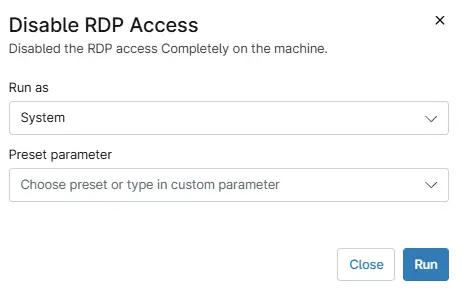

## Summary

The script disables the RDP access on windows machines.

## Sample Run

`Play Button` > `Run Automation` > `Script`  

## Automation Setup/Import

[Automation Configuration](https://github.com/ProVal-Tech/ninjarmm/blob/main/scripts/disable-rdp-access.ps1)

## Output

- Activity Details  

## Changelog

### 2026-07-20

- Initial version of the document.
