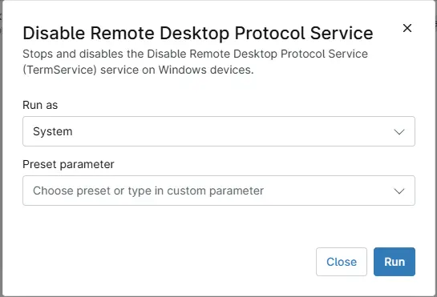

## Overview

This script stops and disables the Remote Desktop Protocol Service (TermService) service on Windows devices.

## Sample Run

## Dependencies

- [Solution - Disable RDP Service](/docs/4e49b064-d81d-47ac-8711-78261a494f5b)

## Automation Setup/Import

[Automation Configuration](https://github.com/ProVal-Tech/ninjarmm/blob/main/scripts/disable-remote-desktop-protocol-service.ps1)

## Output

- Activity Details 

## Changelog

### 2026-10-09

- Initial version of the document
