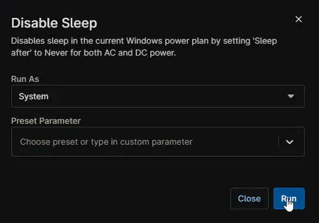

## Overview

Disables sleep in the current Windows power plan by setting 'Sleep after' to Never for both AC and DC power. This script is executed as automation script from [Disable Sleep Windows Workstation](/docs/01e513a0-0764-4d2d-ae60-871e42010526) and [Disable Sleep Windows Server](/docs/047f1fc9-f296-42c0-bad6-3498b9160609) compound conditions.

## Sample Run

## Dependencies

- [Agnostic Script - Get-PowerPlan](/docs/4d7993ab-1fa8-4b96-9f19-f503737ea015)
- [Agnostic Script - Set-PowerPlan](/docs/05737947-e8d5-4711-a1d7-91a6db43358f)
- [Custom Field - cPVAL Disable Sleep](/docs/b0c22386-feb6-427c-b1fd-e29a9c4863a3)
- [Solution - Disable Sleep](/docs/)
- [Solution - Device Standards](/docs/)

## Automation Setup/Import

[Automation Configuration](https://github.com/ProVal-Tech/ninjarmm/blob/main/scripts/disable-sleep.ps1)

## Output

- Activity Details
