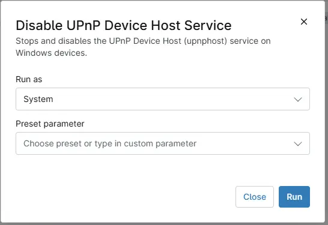

## Overview

This script stops and disables the UPnP Device Host (upnphost) service on Windows devices.

## Sample Run

## Dependencies

- [Solution - Disable UPnP Service](/docs/70d10692-83c6-4c25-b546-9beadaba5468)

## Automation Setup/Import

[Automation Configuration](https://github.com/ProVal-Tech/ninjarmm/blob/main/scripts/disable-upnp-device-host-service.ps1)

## Output

- Activity Details  

## Changelog

## 2026-10-01

- Initial version of the document
