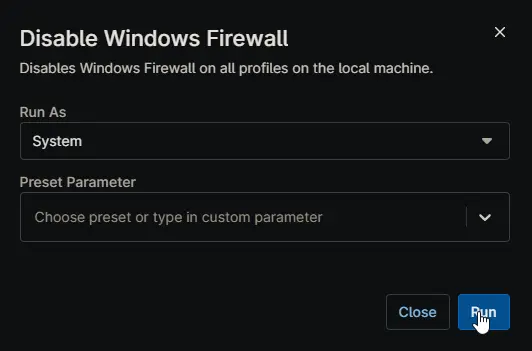

## Overview

Disables Windows Firewall on all profiles on the local machine. This script is executed as automation script from [Turn off Windows Firewall Windows Workstation](/docs/) and [Turn off Windows Firewall Windows Server](/docs/) compound conditions.

## Sample Run

## Dependencies

- [Custom Field - cPVAL Turn off Windows Firewall](/docs/48a340ed-d4aa-4949-9862-89e0737c5c95)
- [Solution - Turn off Windows Firewall](/docs/)
- [Solution - Device Standards](/docs/)

## Automation Setup/Import

[Automation Configuration](https://github.com/ProVal-Tech/ninjarmm/blob/main/scripts/disable-windows-firewall.ps1)

## Output

- Activity Details  
