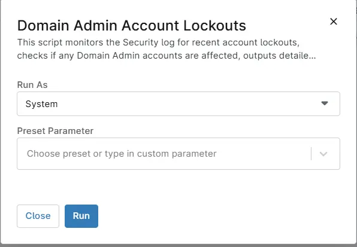

## Overview
This script monitors the Security log for recent account lockouts, checks if any Domain Admin accounts are affected, outputs detailed info about the locked accounts, and fails immediately if any Domain Admin is locked out. This script has to be executed against Infrastructure masters only.

## Sample Run

`Play Button` > `Run Automation` > `Script`  

Schedule this script against infrastructure master to generate automatic tickets on domain account lockouts.

## Dependencies
[Condition : Domain Admin Account LockOut](/docs/588b31d4-04a3-4b39-af8c-6c1f24da0710)
[Ticket Template : Domain Admin Account LockOut](/docs/4583116e-e1b9-42bc-826d-61ec2785e532)

## Automation Setup/Import

[Automation Configuration](https://github.com/ProVal-Tech/ninjarmm/blob/main/scripts/domain-admin-account-lockouts.ps1)

## Output

- Activity Details 
