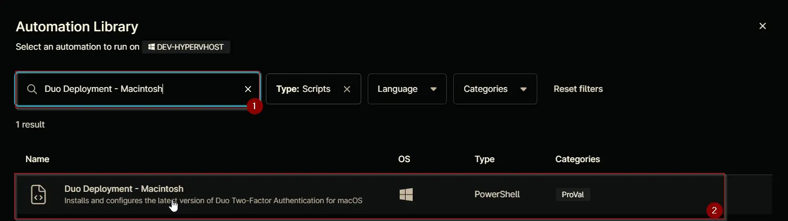
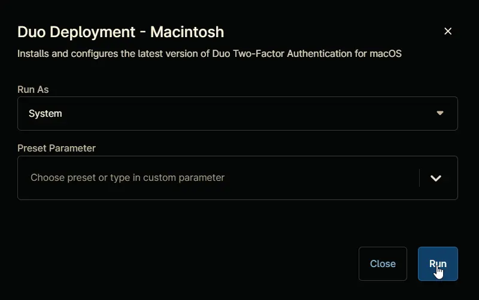
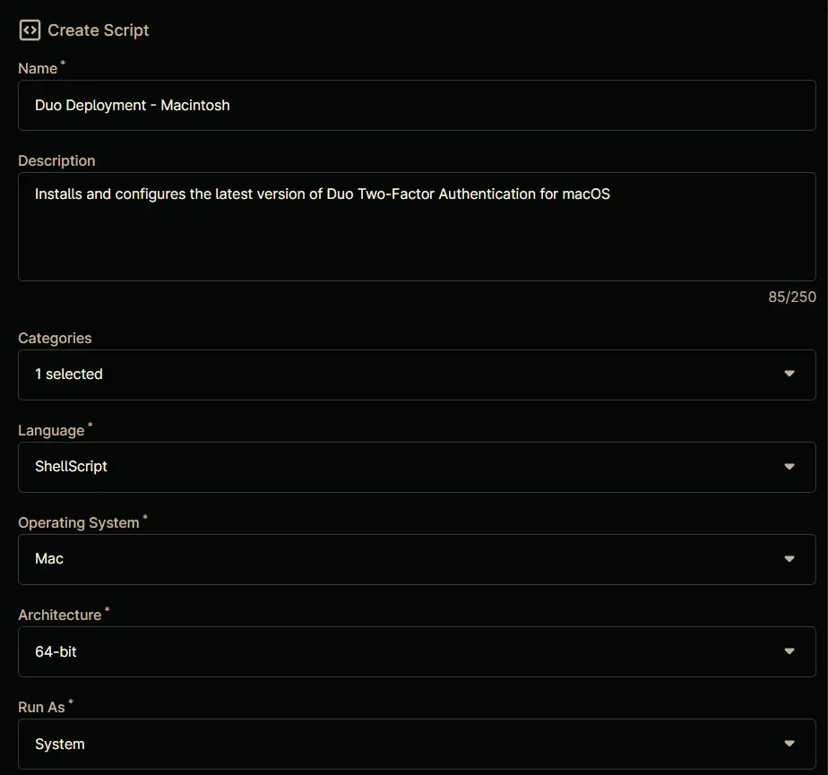
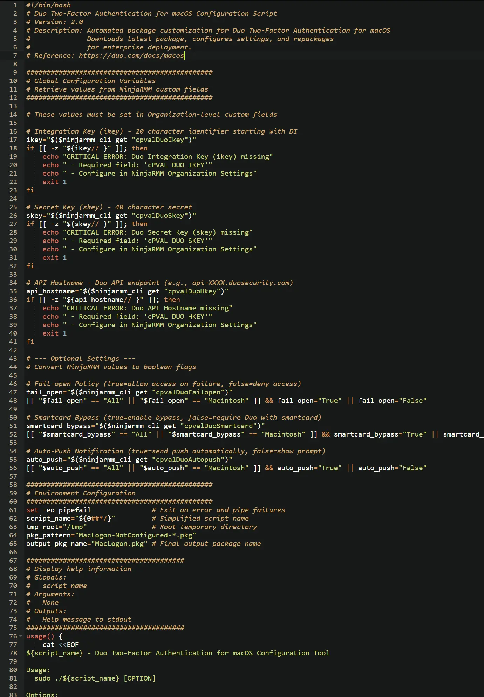
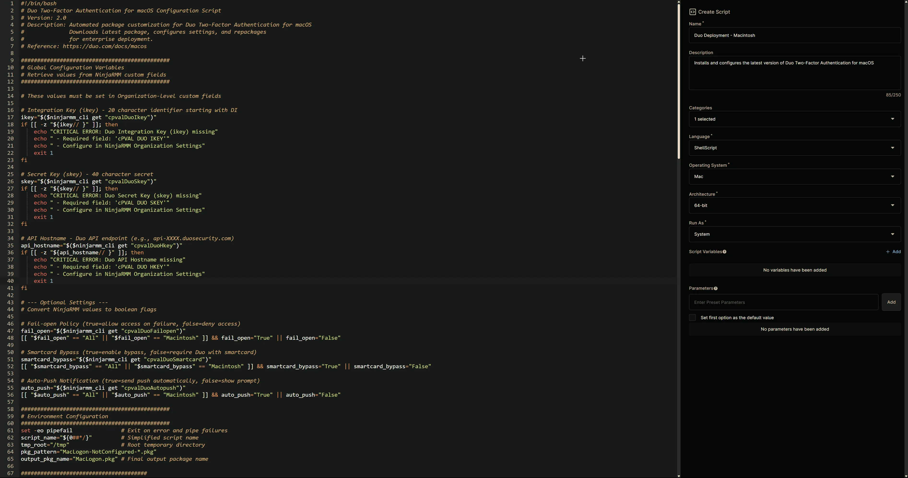

## Overview

Installs and configures the latest version of Duo Two-Factor Authentication for macOS.

Parameters Reference: [Duo Silent Install](https://duo.com/docs/macos)

## Sample Run

`Play Button` > `Run Automation` > `Script`  


Search and select `Duo Deployment - Macintosh`


Click the `Run` button to run the script.  
**Run As:** `System`  
**Preset Parameter:** `<Leave it Blank>`  


**Run Automation:** `Yes`  


## Dependencies

- [cPVAL DUO IKEY](/docs/ca460823-862e-4c38-8a30-72474f2b1b5a)  
- [cPVAL DUO SKEY](/docs/868d35d1-fe4e-4e65-b7a5-7661d0d33405)  
- [cPVAL DUO HKEY](/docs/b8a5b5bd-a7fe-4cd5-aae4-81a25a0be7fa)  
- [cPVAL DUO AUTOPUSH](/docs/3ce9e690-2bf1-4e78-9e66-04960f3f1b25)  
- [cPVAL DUO FAILOPEN](/docs/b3cbbe5c-f1a6-4f9f-99b7-9b0dbbca574e)  
- [cPVAL DUO SMARTCARD](/docs/f0c8a089-0c1b-4056-8375-c3601acc968d)

## Automation Setup/Import

### Step 1

Navigate to `Administration` > `Library` > `Automation`  


### Step 2

Locate the `Add` button on the right-hand side of the screen, click on it and click the `New Script` button.  


The scripting window will open.  


### Step 3

Configure the `Create Script` section as follows:

**Name:** `Duo Deployment - Macintosh`  
**Description:** `Installs and configures the latest version of Duo Two-Factor Authentication for macOS`  
**Categories:** `ProVal`  
**Language:** `ShellScript`  
**Operating System:** `Mac`  
**Architecture:** `64-bit`  
**Run As:** `System`  


## Step 4

Paste the following Shell script in the scripting section:  

```bash
#!/bin/bash
# Duo Two-Factor Authentication for macOS Configuration Script
# Version: 2.0
# Description: Automated package customization for Duo Two-Factor Authentication for macOS
#              Downloads latest package, configures settings, and repackages
#              for enterprise deployment.
# Reference: https://duo.com/docs/macos

##############################################
# Global Configuration Variables
# Retrieve values from NinjaRMM custom fields
##############################################

# These values must be set in Organization-level custom fields

# Integration Key (ikey) - 20 character identifier starting with DI
ikey="$($ninjarmm_cli get "cpvalDuoIkey")"
if [[ -z "${ikey// }" ]]; then
    echo "CRITICAL ERROR: Duo Integration Key (ikey) missing"
    echo " - Required field: 'cPVAL DUO IKEY'"
    echo " - Configure in NinjaRMM Organization Settings"
    exit 1
fi

# Secret Key (skey) - 40 character secret
skey="$($ninjarmm_cli get "cpvalDuoSkey")"
if [[ -z "${skey// }" ]]; then
    echo "CRITICAL ERROR: Duo Secret Key (skey) missing"
    echo " - Required field: 'cPVAL DUO SKEY'"
    echo " - Configure in NinjaRMM Organization Settings"
    exit 1
fi

# API Hostname - Duo API endpoint (e.g., api-XXXX.duosecurity.com)
api_hostname="$($ninjarmm_cli get "cpvalDuoHkey")"
if [[ -z "${api_hostname// }" ]]; then
    echo "CRITICAL ERROR: Duo API Hostname missing"
    echo " - Required field: 'cPVAL DUO HKEY'"
    echo " - Configure in NinjaRMM Organization Settings"
    exit 1
fi

# --- Optional Settings ---
# Convert NinjaRMM values to boolean flags

# Fail-open Policy (true=allow access on failure, false=deny access)
fail_open="$($ninjarmm_cli get "cpvalDuoFailopen")"
[[ "$fail_open" == "All" || "$fail_open" == "Macintosh" ]] && fail_open="True" || fail_open="False"

# Smartcard Bypass (true=enable bypass, false=require Duo with smartcard)
smartcard_bypass="$($ninjarmm_cli get "cpvalDuoSmartcard")"
[[ "$smartcard_bypass" == "All" || "$smartcard_bypass" == "Macintosh" ]] && smartcard_bypass="True" || smartcard_bypass="False"

# Auto-Push Notification (true=send push automatically, false=show prompt)
auto_push="$($ninjarmm_cli get "cpvalDuoAutopush")"
[[ "$auto_push" == "All" || "$auto_push" == "Macintosh" ]] && auto_push="True" || auto_push="False"

##############################################
# Environment Configuration
##############################################
set -eo pipefail               # Exit on error and pipe failures
script_name="${0##*/}"         # Simplified script name
tmp_root="/tmp"                # Root temporary directory
pkg_pattern="MacLogon-NotConfigured-*.pkg"
output_pkg_name="MacLogon.pkg" # Final output package name

#######################################
# Display help information
# Globals:
#   script_name
# Arguments:
#   None
# Outputs:
#   Help message to stdout
#######################################
usage() {
    cat <<EOF
${script_name} - Duo Two-Factor Authentication for macOS Configuration Tool

Usage:
  sudo ./${script_name} [OPTION]

Options:
  -h, --help    Show this help message and exit

Description:
1. Removes previous installation artifacts
2. Downloads latest Duo Two-Factor Authentication for macOS package
3. Extracts and validates package contents
4. Configures organizational settings
5. Repackages for enterprise deployment

Requirements:
- Root privileges for package installation
- Active internet connection for downloads
- curl, unzip, pkgutil utilities available

Examples:
  sudo ./${script_name}
  sudo ./${script_name} --help
EOF
}

#######################################
# Clean up temporary files and handle exit
# Arguments:
#   $1 - Exit code
#######################################
cleanup() {
    local exit_code=$1
    echo "CLEANUP: Removing temporary files..."
    find "${tmp_root}" -maxdepth 1 -type f -name "${pkg_pattern}" -delete 2>/dev/null
    [[ -d "${tmp_pkg_path}" ]] && rm -rf "${tmp_pkg_path}"
    echo "Cleanup completed successfully"
    exit "${exit_code}"
}

#######################################
# Main script execution flow
#######################################
main() {
    echo "=== Duo Two-Factor Authentication for macOS Configuration Process ==="

    # Show help if requested
    if [[ "$1" =~ ^-h|--help ]]; then
        usage
        exit 0
    fi

    # Check for root privileges
    if [[ $EUID -ne 0 ]]; then
        echo "Error: This script must be run as root" >&2
        exit 1
    fi

    # Initial cleanup
    echo "PHASE 1: System Preparation"
    echo "Clearing previous installation artifacts..."
    find "${tmp_root}" -maxdepth 1 -type f -name "${pkg_pattern}" -delete 2>/dev/null

    # Download package
    echo "PHASE 2: Package Acquisition"
    local zip_path="${tmp_root}/MacLogon-latest.zip"
    echo "Downloading latest Duo Two-Factor Authentication for macOS package..."
    curl -fsSL -o "${zip_path}" 'https://dl.duosecurity.com/MacLogon-latest.zip'
    
    # Verify download
    echo "Validating package integrity..."
    [[ -f "${zip_path}" ]] || { echo "Error: Download failed"; cleanup 1; }
    stat "${zip_path}"

    # Extract package
    echo "PHASE 3: Package Extraction"
    echo "Unpacking compressed archive..."
    unzip -q "${zip_path}" -d "${tmp_root}/"
    
    # Locate package file
    echo "Searching for installer package..."
    local pkg_path=$(find "${tmp_root}" -type f -name "${pkg_pattern}" -print -quit)
    [[ -z "${pkg_path}" ]] && { echo "Error: Package not found"; cleanup 1; }
    echo "Discovered package at: ${pkg_path}"

    # Version extraction
    echo "PHASE 4: Version Validation"
    local version=$(basename "${pkg_path}" | sed -E 's/MacLogon-NotConfigured-(.*)\.pkg/\1/')
    [[ "${version}" =~ ^[0-9]+(\.[0-9]+)*$ ]] || { echo "Invalid version format: ${version}"; cleanup 1; }
    echo "Validated package version: ${version}"

    # Package configuration
    echo "PHASE 5: Package Customization"
    tmp_pkg_path="${tmp_root}/$(basename "${pkg_path}" .pkg)"
    echo "Creating temporary workspace: ${tmp_pkg_path}"
    pkgutil --expand "${pkg_path}" "${tmp_pkg_path}"

    # Configuration updates
    echo "Applying organizational settings..."
    local config_plist="${tmp_pkg_path}/Scripts/config.plist"
    defaults write "${config_plist}" ikey -string "${ikey}"
    defaults write "${config_plist}" skey -string "${skey}"
    defaults write "${config_plist}" api_hostname -string "${api_hostname}"
    defaults write "${config_plist}" fail_open -bool "${fail_open}"
    defaults write "${config_plist}" smartcard_bypass -bool "${smartcard_bypass}"
    defaults write "${config_plist}" auto_push -bool "${auto_push}"
    defaults write "${config_plist}" twofa_unlock -bool false
    
    echo "Finalizing configuration..."
    plutil -convert xml1 "${config_plist}"

    # Repackaging
    echo "PHASE 6: Package Assembly"
    local output_pkg="${tmp_root}/${output_pkg_name}"
    echo "Generating final package: ${output_pkg}"
    pkgutil --flatten "${tmp_pkg_path}" "${output_pkg}"
    
    # Final validation
    [[ -f "${output_pkg}" ]] || { echo "Error: Repackaging failed"; cleanup 1; }
    echo "Successfully generated configured package"
}

# Execution and cleanup trap
trap 'cleanup $?' EXIT
main "$@"
```



## Saving the Automation

Click the `Save` button in the top-right corner of the screen to save your automation.  


You will be prompted to enter your MFA code. Provide the code and press the Continue button to finalize the process.  


## Completed Automation



## Output

- Activity Details