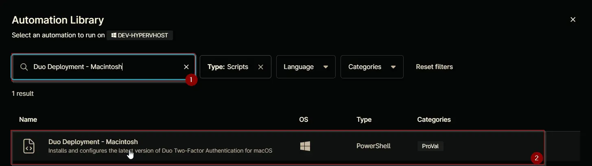
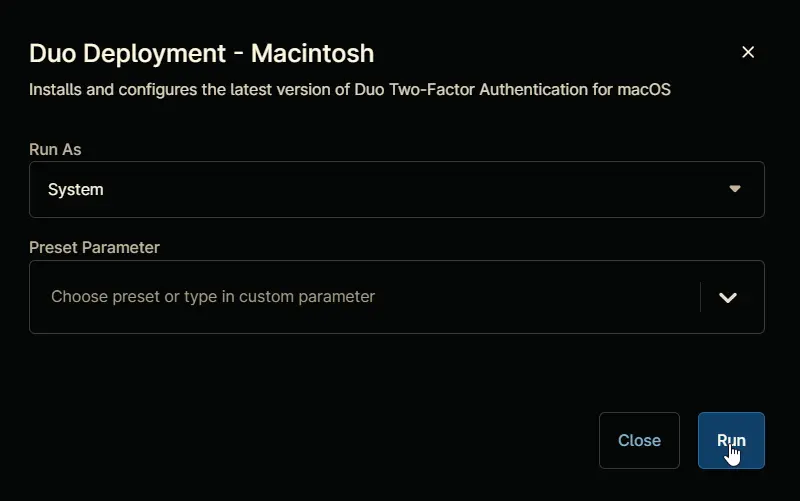

## Overview

Installs and configures the latest version of Duo Two-Factor Authentication for macOS.

Parameters Reference: [Duo Silent Install](https://duo.com/docs/macos)

## Sample Run

`Play Button` > `Run Automation` > `Script`  

Search and select `Duo Deployment - Macintosh`

Click the `Run` button to run the script.  
**Run As:** `System`  
**Preset Parameter:** `<Leave it Blank>`  

**Run Automation:** `Yes`  

## Dependencies

- [Solution - Duo Deployment](/docs/a11cd829-a491-4cb1-a7c1-3f56fa8c7557)
- [cPVAL DUO IKEY](/docs/ca460823-862e-4c38-8a30-72474f2b1b5a)  
- [cPVAL DUO SKEY](/docs/868d35d1-fe4e-4e65-b7a5-7661d0d33405)  
- [cPVAL DUO HKEY](/docs/b8a5b5bd-a7fe-4cd5-aae4-81a25a0be7fa)  
- [cPVAL DUO AUTOPUSH](/docs/3ce9e690-2bf1-4e78-9e66-04960f3f1b25)  
- [cPVAL DUO FAILOPEN](/docs/b3cbbe5c-f1a6-4f9f-99b7-9b0dbbca574e)  
- [cPVAL DUO SMARTCARD](/docs/f0c8a089-0c1b-4056-8375-c3601acc968d)

## Automation Setup/Import

[Automation Configuration](https://github.com/ProVal-Tech/ninjarmm/blob/main/scripts/duo-deployment-macintosh.sh)

## Output

- Activity Details

## Changelog

### 2026-05-25

* Updated the documentation to align with the new documentation format and standards.

### 2025-04-14

- Initial version of the document
