## Overview

This script will install or update DUO if the currently installed instance is older than the [latest released version](https://dl.duosecurity.com/duo-win-login-latest.exe). It matches the hash of the installer from the [official website](https://duo.com/docs/checksums#duo-windows-logon) before deploying it.

Parameters Reference: [Duo Silent Install](https://help.duo.com/s/article/1090?language=en_US)

## Sample Run

`Play Button` > `Run Automation` > `Script`  


Search and select `Duo Deployment - Windows`
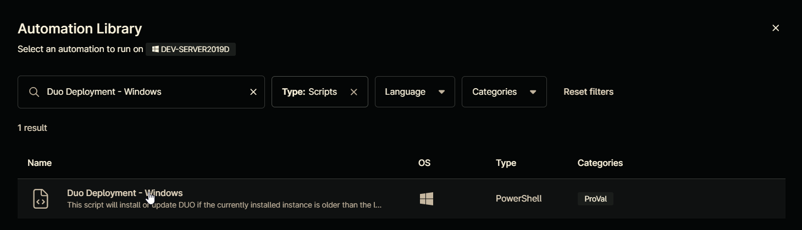

Set the required arguments and click the `Run` button to run the script.  
**Run As:** `System`  
**Preset Parameter:** `<Leave it Blank>`  
**DUO IKEY:** `Leave it blank or set this variable to override the value stored in the organization-level custom field 'cPVAL DUO IKEY'`  
**DUO SKEY:** `Leave it blank or set this variable to override the value stored in the organization-level custom field 'cPVAL DUO SKEY'`  
**DUO HKEY:** `Leave it blank or set this variable to override the value stored in the organization-level custom field 'cPVAL DUO HKEY'`  
**DUO AUTOPUSH:** `Leave it blank or set this variable to override the value stored in the organization-level custom field 'cPVAL DUO AUTOPUSH'`  
**DUO FAILOPEN:** `Leave it blank or set this variable to override the value stored in the organization-level custom field 'cPVAL DUO FAILOPEN'`  
**DUO SMARTCARD:** `Leave it blank or set this variable to override the value stored in the organization-level custom field 'cPVAL DUO SMARTCARD'`  
**DUO ENABLEOFFLINE:** `Leave it blank or set this variable to override the value stored in the organization-level custom field 'cPVAL DUO ENABLEOFFLINE'`  
**DUO RDPONLY:** `Leave it blank or set this variable to override the value stored in the organization-level custom field 'cPVAL DUO RDPONLY'`  
**DUO WRAPSMARTCARD:** `Leave it blank or set this variable to override the value stored in the organization-level custom field 'cPVAL DUO WRAPSMARTCARD'`  
**DUO USERNAMEFORMAT:** `Leave it blank or set this variable to override the value stored in the organization-level custom field 'cPVAL DUO USERNAMEFORMAT'`  
**DUO UAC_PROTECTMODE:** `Leave it blank or set this variable to override the value stored in the organization-level custom field 'cPVAL DUO UAC_PROTECTMODE'`  
**DUO UAC_OFFLINE:** `Leave it blank or set this variable to override the value stored in the organization-level custom field 'cPVAL DUO UAC_OFFLINE'`  
**DUO UAC_OFFLINE_ENROLL:** `Leave it blank or set this variable to override the value stored in the organization-level custom field 'cPVAL DUO UAC_OFFLINE_ENROLL'`
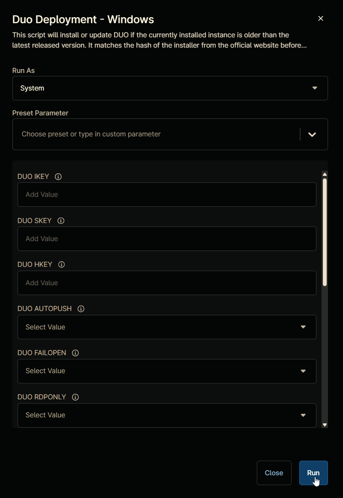

**Run Automation:** `Yes`  


## Dependencies

- [cPVAL DUO IKEY](/docs/ca460823-862e-4c38-8a30-72474f2b1b5a)  
- [cPVAL DUO SKEY](/docs/868d35d1-fe4e-4e65-b7a5-7661d0d33405)  
- [cPVAL DUO HKEY](/docs/b8a5b5bd-a7fe-4cd5-aae4-81a25a0be7fa)  
- [cPVAL DUO AUTOPUSH](/docs/3ce9e690-2bf1-4e78-9e66-04960f3f1b25)  
- [cPVAL DUO FAILOPEN](/docs/b3cbbe5c-f1a6-4f9f-99b7-9b0dbbca574e)  
- [cPVAL DUO SMARTCARD](/docs/f0c8a089-0c1b-4056-8375-c3601acc968d)  
- [cPVAL DUO ENABLEOFFLINE](/docs/4db3e2e3-adfc-465a-8dc8-026b2fc77b45)  
- [cPVAL DUO RDPONLY](/docs/1bef21cf-30ae-4f56-ab2b-8f2b6165806a)  
- [cPVAL DUO WRAPSMARTCARD](/docs/f7519fa5-6ffd-49a1-aab2-d63e3d1c1d3e)  
- [cPVAL DUO USERNAMEFORMAT](/docs/ca662111-e0a5-4318-8615-a00341257a1c)  
- [cPVAL DUO UAC_PROTECTMODE](/docs/61453e58-57fd-425e-aa68-0a1e003784d5)  
- [cPVAL DUO UAC_OFFLINE](/docs/bb3f2e8b-d772-4f42-9bb0-da16facafa0e)  
- [cPVAL DUO UAC_OFFLINE_ENROLL](/docs/a83d55b5-c765-4a82-84e1-03fbeb3e8606)

## Parameters

| Name | Required | Accepted Values | Default | Type | Description |
| ---- | -------- | --------------- | ------- | ---- | ----------- |
| DUO IKEY | False | | | String/Text | Set this variable to override the value stored in the organization-level custom field [cPVAL DUO IKEY](/docs/ca460823-862e-4c38-8a30-72474f2b1b5a) |
| DUO SKEY | False | | | String/Text | Set this variable to override the value stored in the organization-level custom field [cPVAL DUO SKEY](/docs/868d35d1-fe4e-4e65-b7a5-7661d0d33405) |
| DUO HKEY | False | | | String/Text | Set this variable to override the value stored in the organization-level custom field [cPVAL DUO HKEY](/docs/b8a5b5bd-a7fe-4cd5-aae4-81a25a0be7fa) |
| DUO AUTOPUSH | False | `0`,`1` | | Drop-down | Set this variable to override the value stored in the organization-level custom field [cPVAL DUO AUTOPUSH](/docs/3ce9e690-2bf1-4e78-9e66-04960f3f1b25) |
| DUO FAILOPEN | False | `0`,`1` | | Drop-down | Set this variable to override the value stored in the organization-level custom field [cPVAL DUO FAILOPEN](/docs/b3cbbe5c-f1a6-4f9f-99b7-9b0dbbca574e) |
| DUO SMARTCARD | False | `0`,`1` | | Drop-down | Set this variable to override the value stored in the organization-level custom field [cPVAL DUO SMARTCARD](/docs/f0c8a089-0c1b-4056-8375-c3601acc968d) |
| DUO ENABLEOFFLINE | False | `0`,`1` | | Drop-down | Set this variable to override the value stored in the organization-level custom field [cPVAL DUO ENABLEOFFLINE](/docs/4db3e2e3-adfc-465a-8dc8-026b2fc77b45) |
| DUO RDPONLY | False | `0`,`1` | | Drop-down | Set this variable to override the value stored in the organization-level custom field [cPVAL DUO RDPONLY](/docs/1bef21cf-30ae-4f56-ab2b-8f2b6165806a) |
| DUO WRAPSMARTCARD | False | `0`,`1` | | Drop-down | Set this variable to override the value stored in the organization-level custom field [cPVAL DUO WRAPSMARTCARD](/docs/f7519fa5-6ffd-49a1-aab2-d63e3d1c1d3e) |
| DUO USERNAMEFORMAT | False | `0`,`1`,`2` | | Drop-down | Set this variable to override the value stored in the organization-level custom field [cPVAL DUO USERNAMEFORMAT](/docs/ca662111-e0a5-4318-8615-a00341257a1c) |
| DUO UAC_PROTECTMODE | False | `0`,`1`,`2` | | Drop-down | Set this variable to override the value stored in the organization-level custom field [cPVAL DUO UAC_PROTECTMODE](/docs/61453e58-57fd-425e-aa68-0a1e003784d5) |
| DUO UAC_OFFLINE | False | `0`,`1` | | Drop-down | Set this variable to override the value stored in the organization-level custom field [cPVAL DUO UAC_OFFLINE](/docs/bb3f2e8b-d772-4f42-9bb0-da16facafa0e) |
| DUO UAC_OFFLINE_ENROLL | False | `0`,`1` | | Drop-down | Set this variable to override the value stored in the organization-level custom field [cPVAL DUO UAC_OFFLINE_ENROLL](/docs/a83d55b5-c765-4a82-84e1-03fbeb3e8606) |

## Automation Setup/Import

### Step 1

Navigate to `Administration` > `Library` > `Automation`  


### Step 2

Locate the `Add` button on the right-hand side of the screen, click on it and click the `New Script` button.  


The scripting window will open.  


### Step 3

Configure the `Create Script` section as follows:

**Name:** `Duo Deployment - Windows`  
**Description:** `This script will install or update DUO if the currently installed instance is older than the latest released version. It matches the hash of the installer from the official website before deploying it.`  
**Categories:** `ProVal`  
**Language:** `PowerShell`  
**Operating System:** `Windows`  
**Architecture:** `All`  
**Run As:** `System`  
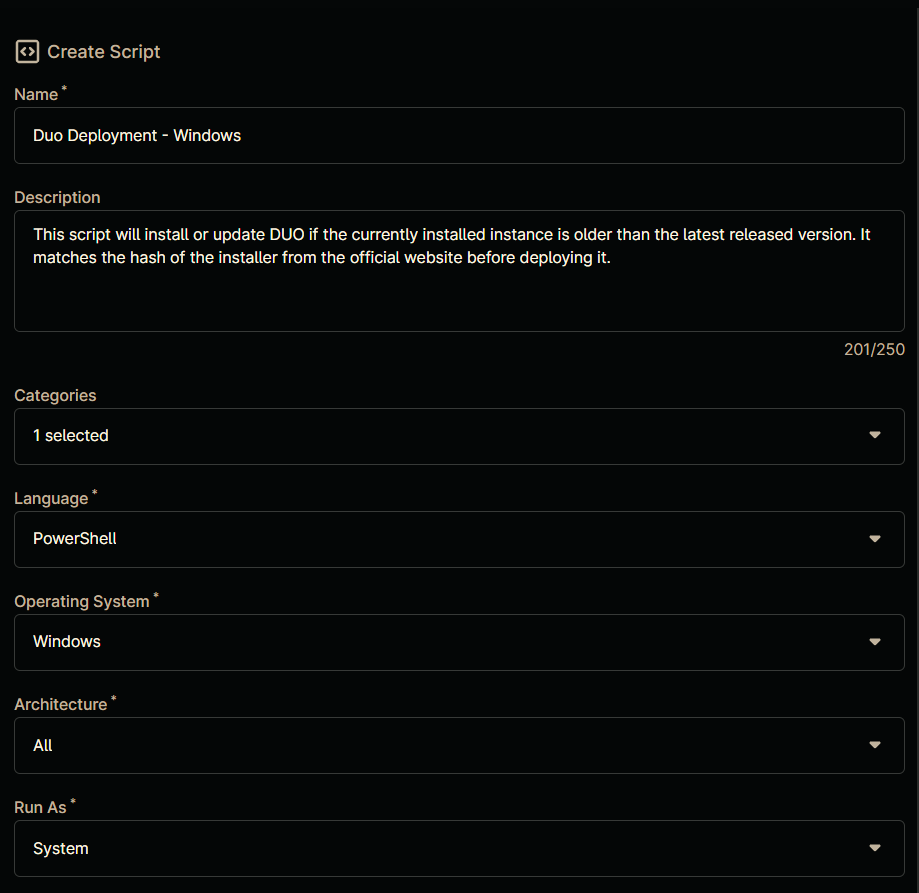

## Step 4

Paste the following powershell script in the scripting section:  

```PowerShell
#requires -RunAsAdministrator
#requires -Version 5.1

<#
.SYNOPSIS
Automates the installation or update of Duo Authentication for Windows Logon.

.DESCRIPTION
This script is designed to automate the installation or update process for Duo Authentication for Windows Logon. It performs the following steps:

1. **Environment Preparation**:
   - Ensures the script is run with administrative privileges.
   - Configures script environment variables and constants, such as working directories, download URLs, and log file paths.
   - Enforces TLS 1.2 for secure network communications.
   - Prepares a clean working directory by removing any existing files and ensuring proper permissions.

2. **Configuration Retrieval**:
   - Retrieves Duo configuration values (e.g., IKEY, SKEY, HOST) from environment variables or NinjaRMM custom fields.
   - Validates the presence of required configuration values and throws errors if any are missing.
   - Configures optional Duo settings such as AutoPush, FailOpen, RdpOnly, SmartCard, and UAC-related options based on environment variables or custom fields.

3. **Version Comparison**:
   - Fetches the latest version of the Duo installer from the Duo Security website.
   - Compares the installed version (if any) with the latest version to determine if an update is required.

4. **Installer Download and Validation**:
   - Downloads the latest Duo installer from the official Duo Security URL.
   - Verifies the integrity of the downloaded installer by comparing its SHA256 hash with the vendor-provided hash.

5. **Installation**:
   - Constructs the installation arguments dynamically based on the retrieved configuration values.
   - Unblocks the downloaded installer file to ensure it can be executed.
   - Executes the installer with the constructed arguments in silent mode and waits for the process to complete.

6. **Validation**:
   - Waits for 30 seconds after installation to allow the system to register the changes.
   - Checks the installed version of Duo Authentication for Windows Logon in the system registry.
   - Confirms if the installed version matches the latest version and provides appropriate success or error messages.

7. **Cleanup**:
   - Removes the working directory and any temporary files created during the script execution.

.PARAMETER None
This script does not accept any parameters. All configuration values are retrieved from environment variables or NinjaRMM custom fields.

.NOTES
- Requires PowerShell 5.1 or later.
- Must be run with administrative privileges.
- Designed for use in NinjaRMM.
- Logs installation details to a specified log file for troubleshooting purposes.

.EXAMPLE
.\Install-DUONinjaRMM.ps1
Runs the script to install or update Duo Authentication for Windows Logon using the configuration values provided in the environment or NinjaRMM custom fields.
#>

Begin {
    #region Ninja Variables
    $productType = (Get-CimInstance -ClassName WIn32_OperatingSystem -ErrorAction SilentlyContinue).ProductType

    #Duo IKEY
    $cfDuoIKey = Ninja-Property-Get 'cpvalDuoIkey'
    if (-not [string]::IsNullOrEmpty($env:duoIkey)) {
        $iKey = $env:duoIkey  # Prefer runtime environment variable
    } elseif (-not [string]::IsNullOrEmpty($cfDuoIKey)) {
        $iKey = $cfDuoIKey  # Fallback to NinjaRMM custom field
    } else {
        throw 'Error: DUO integration key is missing. Please set the DUO integration Key in the custom field ''cPVAL DUO IKEY'' or as the runtime variable ''DUO IKEY''.'
    }

    #Duo SKEY
    $cfDuoSKey = Ninja-Property-Get 'cpvalDuoSkey'
    if (-not [string]::IsNullOrEmpty($env:duoSkey)) {
        $sKey = $env:duoSkey  # Prefer runtime environment variable
    } elseif (-not [string]::IsNullOrEmpty($cfDuoSKey)) {
        $sKey = $cfDuoSKey  # Fallback to NinjaRMM custom field
    } else {
        throw 'Error: DUO secret key is missing. Please set the DUO secret Key in the custom field ''cPVAL DUO SKEY'' or as the runtime variable ''DUO SKEY''.'
    }

    #Duo HKEY
    $cfDuoHKey = Ninja-Property-Get 'cpvalDuoHkey'
    if (-not [string]::IsNullOrEmpty($env:duoHkey)) {
        $hKey = $env:duoHkey  # Prefer runtime environment variable
    } elseif (-not [string]::IsNullOrEmpty($cfDuoHKey)) {
        $hKey = $cfDuoHKey  # Fallback to NinjaRMM custom field
    } else {
        throw 'Error: DUO API hostname is missing. Please set the DUO API hostname Key in the custom field ''cPVAL DUO HKEY'' or as the runtime variable ''DUO HKEY''.'
    }

    #Duo AutoPush
    $cfDuoAutoPush = Ninja-Property-Get 'cpvalDuoAutopush'
    if (-not [string]::IsNullOrEmpty($env:duoAutopush)) {
        $autoPush = $env:duoAutopush  # Prefer runtime environment variable
    } elseif (-not [string]::IsNullOrEmpty($cfDuoAutoPush)) {
        $autoPush = $cfDuoAutoPush  # Fallback to NinjaRMM custom field
    }
    $autoPush = Switch ($autoPush) {
        '0' { '0' }
        '1' { '1' }
        'Disabled' { '0' }
        'All' { '1' }
        'Windows' { '1' }
        'Windows Workstations' { if ( $productType -eq 1 ) { '1' } else { $null } }
        'Windows Servers' { if ( $productType -ne 1 ) { '1' } else { $null } }
        Default { $null }
    }

    #Duo FailOpen
    $cfDuoFailopen = Ninja-Property-Get 'cpvalDuoFailopen'
    if (-not [string]::IsNullOrEmpty($env:duoFailopen)) {
        $failOpen = $env:duoFailopen  # Prefer runtime environment variable
    } elseif (-not [string]::IsNullOrEmpty($cfDuoFailopen)) {
        $failOpen = $cfDuoFailopen  # Fallback to NinjaRMM custom field
    }
    $failOpen = Switch ($failOpen) {
        '0' { '0' }
        '1' { '1' }
        'Disabled' { '0' }
        'All' { '1' }
        'Windows' { '1' }
        'Windows Workstations' { if ( $productType -eq 1 ) { '1' } else { $null } }
        'Windows Servers' { if ( $productType -ne 1 ) { '1' } else { $null } }
        Default { $null }
    }

    #Duo RdpOnly
    $cfDuoRdponly = Ninja-Property-Get 'cpvalDuoRdponly'
    if (-not [string]::IsNullOrEmpty($env:duoRdponly)) {
        $rdpOnly = $env:duoRdponly  # Prefer runtime environment variable
    } elseif (-not [string]::IsNullOrEmpty($cfDuoRdponly)) {
        $rdpOnly = $cfDuoRdponly  # Fallback to NinjaRMM custom field
    }
    $rdpOnly = Switch ($rdpOnly) {
        '0' { '0' }
        '1' { '1' }
        'Disabled' { '0' }
        'Windows' { '1' }
        'Windows Workstations' { if ( $productType -eq 1 ) { '1' } else { $null } }
        'Windows Servers' { if ( $productType -ne 1 ) { '1' } else { $null } }
        Default { $null }
    }

    #Duo SmartCard
    $cfDuoSmartCard = Ninja-Property-Get 'cpvalDuoSmartcard'
    if (-not [string]::IsNullOrEmpty($env:duoSmartcard)) {
        $smartCard = $env:duoSmartcard  # Prefer runtime environment variable
    } elseif (-not [string]::IsNullOrEmpty($cfDuoSmartCard)) {
        $smartCard = $cfDuoSmartCard  # Fallback to NinjaRMM custom field
    }
    $smartCard = Switch ($smartCard) {
        '0' { '0' }
        '1' { '1' }
        'Disabled' { '0' }
        'All' { '1' }
        'Windows' { '1' }
        'Windows Workstations' { if ( $productType -eq 1 ) { '1' } else { $null } }
        'Windows Servers' { if ( $productType -ne 1 ) { '1' } else { $null } }
        Default { $null }
    }

    #Duo WrapSmartCard
    $cfDuoWrapsmartCard = Ninja-Property-Get 'cpvalDuoWrapsmartcard'
    if (-not [string]::IsNullOrEmpty($env:duoWrapsmartcard)) {
        $wrapSmartCard = $env:duoWrapsmartcard  # Prefer runtime environment variable
    } elseif (-not [string]::IsNullOrEmpty($cfDuoWrapsmartCard)) {
        $wrapSmartCard = $cfDuoWrapsmartCard  # Fallback to NinjaRMM custom field
    }
    $wrapSmartCard = Switch ($wrapSmartCard) {
        '0' { '0' }
        '1' { '1' }
        'Disabled' { '0' }
        'Windows' { '1' }
        'Windows Workstations' { if ( $productType -eq 1 ) { '1' } else { $null } }
        'Windows Servers' { if ( $productType -ne 1 ) { '1' } else { $null } }
        Default { $null }
    }

    #Duo EnableOffline
    $cfDuoEnableoffline = Ninja-Property-Get 'cpvalDuoEnableoffline'
    if (-not [string]::IsNullOrEmpty($env:duoEnableoffline)) {
        $enableOffline = $env:duoEnableoffline  # Prefer runtime environment variable
    } elseif (-not [string]::IsNullOrEmpty($cfDuoEnableoffline)) {
        $enableOffline = $cfDuoEnableoffline  # Fallback to NinjaRMM custom field
    }
    $enableOffline = Switch ($enableOffline) {
        '0' { '0' }
        '1' { '1' }
        'Disabled' { '0' }
        'Windows' { '1' }
        'Windows Workstations' { if ( $productType -eq 1 ) { '1' } else { $null } }
        'Windows Servers' { if ( $productType -ne 1 ) { '1' } else { $null } }
        Default { $null }
    }

    #Duo UserNameFormat
    $cfDuoUsernameformat = Ninja-Property-Get 'cpvalDuoUsernameformat'
    if (-not [string]::IsNullOrEmpty($env:duoUsernameformat)) {
        $userNameFormat = $env:duoUsernameformat  # Prefer runtime environment variable
    } elseif (-not [string]::IsNullOrEmpty($cfDuoUsernameformat)) {
        $userNameFormat = $cfDuoUsernameformat  # Fallback to NinjaRMM custom field
    }
    $userNameFormat = Switch ($userNameFormat) {
        '0' { '0' }
        '1' { '1' }
        '2' { '2' }
        Default { $null }
    }

    #Duo UAC_ProtectMode
    $cfDuoUacprotectmode = Ninja-Property-Get 'cpvalDuoUacprotectmode'
    if (-not [string]::IsNullOrEmpty($env:duoUac_protectmode)) {
        $uacProtectMode = $env:duoUac_protectmode  # Prefer runtime environment variable
    } elseif (-not [string]::IsNullOrEmpty($cfDuoUacprotectmode)) {
        $uacProtectMode = $cfDuoUacprotectmode  # Fallback to NinjaRMM custom field
    }
    $uacProtectMode = Switch ($uacProtectMode) {
        '0' { '0' }
        '1' { '1' }
        '2' { '2' }
        Default { $null }
    }

    #Duo  UAC_Offline
    $cfDuoUacoffline = Ninja-Property-Get 'cpvalDuoUacoffline'
    if (-not [string]::IsNullOrEmpty($env:duoUac_offline)) {
        $uacOffline = $env:duoUac_offline  # Prefer runtime environment variable
    } elseif (-not [string]::IsNullOrEmpty($cfDuoUacoffline)) {
        $uacOffline = $cfDuoUacoffline  # Fallback to NinjaRMM custom field
    }
    $uacOffline = Switch ($uacOffline) {
        '0' { '0' }
        '1' { '1' }
        Default { $null }
    }

    #Duo UAC_Offline_Enroll
    $cfDuoUacofflineenroll = Ninja-Property-Get 'cpvalDuoUacofflineenroll'
    if (-not [string]::IsNullOrEmpty($env:duoUac_offline_enroll)) {
        $uacOfflineEnroll = $env:duoUac_offline_enroll  # Prefer runtime environment variable
    } elseif (-not [string]::IsNullOrEmpty($cfDuoUacofflineenroll)) {
        $uacOfflineEnroll = $cfDuoUacofflineenroll  # Fallback to NinjaRMM custom field
    }
    $uacOfflineEnroll = Switch ($uacOfflineEnroll) {
        '0' { '0' }
        '1' { '1' }
        Default { $null }
    }
    #regionEnd

    #region Variables - Configure script environment and define constants
    # Suppress progress bars for cleaner output in automated environments
    $ProgressPreference = 'SilentlyContinue'
    # Disable confirmation prompts to allow unattended execution
    $ConfirmPreference = 'None'
    # Enforce TLS 1.2 for secure network communications
    [Net.ServicePointManager]::SecurityProtocol = [Enum]::ToObject([Net.SecurityProtocolType], 3072)

    # Define core script parameters
    $appName = 'Duo-win-login'  # Base name for project-related files
    $workingDirectory = 'C:\ProgramData\_automation\app\{0}' -f $appName  # Centralized working directory
    $appPath = '{0}\{1}.exe' -f $workingDirectory, $appName  # Full path to installation script
    $appDownloadUrl = 'https://dl.duosecurity.com/duo-win-login-latest.exe'  # DUO latest version download url
    $hashUrl = 'https://duo.com/docs/checksums#duo-windows-logon' #File Hash for latest Duo Installer

    #region workingDirectory - Prepare clean execution environment
    # Remove existing directory to prevent file conflicts
    Remove-Item -Path $workingDirectory -Recurse -Force -ErrorAction SilentlyContinue

    # Create fresh working directory with error handling
    if (-not (Test-Path $workingDirectory)) {
        try {
            New-Item -Path $workingDirectory -ItemType Directory -Force -ErrorAction Stop | Out-Null
        } catch {
            throw ('Error: Failed to Create {0}. Reason: {1}' -f $workingDirectory, $($Error[0].Exception.Message))
        }
    }

    # Ensure full permissions for automated operations
    if (-not ( ( ( Get-Acl $workingDirectory ).Access | Where-Object { $_.IdentityReference -Match 'EveryOne' } ).FileSystemRights -Match 'FullControl' )) {
        $acl = Get-Acl $workingDirectory
        $AccessRule = New-Object System.Security.AccessControl.FileSystemAccessRule('Everyone', 'FullControl', 'ContainerInherit, ObjectInherit', 'none', 'Allow')
        $acl.AddAccessRule($AccessRule)
        Set-Acl $workingDirectory $acl -ErrorAction SilentlyContinue
    }
    #endRegion
}

Process {
    #region Remove erroneous directory
    $pathToRemove = 'C:\Windows\Temp\{4804031F-0496-4E9A-BD3D-E6B637D29EA7}'
    if (Test-Path -Path $pathToRemove) {
        try {
            Remove-Item -Path $pathToRemove -Force -Recurse -ErrorAction Stop
        } catch {
            Write-Information ('Warning: Failed to remove ''{0}''. Proceeding with installation without removing the directory.' -f $pathToRemove) -InformationAction Continue
        }
    }
    #endRegion

    #region Version Comparison
    try {
        $iwrHeader = Invoke-WebRequest -Uri $appDownloadUrl -UseBasicParsing -Method Head -ErrorAction Stop
    } catch {
        throw ('Error: Unable to reach download Url ({0}). A security application or firewall rule seem to be preventing it.' -f $appDownloadUrl)
    }
    $fileName = ($iwrHeader.Headers.'Content-Disposition' -split '=')[-1] -replace '"', ''
    [Version]$latestVersion = $fileName -replace 'duo-win-login-', '' -replace '\.exe', ''

    $installedVersion = Get-ChildItem -Path 'HKLM:\SOFTWARE\Microsoft\Windows\CurrentVersion\Uninstall', 'HKLM:\SOFTWARE\Wow6432Node\Microsoft\Windows\CurrentVersion\Uninstall' |
        Get-ItemProperty |
        Where-Object { $_.DisplayName -match 'Duo Authentication for Windows Logon' } |
        Select-Object -ExpandProperty DisplayVersion

    if ($installedVersion) {
        if ([Version]$latestVersion -le [Version]$installedVersion) {
            return 'Information: Latest version {0} of Duo Authentication for Windows Logon is already installed' -f $installedVersion
        } else {
            Write-Information ('Information: Installed Version: {0}; Latest Version: {1}' -f $installedVersion, $latestVersion) -InformationAction Continue
        }
    } else {
        Write-Information ('Information: Duo Authentication for Windows Logon is not installed. Installing the latest version {0}' -f $latestVersion) -InformationAction Continue
    }
    #endRegion

    #region Download Installer
    try {
        Invoke-WebRequest -Uri $appDownloadUrl -OutFile $appPath -UseBasicParsing -ErrorAction Stop
    } catch {
        throw ('Error: Failed to download installer from the download url: {0}. Reason: {1}' -f $appDownloadUrl, $($Error[0].Exception.Message))
    }
    #endRegion

    #region Compare Hash
    try {
        $iwrHash = Invoke-WebRequest -Uri $hashUrl -UseBasicParsing -ErrorAction Stop
    } catch {
        throw ('Error: Unable to reach Url ({0}) to fetch authentic file hash. A security application or firewall rule seem to be preventing it.' -f $hashUrl)
    }
    $iwrhash.RawContent -match "([a-z0-9]{64}) +$fileName" | Out-Null
    $authenticHash = $matches[1]

    $downloadedFileHash = (Get-FileHash -Path $appPath -Algorithm SHA256).Hash

    if ($downloadedFileHash -ne $authenticHash) {
        throw ('Error: SHA256 Hash of the installer downloaded from the download url {0} is not matching the Authentic Hash provided by vendor at {1}. Authentic Hash: {2}; Downloaded Installer Hash: {3}' -f $appDownloadUrl, $hashUrl, $authenticHash, $downloadedFileHash)
    }
    #endRegion

    #region Create Parameter
    $additionalArguments = ''

    if ($autoPush -in ('0', '1')) {
        $additionalArguments = '{0} AUTOPUSH="#{1}"' -f $additionalArguments, $autoPush
    }

    if ($failOpen -in ('0', '1')) {
        $additionalArguments = '{0} FAILOPEN="#{1}"' -f $additionalArguments, $failOpen
    }

    if ($rdpOnly -in ('0', '1')) {
        $additionalArguments = '{0} RDPONLY="#{1}"' -f $additionalArguments, $rdpOnly
    }

    if ($smartCard -in ('0', '1')) {
        $additionalArguments = '{0} SMARTCARD="#{1}"' -f $additionalArguments, $smartCard
    }

    if ($wrapSmartCard -in ('0', '1')) {
        $additionalArguments = '{0} WRAPSMARTCARD="#{1}"' -f $additionalArguments, $wrapSmartCard
    }

    if ($enableOffline -in ('0', '1')) {
        $additionalArguments = '{0} ENABLEOFFLINE="#{1}"' -f $additionalArguments, $enableOffline
    }

    if ($userNameFormat -in ('0', '1', '2')) {
        $additionalArguments = '{0} USERNAMEFORMAT="#{1}"' -f $additionalArguments, $userNameFormat
    }

    if ($uacProtectMode -in ('0', '1', '2')) {
        $additionalArguments = '{0} UAC_PROTECTMODE="#{1}"' -f $additionalArguments, $uacProtectMode
    }

    if ($uacOffline -in ('0', '1')) {
        $additionalArguments = '{0} UAC_OFFLINE="#{1}"' -f $additionalArguments, $uacOffline
    }

    if ($uacOfflineEnroll -in ('0', '1')) {
        $additionalArguments = '{0} UAC_OFFLINE_ENROLL="#{1}"' -f $additionalArguments, $uacOfflineEnroll
    }

    $argument = '/S /V" /qn IKEY="{0}" SKEY="{1}" HOST="{2}" {3}"' -f $iKey, $sKey, $hKey, $additionalArguments.Trim()

    Write-Information ('Information: Installation Arguments: {0}' -f $argument) -InformationAction Continue
    #endRegion

    #region Install
    Unblock-File -Path $appPath -ErrorAction SilentlyContinue

    try {
        Start-Process -FilePath $appPath -ArgumentList $argument -Wait -ErrorAction Stop
    } catch {
        throw ('Error: Failed to initiate the install process. Reason: {0}' -f $Error[0].Exception.Message)
    }
    #endRegion

    #region Validation
    Start-Sleep -Seconds 30

    $installedVersion = Get-ChildItem -Path 'HKLM:\SOFTWARE\Microsoft\Windows\CurrentVersion\Uninstall', 'HKLM:\SOFTWARE\Wow6432Node\Microsoft\Windows\CurrentVersion\Uninstall' |
        Get-ItemProperty |
        Where-Object { $_.DisplayName -match 'Duo Authentication for Windows Logon' } |
        Select-Object -ExpandProperty DisplayVersion

    if ($installedVersion) {
        if ([Version]$latestVersion -le [Version]$installedVersion) {
            return 'Information: Successfully installed the latest version {0} of Duo Authentication for Windows Logon.' -f $installedVersion
        } else {
            throw ('Error: Failed to update Duo Authentication for Windows Logon to the latest version: {0}. Installed Version is {1}.' -f $latestVersion, $installedVersion)
        }
    } else {
        throw ('Error: Failed to install the latest version {0} of Duo Authentication for Windows Logon.' -f $latestVersion)
    }
    #endRegion
}

End {
    #region Cleanup
    Get-ChildItem $workingDirectory -Recurse -Force -ErrorAction SilentlyContinue | Remove-Item -Force -Recurse
    #endRegion
}
```

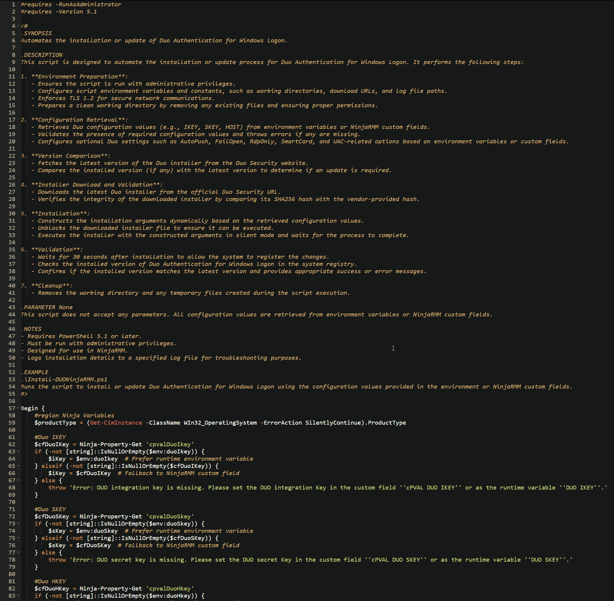

## Script Variables

### DUO IKEY

Click the `Add` button next to `Script Variables`.  


Select the `String/Text` option.  


The `Add String/Text Variable` window will open.  


In the box, fill in the following details and select `Add` to create the script variable.  

**Name:** `DUO IKEY`  
**Description:** `Set this variable to override the value stored in the organization-level custom field cPVAL DUO IKEY`  
**Mandatory:** `<Leave it Unchecked>`  
**Set Default Value:** `<Leave it blank>`

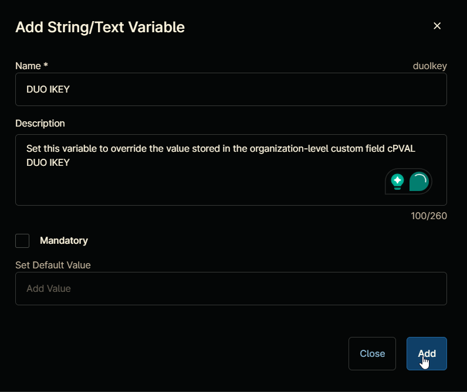

### DUO SKEY

Click the `Add` button next to `Script Variables`.  


Select the `String/Text` option.  


The `Add String/Text Variable` window will open.  


In the box, fill in the following details and select `Add` to create the script variable.  

**Name:** `DUO SKEY`  
**Description:** `Set this variable to override the value stored in the organization-level custom field cPVAL DUO SKEY`  
**Mandatory:** `<Leave it Unchecked>`  
**Set Default Value:** `<Leave it blank>`

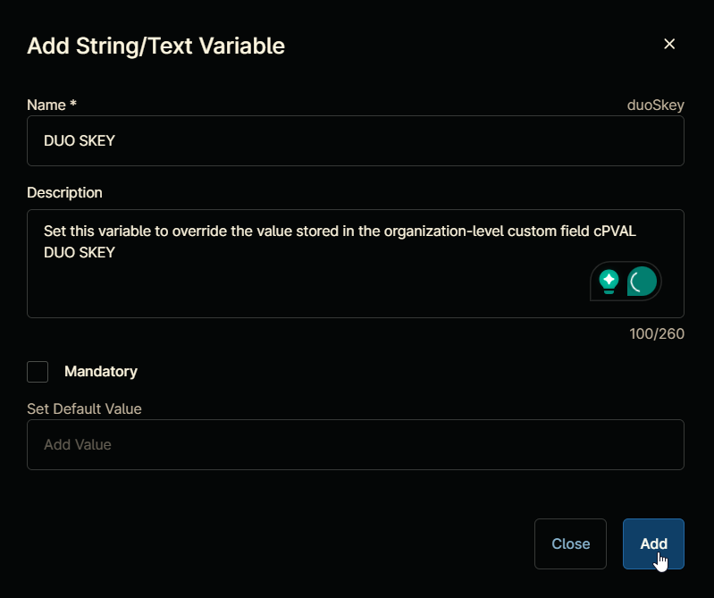

### DUO HKEY

Click the `Add` button next to `Script Variables`.  


Select the `String/Text` option.  


The `Add String/Text Variable` window will open.  


In the box, fill in the following details and select `Add` to create the script variable.  

**Name:** `DUO HKEY`  
**Description:** `Set this variable to override the value stored in the organization-level custom field cPVAL DUO HKEY`  
**Mandatory:** `<Leave it Unchecked>`  
**Set Default Value:** `<Leave it blank>`

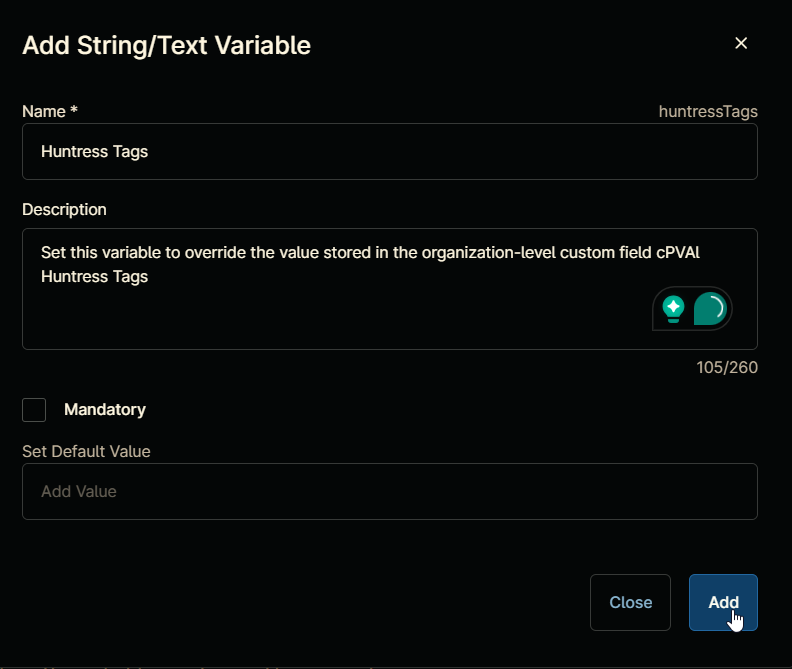

### DUO AUTOPUSH

Click the `Add` button next to `Script Variables`.  


Select the `Drop-down` option.  


The `Add Drop-down Variable` window will open.  
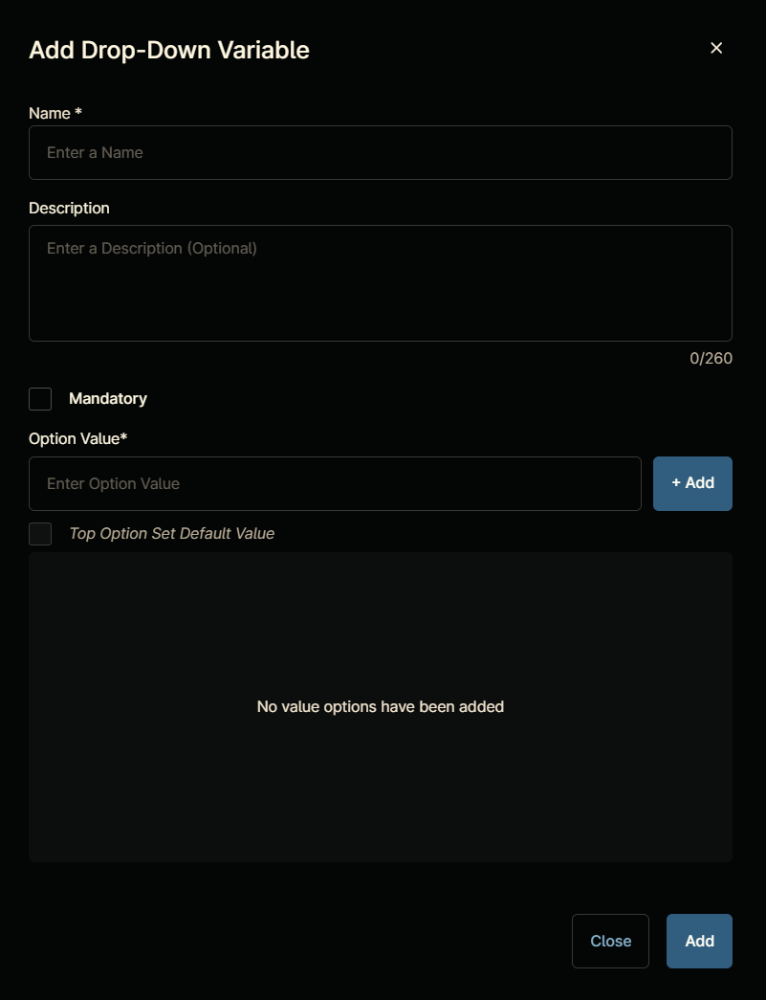

In the box, fill in the following details and select `Add` to create the script variable.

**Name:** `DUO AUTOPUSH`  
**Description:** `Set this variable to override the value stored in the organization-level custom field cPVAL DUO AUTOPUSH`  
**Mandatory:** `<Leave it Unchecked>`  

**Option Value:** Configure the following options in the specified order. To add an option, paste it and click the `Add` button:

- `0`  
- `1`  

**Top Option Set Default Value:** `True`  

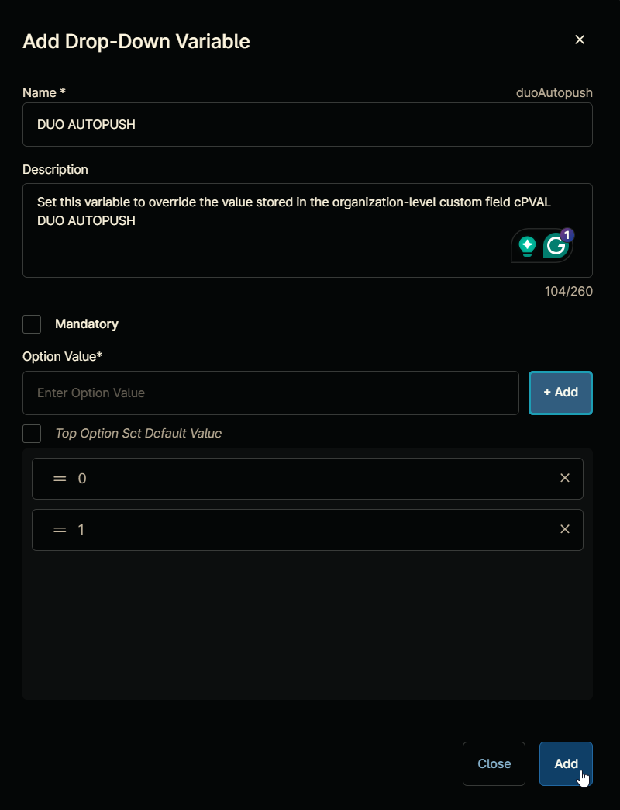

### DUO FAILOPEN

Click the `Add` button next to `Script Variables`.  


Select the `Drop-down` option.  


The `Add Drop-down Variable` window will open.  


In the box, fill in the following details and select `Add` to create the script variable.

**Name:** `DUO FAILOPEN`  
**Description:** `Set this variable to override the value stored in the organization-level custom field cPVAL DUO FAILOPEN`  
**Mandatory:** `<Leave it Unchecked>`  

**Option Value:** Configure the following options in the specified order. To add an option, paste it and click the `Add` button:

- `0`  
- `1`  

**Top Option Set Default Value:** `True`  


### DUO SMARTCARD

Click the `Add` button next to `Script Variables`.  


Select the `Drop-down` option.  


The `Add Drop-down Variable` window will open.  


In the box, fill in the following details and select `Add` to create the script variable.

**Name:** `DUO SMARTCARD`  
**Description:** `Set this variable to override the value stored in the organization-level custom field cPVAL DUO SMARTCARD`  
**Mandatory:** `<Leave it Unchecked>`  

**Option Value:** Configure the following options in the specified order. To add an option, paste it and click the `Add` button:

- `0`  
- `1`  

**Top Option Set Default Value:** `True`  

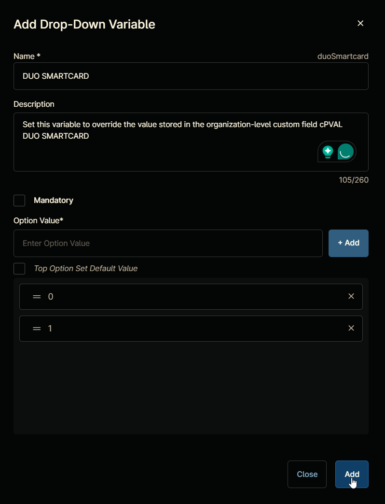

### DUO ENABLEOFFLINE

Click the `Add` button next to `Script Variables`.  


Select the `Drop-down` option.  


The `Add Drop-down Variable` window will open.  


In the box, fill in the following details and select `Add` to create the script variable.

**Name:** `DUO ENABLEOFFLINE`  
**Description:** `Set this variable to override the value stored in the organization-level custom field cPVAL DUO ENABLEOFFLINE`  
**Mandatory:** `<Leave it Unchecked>`  

**Option Value:** Configure the following options in the specified order. To add an option, paste it and click the `Add` button:

- `0`  
- `1`  

**Top Option Set Default Value:** `True`  

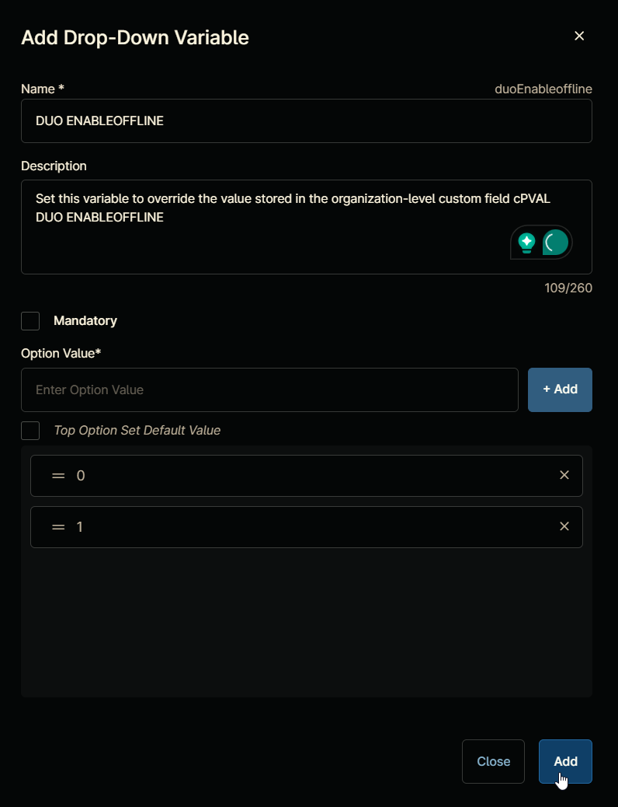

### DUO RDPONLY

Click the `Add` button next to `Script Variables`.  


Select the `Drop-down` option.  


The `Add Drop-down Variable` window will open.  


In the box, fill in the following details and select `Add` to create the script variable.

**Name:** `DUO RDPONLY`  
**Description:** `Set this variable to override the value stored in the organization-level custom field cPVAL DUO RDPONLY`  
**Mandatory:** `<Leave it Unchecked>`  

**Option Value:** Configure the following options in the specified order. To add an option, paste it and click the `Add` button:

- `0`  
- `1`  

**Top Option Set Default Value:** `True`  

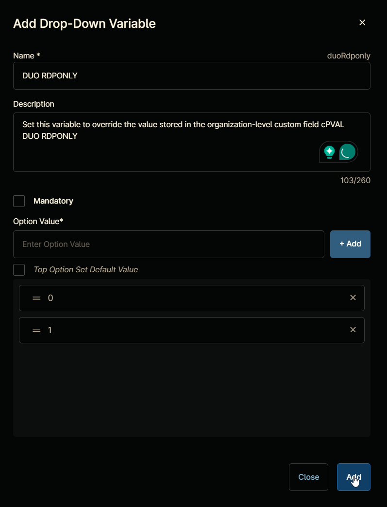

### DUO WRAPSMARTCARD

Click the `Add` button next to `Script Variables`.  


Select the `Drop-down` option.  


The `Add Drop-down Variable` window will open.  


In the box, fill in the following details and select `Add` to create the script variable.

**Name:** `DUO WRAPSMARTCARD`  
**Description:** `Set this variable to override the value stored in the organization-level custom field cPVAL DUO WRAPSMARTCARD`  
**Mandatory:** `<Leave it Unchecked>`  

**Option Value:** Configure the following options in the specified order. To add an option, paste it and click the `Add` button:

- `0`  
- `1`  

**Top Option Set Default Value:** `True`  

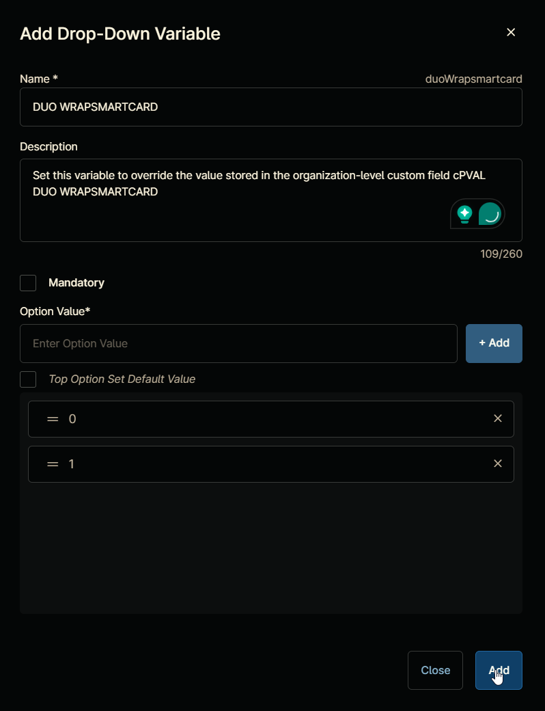

### DUO USERNAMEFORMAT

Click the `Add` button next to `Script Variables`.  


Select the `Drop-down` option.  


The `Add Drop-down Variable` window will open.  


In the box, fill in the following details and select `Add` to create the script variable.

**Name:** `DUO USERNAMEFORMAT`  
**Description:** `Set this variable to override the value stored in the organization-level custom field cPVAL DUO USERNAMEFORMAT`  
**Mandatory:** `<Leave it Unchecked>`  

**Option Value:** Configure the following options in the specified order. To add an option, paste it and click the `Add` button:

- `0`  
- `1`  
- `2`

**Top Option Set Default Value:** `True`  

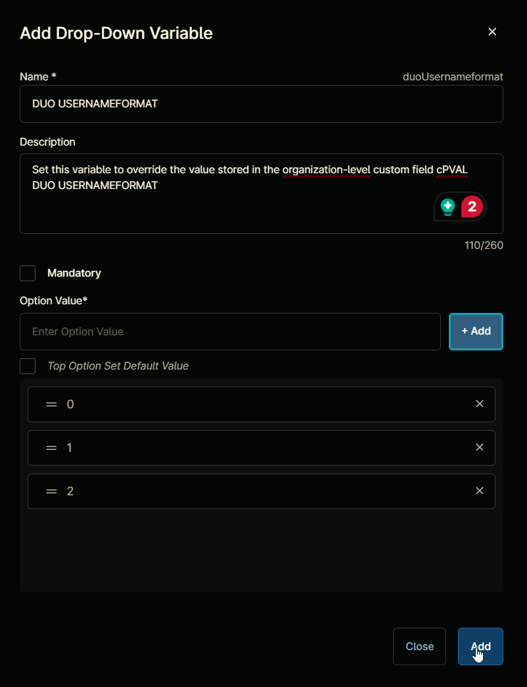

### DUO UAC_PROTECTMODE

Click the `Add` button next to `Script Variables`.  


Select the `Drop-down` option.  


The `Add Drop-down Variable` window will open.  


In the box, fill in the following details and select `Add` to create the script variable.

**Name:** `DUO UAC_PROTECTMODE`  
**Description:** `Set this variable to override the value stored in the organization-level custom field cPVAL DUO UAC_PROTECTMODE`  
**Mandatory:** `<Leave it Unchecked>`  

**Option Value:** Configure the following options in the specified order. To add an option, paste it and click the `Add` button:

- `0`  
- `1`  
- `2`

**Top Option Set Default Value:** `True`  

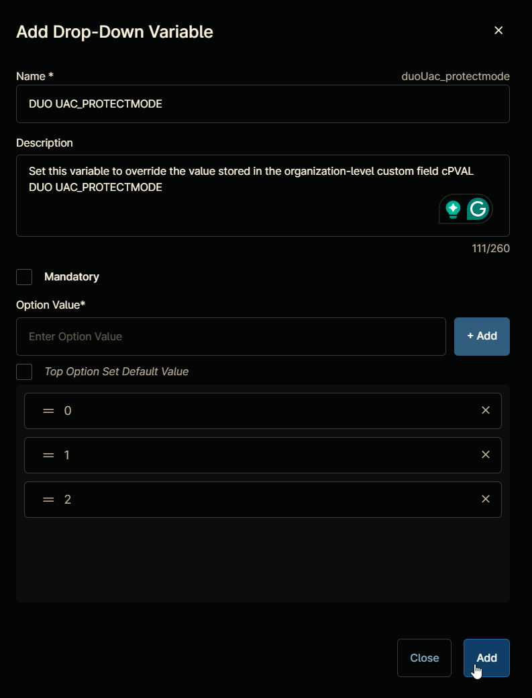

### DUO UAC_OFFLINE

Click the `Add` button next to `Script Variables`.  


Select the `Drop-down` option.  


The `Add Drop-down Variable` window will open.  


In the box, fill in the following details and select `Add` to create the script variable.

**Name:** `DUO UAC_OFFLINE`  
**Description:** `Set this variable to override the value stored in the organization-level custom field cPVAL DUO UAC_OFFLINE`  
**Mandatory:** `<Leave it Unchecked>`  

**Option Value:** Configure the following options in the specified order. To add an option, paste it and click the `Add` button:

- `0`  
- `1`  

**Top Option Set Default Value:** `True`  

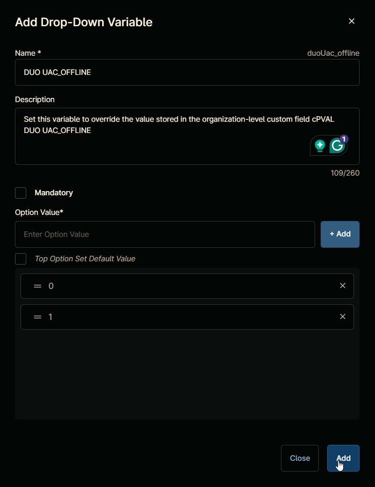

### DUO UAC_OFFLINE_ENROLL

Click the `Add` button next to `Script Variables`.  


Select the `Drop-down` option.  


The `Add Drop-down Variable` window will open.  


In the box, fill in the following details and select `Add` to create the script variable.

**Name:** `DUO UAC_OFFLINE_ENROLL`  
**Description:** `Set this variable to override the value stored in the organization-level custom field cPVAL DUO UAC_OFFLINE_ENROLL`  
**Mandatory:** `<Leave it Unchecked>`  

**Option Value:** Configure the following options in the specified order. To add an option, paste it and click the `Add` button:

- `0`  
- `1`  

**Top Option Set Default Value:** `True`  

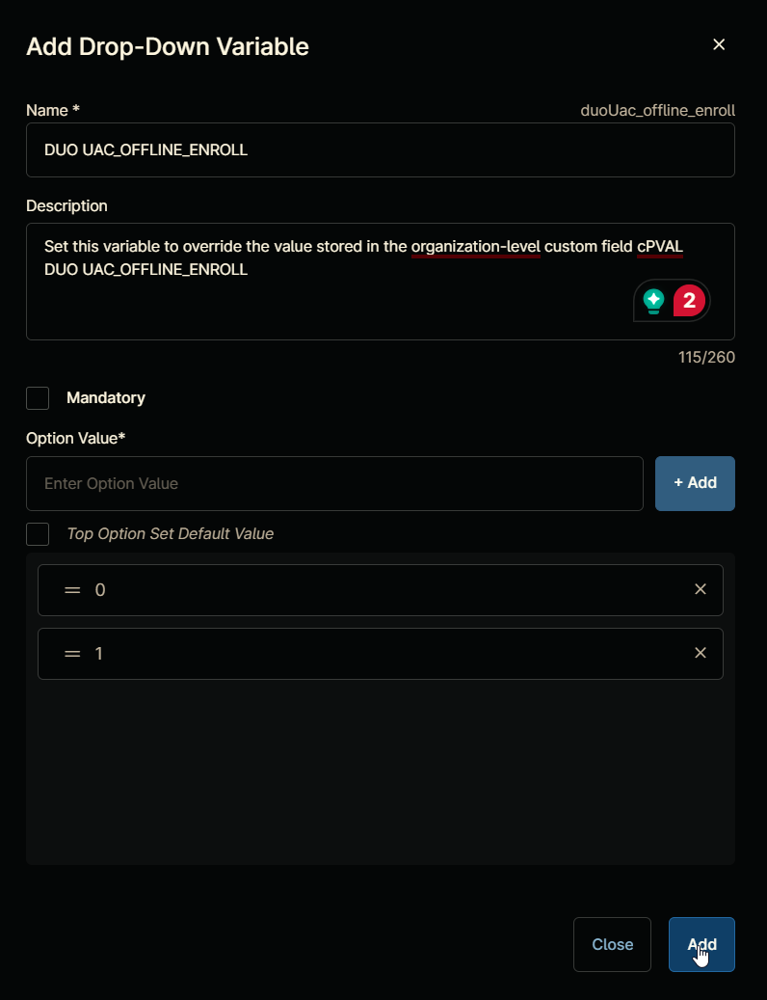

## Saving the Automation

Click the `Save` button in the top-right corner of the screen to save your automation.  


You will be prompted to enter your MFA code. Provide the code and press the Continue button to finalize the process.  


## Completed Automation

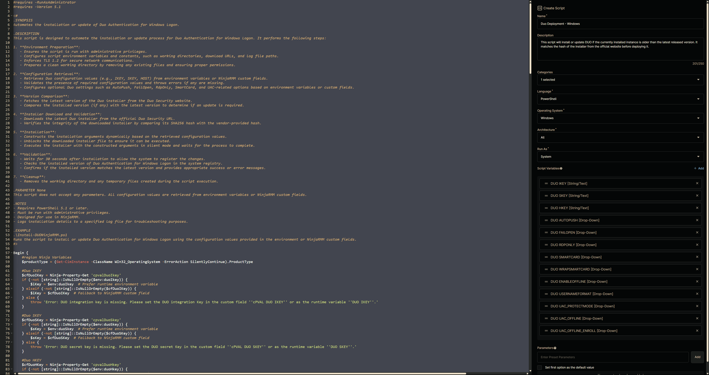

## Output

- Activity Details
