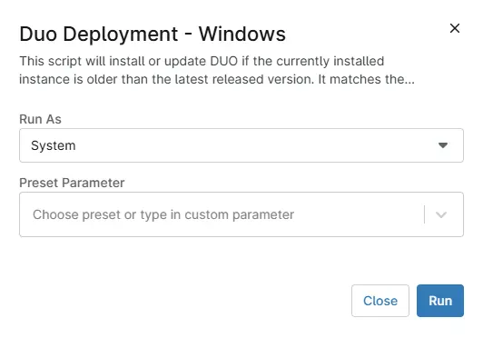

## Overview

This script will install or update DUO if the currently installed instance is older than the [latest released version](https://dl.duosecurity.com/duo-win-login-latest.exe). It matches the hash of the installer from the [official website](https://duo.com/docs/checksums#duo-windows-logon) before deploying it.

Parameters Reference: [Duo Silent Install](https://help.duo.com/s/article/1090?language=en_US)

## Sample Run

`Play Button` > `Run Automation` > `Script`  

Search and select `Duo Deployment - Windows`

Set the required arguments and click the `Run` button to run the script.  
**Run As:** `System`  
**Preset Parameter:** `<Leave it Blank>`  

**Run Automation:** `Yes`  

## Dependencies

- [cPVAL DUO IKEY](/docs/ca460823-862e-4c38-8a30-72474f2b1b5a)  
- [cPVAL DUO SKEY](/docs/868d35d1-fe4e-4e65-b7a5-7661d0d33405)  
- [cPVAL DUO HKEY](/docs/b8a5b5bd-a7fe-4cd5-aae4-81a25a0be7fa)  
- [cPVAL DUO AUTOPUSH](/docs/3ce9e690-2bf1-4e78-9e66-04960f3f1b25)  
- [cPVAL DUO FAILOPEN](/docs/b3cbbe5c-f1a6-4f9f-99b7-9b0dbbca574e)  
- [cPVAL DUO SMARTCARD](/docs/f0c8a089-0c1b-4056-8375-c3601acc968d)  
- [cPVAL DUO ENABLEOFFLINE](/docs/4db3e2e3-adfc-465a-8dc8-026b2fc77b45)  
- [cPVAL DUO RDPONLY](/docs/1bef21cf-30ae-4f56-ab2b-8f2b6165806a)  
- [cPVAL DUO WRAPSMARTCARD](/docs/f7519fa5-6ffd-49a1-aab2-d63e3d1c1d3e)  
- [cPVAL DUO USERNAMEFORMAT](/docs/ca662111-e0a5-4318-8615-a00341257a1c)  
- [cPVAL DUO UAC_PROTECTMODE](/docs/61453e58-57fd-425e-aa68-0a1e003784d5)  
- [cPVAL DUO UAC_OFFLINE](/docs/bb3f2e8b-d772-4f42-9bb0-da16facafa0e)  
- [cPVAL DUO UAC_OFFLINE_ENROLL](/docs/a83d55b5-c765-4a82-84e1-03fbeb3e8606)

## Automation Setup/Import

[Automation Configuration](https://github.com/ProVal-Tech/ninjarmm/blob/main/scripts/duo-deployment-windows.ps1)

## Saving the Automation

Click the `Save` button in the top-right corner of the screen to save your automation.  

You will be prompted to enter your MFA code. Provide the code and press the Continue button to finalize the process.  

## Completed Automation

## Output

- Activity Details