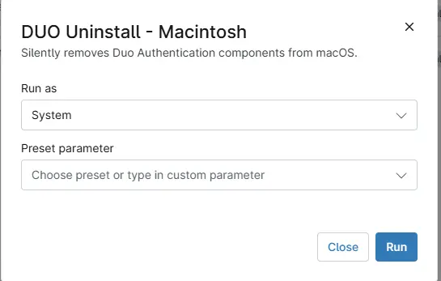

## Overview
Silently removes Duo Authentication components from macOS.

## Sample Run

## Dependencies

- [Solution - Duo Deployment](/docs/a11cd829-a491-4cb1-a7c1-3f56fa8c7557)

## Automation Setup/Import

[Automation Configuration](https://github.com/ProVal-Tech/ninjarmm/blob/main/scripts/duo-uninstall-macintosh.ps1)

## Output

- Activity Details  

## Changelog

### 2026-05-25

- Initial version of the document
