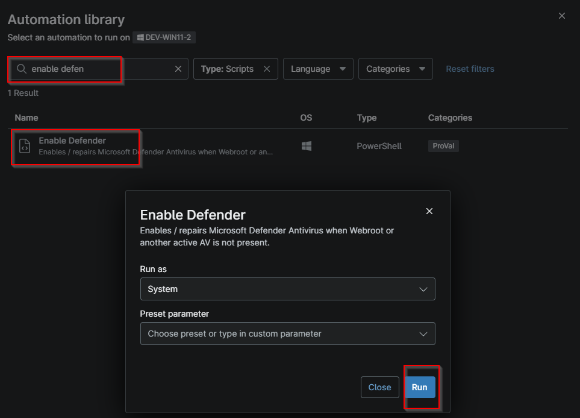
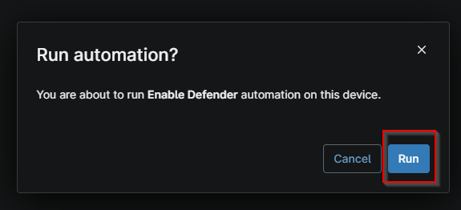

## Overview

Enables / repairs Microsoft Defender Antivirus when Webroot or another active AV is not present.

## Sample Run

- Navigate to Automation > Script
- Search for `Enable Defender`
- Click the `Enable Defender` after search result
- Click Run
  

- Click Run again to execute the script

## Dependencies

- [Solution - Enable Defender](/docs/265e1888-ce5f-4d44-a5c4-6a64d578eb98)

## Custom Fields

| Field Name | Type | Mandatory | Scope | Description |
| ---------- | ---- | --------- | ----- | ----------- |
| cpvalEnableDefenderOnly | Checkbox | false | `Organization` | This custom field is designed to enable Windows Defender only. It doesn't lead to setting up automation for ticket creation for the failure. |
| cpvalEnableDefenderWithTicketOnFailure | Checkbox | false | `Organization` | This custom field is designed to enable Windows Defender and set up automation for ticket creation for the failure. |
| cpvalDefenderEnableStatus | Text | true | `Device` | This custom field stores the success or failure of the Enable Defender automation. |

## Automation Setup/Import

[Automation Configuration](https://github.com/ProVal-Tech/ninjarmm/blob/main/scripts/enable-defender.ps1)

## Output

- Activity Details  
- Custom Field

## Changelog

### 2026-10-07

- Initial version of the document