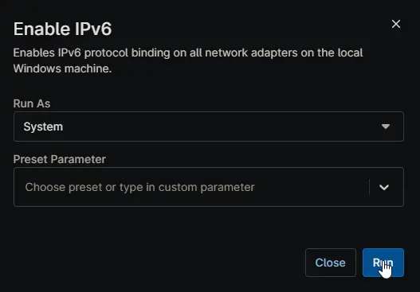

## Overview

Enables IPv6 protocol binding on all network adapters on the local Windows machine.

## Sample Run

## Dependencies

- [Solution - Disable IPv6](/docs/1e9dee40-965f-4b6c-a9cf-4cb45162d5ac)
- [Solution - Device Standards](/docs/a0c383d4-699a-4bb8-af7f-c2a007747182)

## Automation Setup/Import

[Automation Configuration](https://github.com/ProVal-Tech/ninjarmm/blob/main/scripts/enable-ipv6.ps1)

## Output

- Activity Details  
