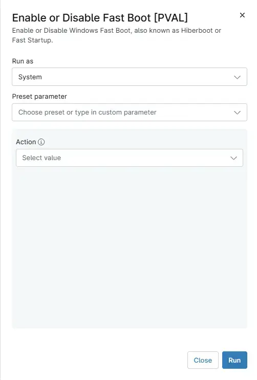

## Overview

This script will enable or disable Windows Fast Boot, also known as Hiberboot or Fast Startup.

- Enabling will enable the option to hibernate as it is a requirement for Fast Boot.
- Disabling will disable the Fast Boot option only, leaving hibernation enabled.
- Disabling with the DisableHibernation switch will disable both Fast Boot and Hibernation. 
- This script is executed as automation script from Compound Conditions [FastBoot Config Windows Server](/docs/95088908-fbea-4007-8914-f5b49d797dfe) and [FastBoot Config Windows Workstations](/docs/3ac6bda9-175b-4585-b252-b7456a440cdd)

## Sample Run

## Dependencies
- [Automation - Get Fast Boot and Hibernation Status](/docs/9dc318fa-ce35-47ae-9442-f867208cde93)
- [Custom Field - cPVAL FastBoot Action](/docs/b9461be5-6fe8-4ce9-900f-4aa929fe2d78)
- [Custom Field - cPVAL FastBoot Config Deployment](/docs/9850d788-d044-4faa-b709-953b6e01a012)
- [Compound Condition - FastBoot Config Windows Workstations](/docs/3ac6bda9-175b-4585-b252-b7456a440cdd)
- [Compound Condition - FastBoot Config Windows Server](/docs/95088908-fbea-4007-8914-f5b49d797dfe)
- [Solution - Enable or Disable FastBoot](/docs/0d0fda4d-0f91-4093-bb04-025117299d28)
- [Solution - Device Standards](/docs/a0c383d4-699a-4bb8-af7f-c2a007747182)

## Parameters

| Name | Example | Accepted Values | Required | Default | Type | Description |
| ---- | ------- | --------------- | -------- | ------- | ---- | ----------- |
| Action | Enable Fast Boot and Hibernation |<ul><li>`Enable Fast Boot and Hibernation`</li><li>`Disable Fast Boot`</li><li>`Disable Fast Boot and Hibernation`</ul> | True |  | String/Text | Enable or Disable Fast Startup and Hibernation. |

## Automation Setup/Import
 
[Automation Configuration](https://github.com/ProVal-Tech/ninjarmm/blob/main/scripts/enable-or-disable-fast-startup.ps1)

## Output

- Activity Details
