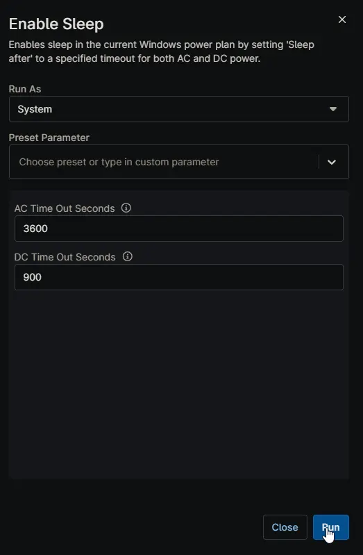

## Overview

Enables sleep in the current Windows power plan by setting 'Sleep after' to a specified timeout for both AC and DC power.

## Sample Run

## Dependencies

- [Agnostic Script - Get-PowerPlan](/docs/4d7993ab-1fa8-4b96-9f19-f503737ea015)
- [Agnostic Script - Set-PowerPlan](/docs/05737947-e8d5-4711-a1d7-91a6db43358f)
- [Solution - Disable Sleep](/docs/)
- [Solution - Device Standards](/docs/)

## Parameters

| Name | Example | Accepted Values | Required | Default | Type | Description |
| ---- | ------- | --------------- | -------- | ------- | ---- | ----------- |
| AC Time Out Seconds | 1800 | | False | 3600 | Integer | The timeout (in seconds) for sleep after on AC power. |
| DC Time Out Seconds | 300 | | False | 900 | Integer | The timeout (in seconds) for sleep after on DC power. |

## Automation Setup/Import

[Automation Configuration](https://github.com/ProVal-Tech/ninjarmm/blob/main/scripts/enable-sleep.ps1)

## Output

- Activity Details
