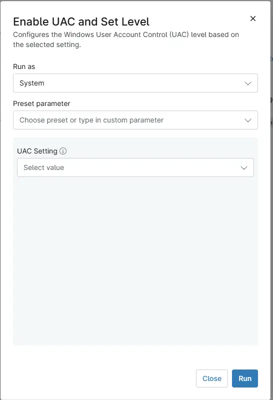

## Overview
Configures the Windows User Account Control (UAC) level based on the selected setting.

## Sample Run

## Dependencies

- [Solution - Enable UAC Settings](/docs/01c2c7d9-7ce9-4e09-981b-b18e55ed2cbf)

## Parameters

| Name | Example | Accepted Values | Required | Default | Type | Description |
| ---- | ------- | --------------- | -------- | ------- | ---- | ----------- |
| UAC Setting  | `Never Notify when apps or users make changes`  | <ul><li>Not Configured</li><li>Never Notify when apps or users make changes</li><li>Notify When Apps make Changes - Dim Desktop</li><li>Always Notify when Apps and Users make Changes</li><li>Notify When Apps make Changes - Do Not Dim Desktop</li></ul> | `False` | Drop Down | Select the UAC setting to configure on the machine. | 

## Automation Setup/Import

[Automation Configuration](https://github.com/ProVal-Tech/ninjarmm/blob/main/scripts/enable-uac-and-set-level.ps1)

## Output

- Activity Details

## Changelog

### 2026-10-05

- Initial version of the document