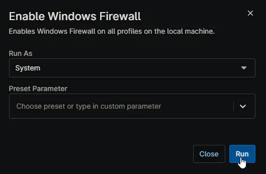

## Overview

Enables Windows Firewall on all profiles on the local machine.

## Sample Run

## Dependencies

- [Solution - Turn off Windows Firewall](/docs/)
- [Solution - Device Standards](/docs/)

## Automation Setup/Import

[Automation Configuration](https://github.com/ProVal-Tech/ninjarmm/blob/main/scripts/enable-windows-firewall.ps1)

## Output

- Activity Details  
