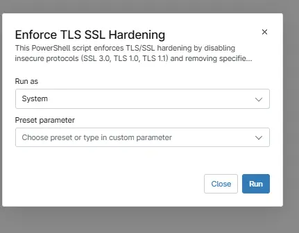

## Overview

This script is designed to secure Windows systems by enforcing strong cryptographic protocols and cipher configurations. It performs the following actions:

Disables legacy protocols
  SSL 3.0, TLS 1.0, and TLS 1.1 are disabled at both server and client levels via SCHANNEL registry settings, preventing the use of outdated and vulnerable communication protocols.

Disables weak TLS 1.2 cipher suites
  The script removes specific medium-strength cipher suites using the Microsoft-supported Disable-TlsCipherSuite cmdlet. These ciphers are commonly flagged in vulnerability assessments and security audits.

Ensures consistent configuration
  Registry keys are created if missing, ensuring consistent enforcement across all systems.

Provides execution feedback
  Displays real-time output for each action performed, making it suitable for deployment via RMM tools like NinjaRMM.

Post-execution requirement
  **`A system reboot is required for all changes to take full effect.`**

## Sample Run

`Play Button` > `Run Automation` > `Script`  

## Automation Setup/Import

[Automation Configuration](https://github.com/ProVal-Tech/ninjarmm/blob/main/scripts/enforce-tls-ssl-hardening.ps1)

## Output

- Activity Details  

## Changelog

*** 2026-04-10

- Initial version of the document.