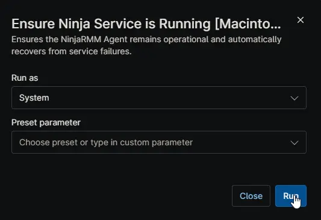

## Overview

This script is designed to keep the NinjaRMM Agent (`com.ninjarmm.agentd`) and Ninja Patcher (`com.ninjarmm.patcher`) services running on macOS. It automatically recovers from service failures or hung states without requiring manual intervention or a system reboot. 

**When to use:** Deploy this script to your Mac endpoints to ensure they maintain constant, reliable connectivity to the NinjaRMM platform, even if the background daemons crash or become unresponsive.

## How it Works

When the script runs, it performs the following actions to set up self-healing:

- **Service Configuration:** It verifies the Ninja LaunchDaemon plists exist, checks if native recovery (`KeepAlive`) is configured, and ensures the services are enabled and loaded into `launchd`.
- **Watchdog Script:** It writes a background monitoring script to the local disk at `/Library/Application Support/NinjaSelfHeal/`.
- **LaunchDaemon:** It registers a persistent macOS LaunchDaemon named `com.ninjarmm.EnsureNinjaServiceRunning` to run the monitoring script in the background. 
  - Runs every **60 minutes** continuously.
- **Immediate Remediation:** It immediately checks the current status of the services. If any are stopped, it attempts to start them using `launchctl` and waits up to 120 seconds for confirmation.

## Logging & Event Management

Because macOS does not use the Windows Event Log, this script writes all diagnostic actions, warnings, and errors to a dedicated text log file and the macOS Unified Log (syslog).

To prevent the log file from growing indefinitely, the script automatically configures macOS `newsyslog` to rotate the logs.

- **Log File:** `/var/log/ninja_selfheal.log`
- **Syslog Source:** `NinjaSelfHeal` (via the `logger` command)

| Log Level | Destination | Source | Description |
| :--- | :--- | :--- | :--- |
| **INFO** | Log File & Syslog | NinjaSelfHeal | Service started successfully, or native `KeepAlive` recovery was verified. |
| **WARN** | Log File & Syslog | NinjaSelfHeal | Service is not running; attempting restart, or native `KeepAlive` is missing from the plist. |
| **ERROR** | Log File & Syslog | NinjaSelfHeal | Service restart failed completely. Manual intervention may be required. |

## Sample Run

## Dependencies

- [Solution: NinjaRMM Agent Self-Heal](/docs/e17b4631-7778-472f-8f5f-f8de33aa3529)

## Automation Setup/Import

[Automation Configuration](https://github.com/ProVal-Tech/ninjarmm/blob/main/scripts/ensure-ninja-service-is-running-macintosh.sh)

## Output

- **Activity Details:** A summary log displaying each service's final status, the configured monitoring interval, and the result of the operation.
- **Final Result:** A clear text output indicating overall success (e.g., `Success: All Ninja services are running. Monitoring scheduled every 60 minutes.`) or failure if manual intervention is required.

## Changelog

### 2026-07-07

- Initial version of the document.
