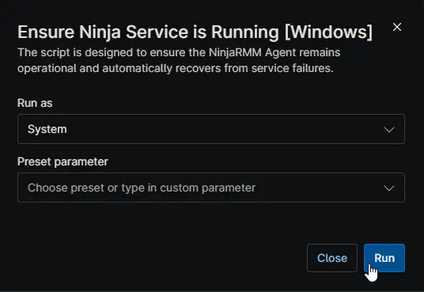

## Overview

This script is designed to keep the NinjaRMM Agent (`NinjaRMMAgent`) and Ninja Remote (`ncstreamer`) services running. It automatically recovers from service failures or hung states without requiring manual intervention or a system reboot.

**When to use:** Deploy this script to your endpoints to ensure they maintain constant, reliable connectivity to the NinjaRMM platform, even if the services crash or become unresponsive.

## How it Works

When the script runs, it performs the following actions to set up self-healing:

- **Service Configuration:** It verifies the Ninja services exist, sets their startup type to Automatic, and configures native Windows Service Recovery to restart them if they crash.
- **Watchdog Script:** It writes a background monitoring script to the local disk. This script is code-signed and embedded to ensure it remains secure and unaltered.
- **Scheduled Task:** It registers a Windows Scheduled Task named `EnsureNinjaServiceRunning` to run the monitoring script in the background. 
  - Runs every **15 minutes** on Windows Servers.
  - Runs every **60 minutes** on Windows Workstations.
- **Immediate Remediation:** It immediately checks the current status of the services. If any are stopped, it attempts to start them. If a service is completely hung, it forcefully terminates the stuck process and restarts it.

## Logging & Event IDs

To prevent flooding the event logs, the background watchdog operates silently when services are healthy. It only logs events when it takes action or encounters an error.

All diagnostic actions, warnings, and errors are written to the Windows Event Log:

- **Log Name:** Application
- **Source:** NinjaSelfHeal

| Event ID | Log Name | Source | Description |
| :--- | :--- | :--- | :--- |
| **1001** | Application | NinjaSelfHeal | Service started successfully (via standard request or forced restart). |
| **1002** | Application | NinjaSelfHeal | Service restart attempt failed completely. Manual intervention may be required. |
| **1004** | Application | NinjaSelfHeal | Service not found on the system. |
| **1005** | Application | NinjaSelfHeal | Service is set to Disabled; recovery skipped. |
| **1006** | Application | NinjaSelfHeal | Service is not running; attempting standard recovery. |
| **1007** | Application | NinjaSelfHeal | Standard start failed for the service. |
| **1008** | Application | NinjaSelfHeal | Service is stuck in an intermediate state; attempting forced termination. |
| **1009** | Application | NinjaSelfHeal | Discovered Process ID (PID) for hung service; executing taskkill. |
| **1010** | Application | NinjaSelfHeal | Exception occurred during forced termination. |
| **1011** | Application | NinjaSelfHeal | Failed to start the service after forced termination. |

## Sample Run

## Dependencies

- [Solution: NinjaRMM Agent Self-Heal](/docs/e17b4631-7778-472f-8f5f-f8de33aa3529)

## Automation Setup/Import

[Automation Configuration](https://github.com/ProVal-Tech/ninjarmm/blob/main/scripts/ensure-ninja-service-is-running-windows.ps1)

## Output

- **Activity Details:** A summary table displaying each service's final status, device type (Server vs. Workstation), monitoring interval, and the result of the operation.
- **Final Result:** A clear text output indicating overall success (e.g., `Success: All Ninja services are running. Monitoring scheduled every 15 minutes.`) or failure if manual intervention is required.

## Changelog

### 2026-07-07

- The background watchdog now detects hung services, queries their Process ID (PID), and forcefully terminates the unresponsive process before attempting a restart.
- The monitoring script written to disk is now fully code-signed, and the script is embedded as a Base64-encoded Unicode string to preserve the signature block during deployment.
- The background monitoring script now operates silently when services are in a normal "Running" state to prevent Event Log flooding during regular scheduled checks.
- The scheduled task now dynamically adjusts its run interval based on the device type, running every 15 minutes for Windows Servers and every 60 minutes for Workstations.
- Added logic to immediately attempt starting stopped services and wait for confirmation (up to 120 seconds) during the initial script run.

### 2026-03-24

- Updated the script to ensure the scheduled task checks services every 15 minutes for servers, and 60 minutes for workstations instead of running only at startup.
- Added attempts to start each service if it's not currently running.
- Script now takes no action if the service is already in a running state.

### 2025-05-12

- Initial version of the document.
