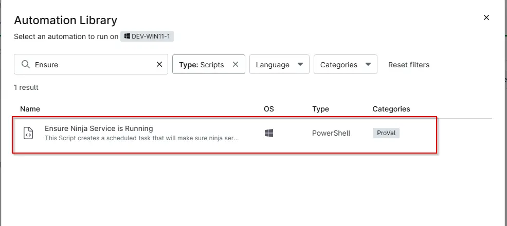
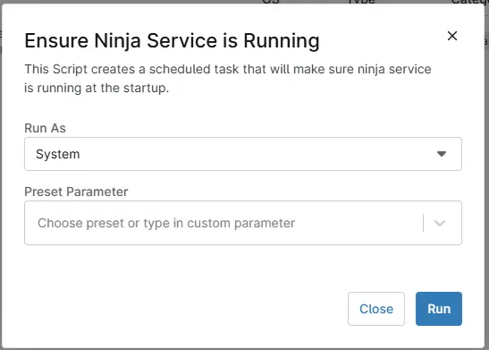
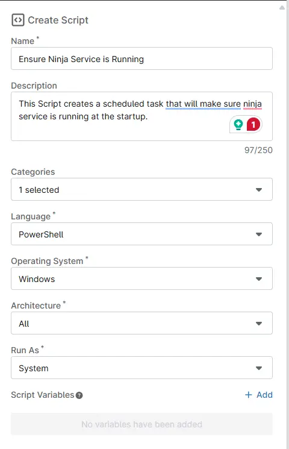
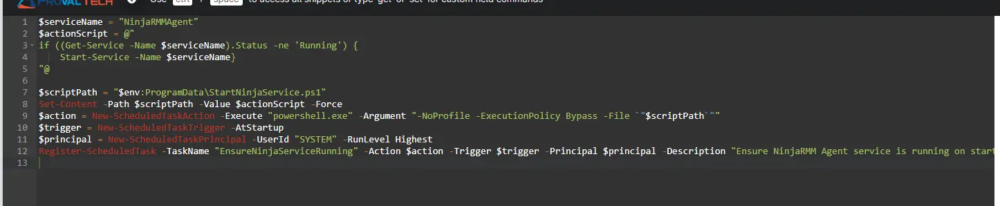
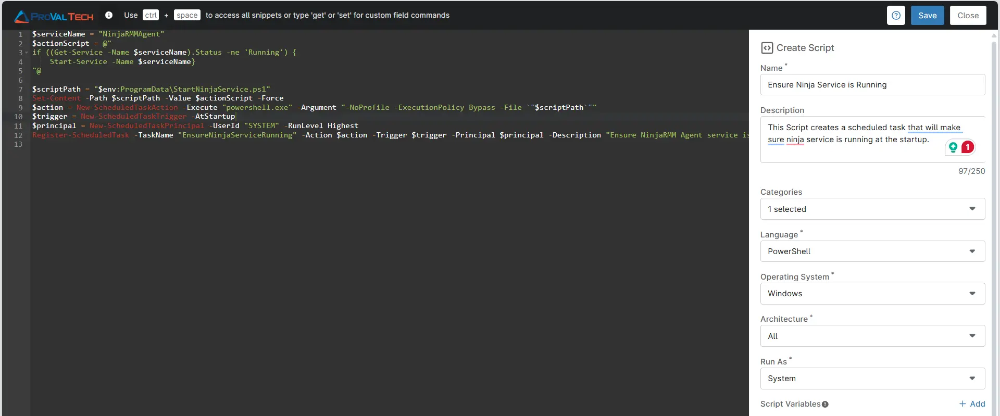

## Overview
This Script creates a scheduled task that will make sure ninja service is running at the startup.

## Sample Run

`Play Button` > `Run Automation` > `Script`  


Search and select Deploy `Ensure Ninja Service is Running`


Sample run to make sure Ninja Service is running at startup


## Automation Setup/Import

### Step 1

Navigate to `Administration` > `Library` > `Automation`  


### Step 2

Locate the `Add` button on the right-hand side of the screen, click on it and click the `New Script` button.  


The scripting window will open.  


### Step 3

Configure the `Create Script` section as follows:

`Name`: Ensure Ninja Service is Running  
`Description`: This Script creates a scheduled task that will make sure ninja service is running at the startup.  
`Categories`: ProVal  
`Language`: PowerShell  
`Operating System`: Windows  
`Architecture`: All  
`Run As`: System  



### Step 4

Paste the following Shell script in the scripting section:
```
$serviceName = "NinjaRMMAgent"
$actionScript = @"
if ((Get-Service -Name $serviceName).Status -ne 'Running') {
    Start-Service -Name $serviceName}
"@

$scriptPath = "$env:ProgramData\StartNinjaService.ps1"
Set-Content -Path $scriptPath -Value $actionScript -Force
$action = New-ScheduledTaskAction -Execute "powershell.exe" -Argument "-NoProfile -ExecutionPolicy Bypass -File `"$scriptPath`""
$trigger = New-ScheduledTaskTrigger -AtStartup
$principal = New-ScheduledTaskPrincipal -UserId "SYSTEM" -RunLevel Highest
Register-ScheduledTask -TaskName "EnsureNinjaServiceRunning" -Action $action -Trigger $trigger -Principal $principal -Description "Ensure NinjaRMM Agent service is running on startup." -Force

```


## Saving the Automation

Click the Save button in the top-right corner of the screen to save your automation.  


You will be prompted to enter your MFA code. Provide the code and press the Continue button to finalize the process.  


## Completed Automation


## Output

- Activity Details  
