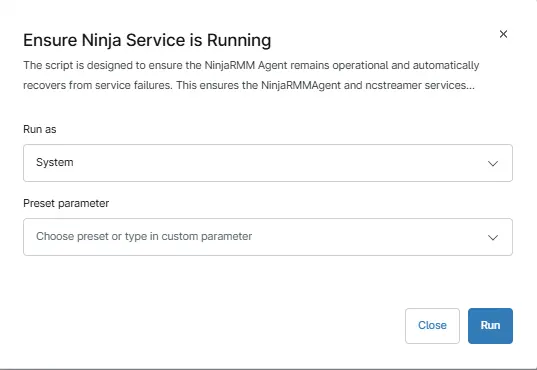

## Overview

This script performs the following actions for NinjaRMMAgent and ncstreamer Services:

- Verifies each service exists on the system.
- Sets the service startup type to Automatic.
- Configures Windows Service Recovery settings to restart on failure.
- Creates a monitoring script that checks service status and restarts if stopped.
- Registers a scheduled task to run the monitoring script at regular intervals (15 minutes for servers, 60 minutes for workstations).
- Attempts to start each service if it's not currently running.
- Logs events to the Application event log for monitoring purposes.

The script is designed to ensure the NinjaRMM Agent and Ninja Remote services remains operational and automatically recovers from service failures.

## Sample Run

Sample run to make sure Ninja Service is running at startup.  

## Automation Setup/Import

[Automation Configuration](https://github.com/ProVal-Tech/ninjarmm/blob/main/scripts/ensure-ninja-service-is-running.ps1)

## Output

- Activity Details

## Changelog

### 2026-03-24

- Changes that were made

  - Updated the document with the powershell to make sure that the task schedule checks the service 15 minutes for servers, 60 minutes for workstations.
  - Removed to run only the startup.
  - Attempts to start each service if it's not currently running.
  - Do nothing if the service is in the running state

### 2025-05-12

- Initial version of the document
