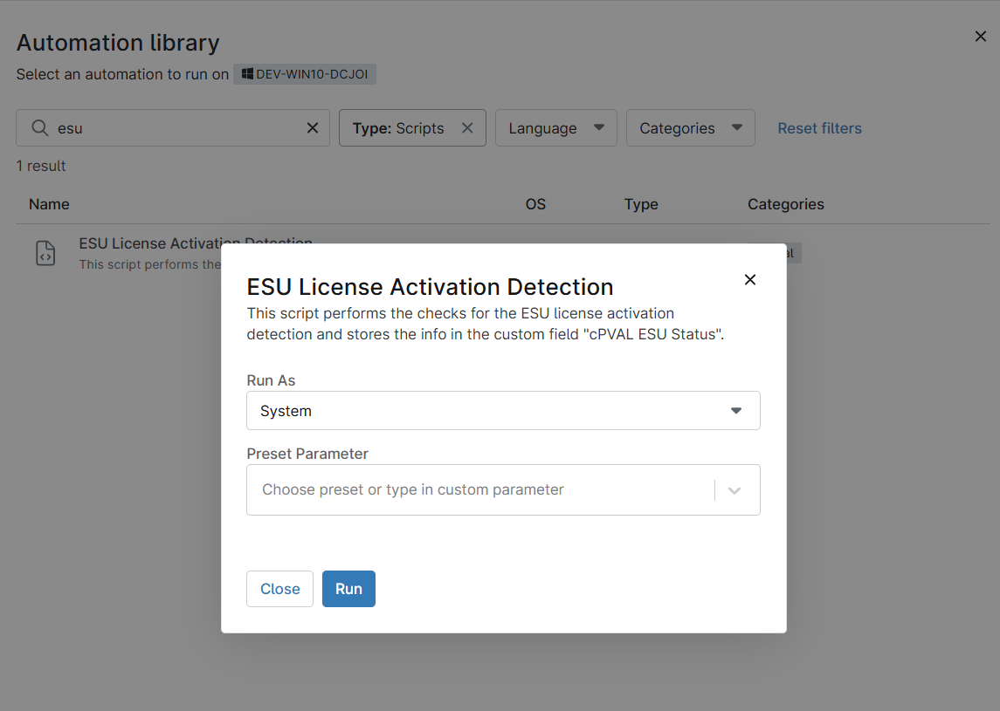

## Overview

This script performs the checks for the ESU license activation detection and stores the info in the device custom field `cPVAL ESU Status`.

## Sample Run

## Dependencies

- [Custom Field - cPVAL ESU Status](/docs/b4d0f4a1-7891-4315-875e-01fc96b17d59)  
- [Solution - Ninja Win10 ESU Licensing and Auditing](/docs/f1ae37d6-7fa7-414c-8550-1ae9ea11b987)

## Automation Setup/Import

[Automation Configuration](https://github.com/ProVal-Tech/ninjarmm/blob/main/scripts/esu-license-activation-detection.ps1)

## Output

- Activity Details  
- Custom Field
