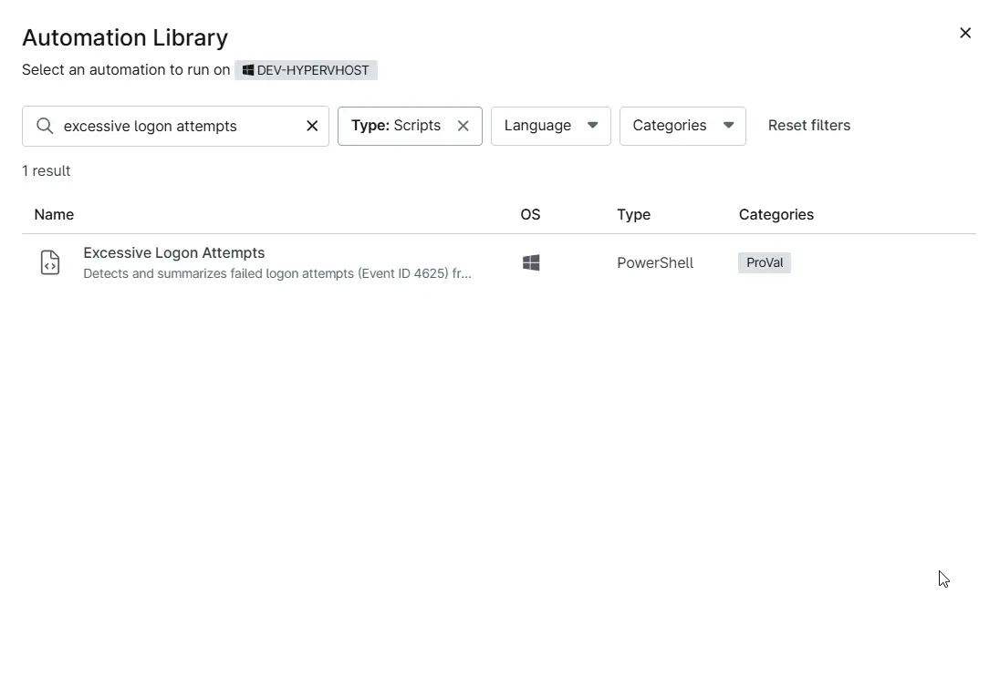
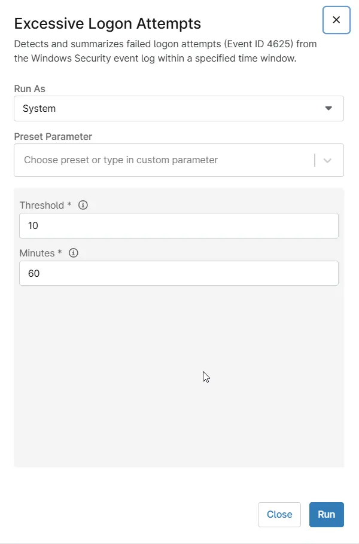

## Overview

Detects and summarizes failed logon attempts (Event ID 4625) from the Windows Security event log within a specified time window.

## Sample Run

`Play Button` > `Run Automation` > `Script`  

Search and select `Excessive Logon Attempts`

Set the required arguments and click the `Run` button to run the script.

- **Run As:** `System`  
- **Preset Parameter:** `<Leave it Blank>`  
- **Threshold:** `<Enter the threshold for the minimum number of failed logon events required to trigger the summary output. Default is 10.>` 
- **Minutes:** `<Enter the number of minutes in the past to search for failed logon events. Default is 60.>`

**Run Automation:** `Yes`  

## Dependencies
- [Solution - Excessive Logon Attempts](/docs/e99ec890-ae05-4ad5-bdbc-6b0599be67e9)
- [Condition - Excessive Logon Attempts](/docs/d8ab94a8-8b00-401b-b1a4-48b7fd2713ae)
- [CW Manage - Ticket Template - Excessive Logon Attempts](/docs/87e8cc64-8a82-4d83-9a91-dcd82c63ffea)

## Parameters

| Name | Example | Accepted Values | Required | Default | Type | Description |
| ---- | ------- | --------------- | -------- | ------- | ---- | ----------- |
| Threshold | 10 | | True |  | Integer | Enter the threshold for the minimum number of failed logon events required to trigger the summary output. Default is 10. |
| Minutes | 60 | | True |  | Integer | Enter the number of minutes in the past to search for failed logon events. Default is 60. |

## Automation Setup/Import

[Automation Configuration](https://github.com/ProVal-Tech/ninjarmm/blob/main/scripts/excessive-logon-attempts.ps1)

## Output

- Activity Details  
