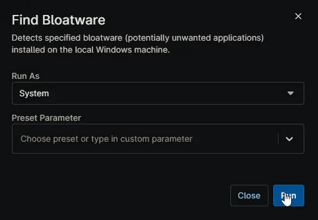

## Overview

Detects specified bloatware (potentially unwanted applications) installed on the local Windows machine. This script is executed as detection script from [Remove Bloatware Windows Workstation](/docs/) and [Remove Bloatware Windows Server](/docs/) compound conditions.

## Sample Run

## Dependencies

- [Custom Field - cPVAL Remove Bloatware](/docs/4eef200f-a609-4993-9533-b7fce30b29ef)
- [Custom Field - cPVAL Bloatware to Remove](/docs/b3a55fe5-d7aa-4976-bf57-c46799ef4548)
- [Solution - Remove Bloatware](/docs/)
- [Solution - Device Standards](/docs/)

## Automation Setup/Import

[Automation Configuration](https://github.com/ProVal-Tech/ninjarmm/blob/main/scripts/find-bloatware.ps1)

## Output

- Activity Details
