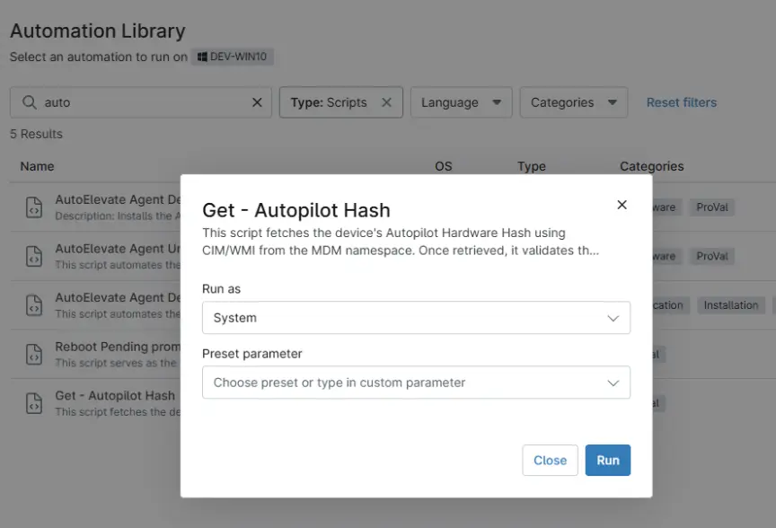

## Overview

This script fetches the device's Autopilot Hardware Hash using CIM/WMI from the MDM namespace. Once retrieved, it validates the hash format and updates the [cPVAL AutoPilot Hash](/docs/8d3fbb67-9f18-426e-b08d-c010d655a94a) custom field with the value. Must be run with Administrator privileges.

## Sample Run

`Play Button` > `Run Automation` > `Script`  

## Dependencies

- [Custom Field - cPVAL AutoPilot Hash](/docs/8d3fbb67-9f18-426e-b08d-c010d655a94a)
- [Solution - Get - AutoPilot Hash - NinjaOne](/docs/d5b749b5-eda4-43d2-8679-eb88f51a3527)

## Automation Setup/Import

[Automation Configuration](https://github.com/ProVal-Tech/ninjarmm/blob/main/scripts/get-autopilot-hash.ps1)

## Output

- Activity Details  
- Custom Field
