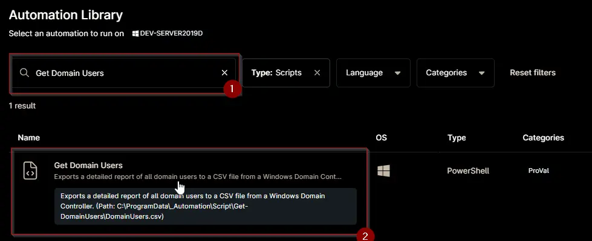
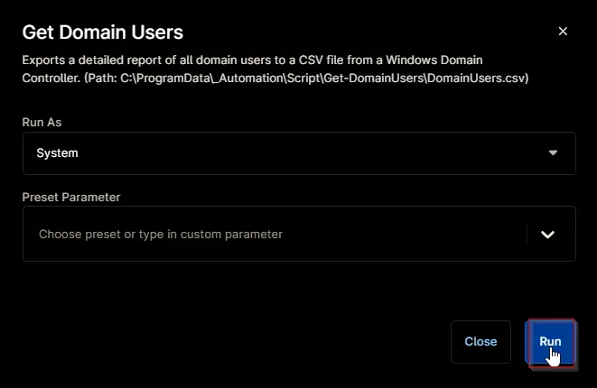
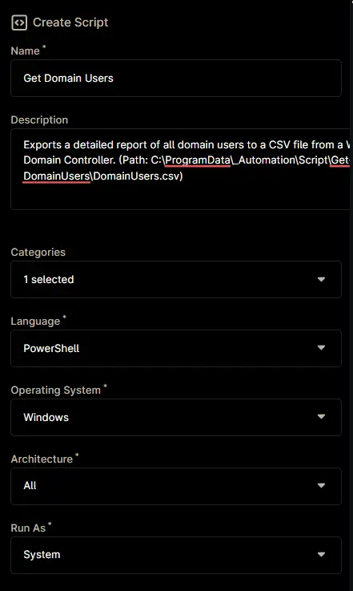
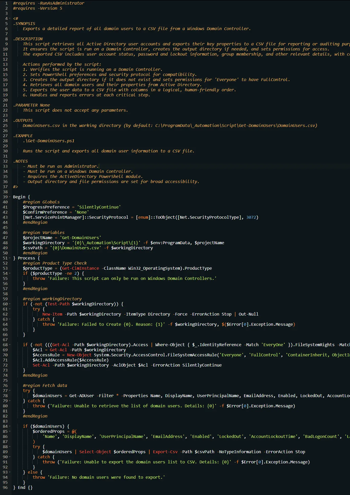
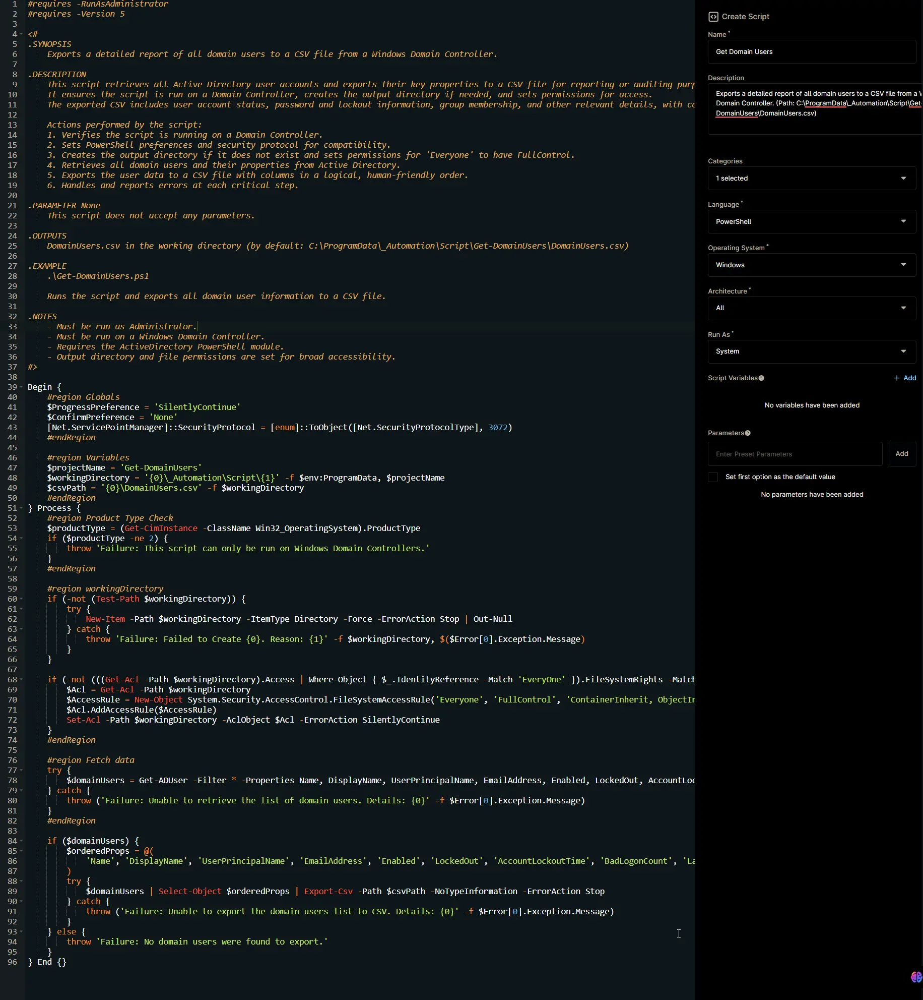

## Overview

Exports a detailed report of all domain users to a CSV file from a Windows Domain Controller. (Path: `C:\ProgramData\_Automation\Script\Get-DomainUsers\DomainUsers.csv`)

**Note:** Limited to Domain Controllers.

## Sample Run

`Play Button` > `Run Automation` > `Script`  


Search and select `Get Domain Users`


Set the required arguments and click the `Run` button to run the script.  
**Run As:** `System`  
**Preset Parameter:** `<Leave it Blank>`  


**Run Automation:** `Yes`  


## Automation Setup/Import

### Step 1

Navigate to `Administration` > `Library` > `Automation`  


### Step 2

Locate the `Add` button on the right-hand side of the screen, click on it and click the `New Script` button.  


The scripting window will open.  


### Step 3

Configure the `Create Script` section as follows:

- **Name:** `Get Domain Users`  
- **Description:** `Exports a detailed report of all domain users to a CSV file from a Windows Domain Controller. (Path: C:\ProgramData\_Automation\Script\Get-DomainUsers\DomainUsers.csv)`  
- **Categories:** `ProVal`  
- **Language:**  `PowerShell`  
- **Operating System:** `Windows`  
- **Architecture:** `All`  
- **Run As:** `System`



## Step 4

Paste the following powershell script in the scripting section:  

```PowerShell
#requires -RunAsAdministrator
#requires -Version 5

<#
.SYNOPSIS
    Exports a detailed report of all domain users to a CSV file from a Windows Domain Controller.

.DESCRIPTION
    This script retrieves all Active Directory user accounts and exports their key properties to a CSV file for reporting or auditing purposes. 
    It ensures the script is run on a Domain Controller, creates the output directory if needed, and sets permissions for access. 
    The exported CSV includes user account status, password and lockout information, group membership, and other relevant details, with columns in a logical order for review.

    Actions performed by the script:
    1. Verifies the script is running on a Domain Controller.
    2. Sets PowerShell preferences and security protocol for compatibility.
    3. Creates the output directory if it does not exist and sets permissions for 'Everyone' to have FullControl.
    4. Retrieves all domain users and their properties from Active Directory.
    5. Exports the user data to a CSV file with columns in a logical, human-friendly order.
    6. Handles and reports errors at each critical step.

.PARAMETER None
    This script does not accept any parameters.

.OUTPUTS
    DomainUsers.csv in the working directory (by default: C:\ProgramData\_Automation\Script\Get-DomainUsers\DomainUsers.csv)

.EXAMPLE
    .\Get-DomainUsers.ps1

    Runs the script and exports all domain user information to a CSV file.

.NOTES
    - Must be run as Administrator.
    - Must be run on a Windows Domain Controller.
    - Requires the ActiveDirectory PowerShell module.
    - Output directory and file permissions are set for broad accessibility.
#>

Begin {
    #region Globals
    $ProgressPreference = 'SilentlyContinue'
    $ConfirmPreference = 'None'
    [Net.ServicePointManager]::SecurityProtocol = [enum]::ToObject([Net.SecurityProtocolType], 3072)
    #endRegion

    #region Variables
    $projectName = 'Get-DomainUsers'
    $workingDirectory = '{0}\_Automation\Script\{1}' -f $env:ProgramData, $projectName
    $csvPath = '{0}\DomainUsers.csv' -f $workingDirectory
    #endRegion
} Process {
    #region Product Type Check
    $productType = (Get-CimInstance -ClassName Win32_OperatingSystem).ProductType
    if ($productType -ne 2) {
        throw 'Failure: This script can only be run on Windows Domain Controllers.'
    }
    #endRegion

    #region workingDirectory
    if (-not (Test-Path $workingDirectory)) {
        try {
            New-Item -Path $workingDirectory -ItemType Directory -Force -ErrorAction Stop | Out-Null
        } catch {
            throw 'Failure: Failed to Create {0}. Reason: {1}' -f $workingDirectory, $($Error[0].Exception.Message)
        }
    }

    if (-not (((Get-Acl -Path $workingDirectory).Access | Where-Object { $_.IdentityReference -Match 'EveryOne' }).FileSystemRights -Match 'FullControl')) {
        $Acl = Get-Acl -Path $workingDirectory
        $AccessRule = New-Object System.Security.AccessControl.FileSystemAccessRule('Everyone', 'FullControl', 'ContainerInherit, ObjectInherit', 'none', 'Allow')
        $Acl.AddAccessRule($AccessRule)
        Set-Acl -Path $workingDirectory -AclObject $Acl -ErrorAction SilentlyContinue
    }
    #endRegion

    #region Fetch data
    try {
        $domainUsers = Get-ADUser -Filter * -Properties Name, DisplayName, UserPrincipalName, EmailAddress, Enabled, LockedOut, AccountLockoutTime, BadLogonCount, LastBadPasswordAttempt, badPasswordTime, badPwdCount, logonCount, AccountExpirationDate, accountExpires, PasswordLastSet, PasswordExpired, PasswordNeverExpires, PasswordNotRequired, CannotChangePassword, SID, MemberOf, DistinguishedName, Created, whenCreated, whenChanged -ErrorAction Stop
    } catch {
        throw ('Failure: Unable to retrieve the list of domain users. Details: {0}' -f $Error[0].Exception.Message)
    }
    #endRegion

    if ($domainUsers) {
        $orderedProps = @(
            'Name', 'DisplayName', 'UserPrincipalName', 'EmailAddress', 'Enabled', 'LockedOut', 'AccountLockoutTime', 'BadLogonCount', 'LastBadPasswordAttempt', 'badPasswordTime', 'badPwdCount', 'logonCount', 'AccountExpirationDate', 'accountExpires', 'PasswordLastSet', 'PasswordExpired', 'PasswordNeverExpires', 'PasswordNotRequired', 'CannotChangePassword', 'SID', 'MemberOf', 'DistinguishedName', 'Created', 'whenCreated', 'whenChanged'
        )
        try {
            $domainUsers | Select-Object $orderedProps | Export-Csv -Path $csvPath -NoTypeInformation -ErrorAction Stop
        } catch {
            throw ('Failure: Unable to export the domain users list to CSV. Details: {0}' -f $Error[0].Exception.Message)
        }
    } else {
        throw 'Failure: No domain users were found to export.'
    }
} End {}
```



## Saving the Automation

Click the Save button in the top-right corner of the screen to save your automation.  


You will be prompted to enter your MFA code. Provide the code and press the Continue button to finalize the process.  


## Completed Automation



## Output

- Activity Details  
- C:\ProgramData\_Automation\Script\Get-DomainUsers\DomainUsers.csv
