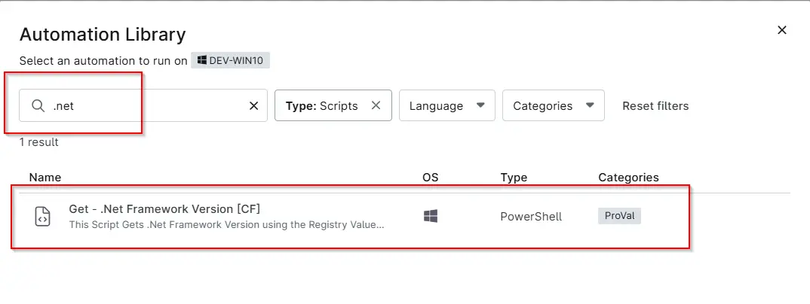
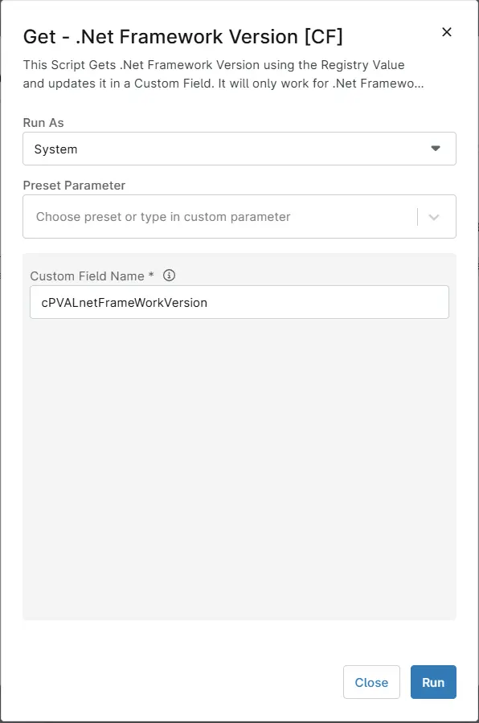
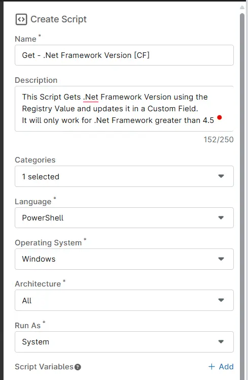
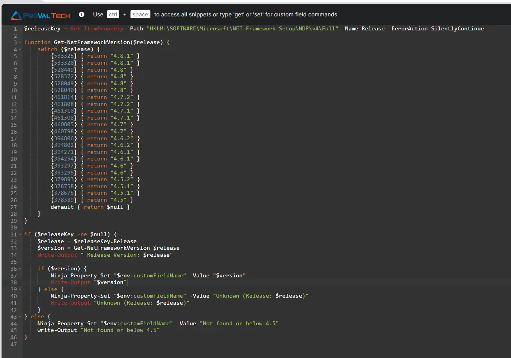
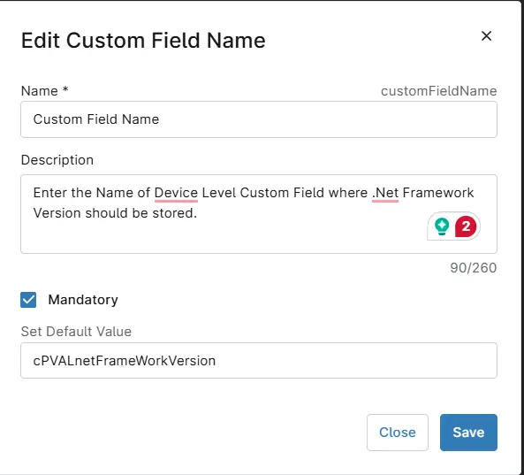
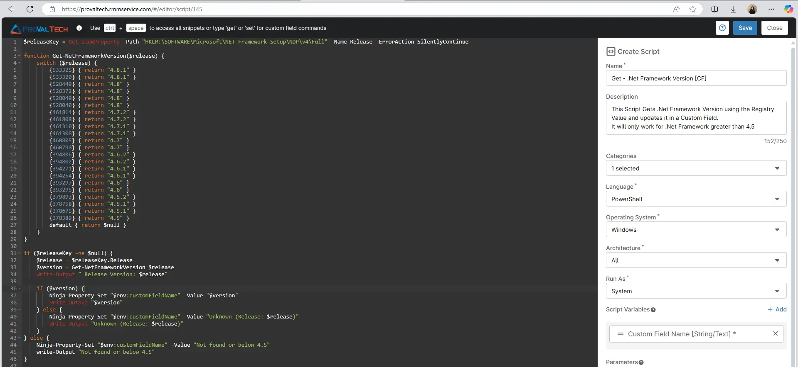

## Overview
This script gets .Net Framework Version using the Registry Value and updates it in a Custom Field.  
It will only work for .Net Framework greater than 4.5

## Sample Run

`Play Button` > `Run Automation` > `Script`  


Search and select `Get - .Net Framework Version [CF]`


 
- Run As: `System`  
- Preset Parameter: `<Leave it Blank>`  
- Custom Field Name : `Change the Custom Field name if you would like to save the version in any other custom Field. The default one is cPVALnetFrameWorkVersion.` 
- Click the `Run` button to run the script. 


## Dependencies
[Task - Get - .Net Framework Version](/docs/7064a8be-8470-4ca4-a1a6-13f70a242b8c)  
[Custom Field - cPVAL .NET FrameWork Version](/docs/06ee57e9-a6cf-4ee0-9430-8e548fac15fb)  
[Group - cPVAL Windows Servers](/docs/c73e004e-6a9c-40e4-8e74-babb4b729256)

## Parameters

| Name | Example | Accepted Values | Required | Default | Type | Description |
| ---- | ------- | --------------- | -------- | ------- | ---- | ----------- |
| Custom Field Name | cPVALnetFrameWorkVersion |  -  | True| cPVALnetFrameWorkVersion | String | Enter the Name of Device Level Custom Field where .Net Framework Version should be stored. |

## Automation Setup/Import

### Step 1

Navigate to `Administration` > `Library` > `Automation`  


### Step 2

Locate the `Add` button on the right-hand side of the screen, click on it and click the `New Script` button.  


The scripting window will open.  


### Step 3
Configure the `Create Script` section as follows:

- Name: `Get - .Net Framework Version [CF]`  
- Description: `This Script Gets .Net Framework Version using the Registry Value and updates it in a Custom Field. It will only work for .Net Framework greater than 4.5`  
- Categories: `ProVal`  
- Language: `PowerShell`  
- Operating System: `Windows`  
- Architecture: `All`  
- Run As: `System`  



### Step 4
Paste the following powershell script in the scripting section:

```
$releaseKey = Get-ItemProperty -Path "HKLM:\SOFTWARE\Microsoft\NET Framework Setup\NDP\v4\Full" -Name Release -ErrorAction SilentlyContinue

function Get-NetFrameworkVersion($release) {
    switch ($release) {
        {533325} { return "4.8.1" }
        {533320} { return "4.8.1" }
        {528449} { return "4.8" }
        {528372} { return "4.8" }
        {528049} { return "4.8" }
        {528040} { return "4.8" }
        {461814} { return "4.7.2" }
        {461808} { return "4.7.2" }
        {461310} { return "4.7.1" }
        {461308} { return "4.7.1" }
        {460805} { return "4.7" }
        {460798} { return "4.7" }
        {394806} { return "4.6.2" }
        {394802} { return "4.6.2" }
        {394271} { return "4.6.1" }
        {394254} { return "4.6.1" }
        {393297} { return "4.6" }
        {393295} { return "4.6" }
        {379893} { return "4.5.2" }
        {378758} { return "4.5.1" }
        {378675} { return "4.5.1" }
        {378389} { return "4.5" }
        default { return $null }
    }
}

if ($releaseKey -ne $null) {
    $release = $releaseKey.Release
    $version = Get-NetFrameworkVersion $release
    Write-Output " Release Version: $release"

    if ($version) {
        Ninja-Property-Set "$env:customFieldName" -Value "$version"
        Write-Output "$version"
    } else {
        Ninja-Property-Set "$env:customFieldName" -Value "Unknown (Release: $release)"
        Write-Output "Unknown (Release: $release)"
    }
} else {
    Ninja-Property-Set "$env:customFieldName" -Value "Not found or below 4.5"
    write-Output "Not found or below 4.5"
}
```


## Script Variables

Click the `Add` button next to `Script Variables`.  


Select the `String/Text` option.
The `Add String/Text Variable` window will open.
In the box, fill in the following details and select `Add` to create the script variable.

- Name: `Custom Field Name`  
- Description: `Enter the Name of Device Level Custom Field where .Net Framework Version should be stored.`  
- Mandatory: `Check it`  
- Set Default Value: `cPVALnetFrameWorkVersion`



## Saving the Automation

Click the `Save` button in the top-right corner of the screen to save your automation.  


You will be prompted to enter your MFA code. Provide the code and press the `Continue` button to finalize the process.  


## Completed Automation


## Output

- Activity Details  
- Custom Field