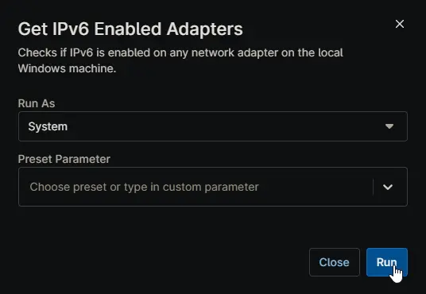

## Overview

Checks if IPv6 is enabled on any network adapter on the local Windows machine. This script is executed as detection script from [Disable IPv6 Windows Workstation](/docs/) and [Disable IPv6 Windows Server](/docs/) compound conditions.

## Sample Run

## Dependencies

- [Custom Field - cPVAL Disable IPv6](/docs/060ad5d8-ee1d-4ee2-a92d-7dbc14121bc6)
- [Solution - Disable IPv6](/docs/)
- [Solution - Device Standards](/docs/)

## Automation Setup/Import

[Automation Configuration](https://github.com/ProVal-Tech/ninjarmm/blob/main/scripts/get-ipv6-enabled-adapters.ps1)

## Output

- Activity Details  
