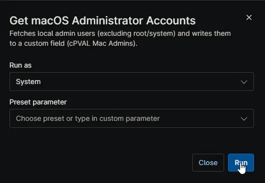

## Overview

This automation finds local administrator accounts on a macOS device and saves them to the [cPVAL Mac Admins](/docs/e030318d-537b-4a81-ba82-d0e4b9a50ab7) custom field.

It excludes the default root account and hidden system users, so you get a cleaner list of real user or service admin accounts.

## Sample Run

## Dependencies

- [Custom Field: cPVAL Mac Admins](/docs/e030318d-537b-4a81-ba82-d0e4b9a50ab7)

## Automation Setup/Import

[Automation Configuration](https://github.com/ProVal-Tech/ninjarmm/blob/main/scripts/get-macos-administrator-accounts.ps1)

## Output

- Activity Details  
- Custom Field

## Changelog

### 2026-04-17

- Initial version of the document.
