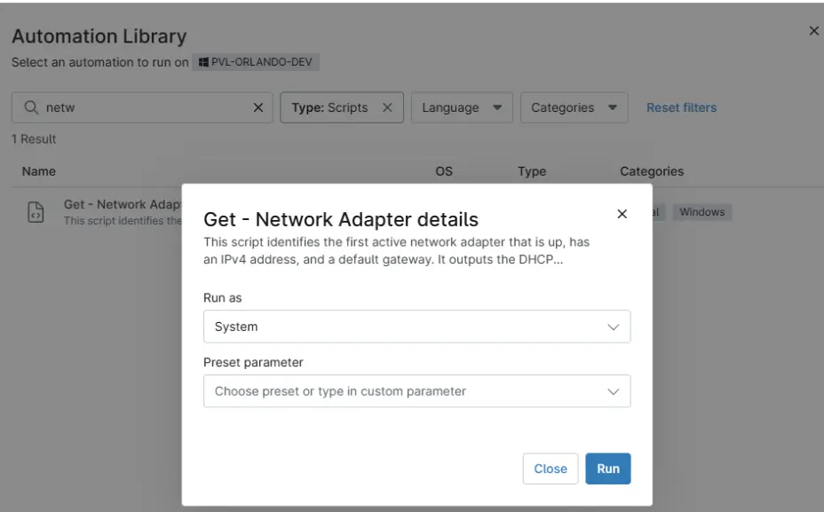

## Overview

This script identifies the first active network adapter that is up, has an IPv4 address, and a default gateway. It outputs the DHCP enabled status, IP configuration type (DHCP or Static), and the comma-separated list of DNS servers.

## Sample Run

`Play Button` > `Run Automation` > `Script`  

## Dependencies

- [cPVAL DNS Server](/docs/050b6b01-ec88-4c11-8e37-f5f34df0daa3)
- [cPVAL Dhcp server](/docs/ce67cff7-8ff2-42a6-8b05-c9dc22bd3392)
- [cPVAL IP Type](/docs/9e7a6f5f-f8c7-483d-9b0a-c04dc10f7cb4)
- [Solution - Network Adapter Details](/docs/81d8fa31-72c7-4339-a107-4a41a3e489f5)

## Automation Setup/Import

[Automation Configuration](https://github.com/ProVal-Tech/ninjarmm/blob/main/scripts/get-network-adapter-details.ps1)

## Output

- Activity Details  
- Custom Field
