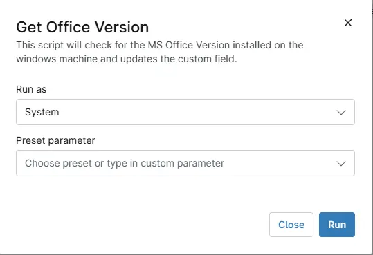

## Overview
This script will check for the MS Office Version installed on the windows machine and updates the custom field.

## Sample Run

`Play Button` > `Run Automation` > `Script`  

## Dependencies
- [Solution - Get Office Version](/docs/19ca26a2-c4f1-4ce1-99a2-b8d37dccfa04) 
- [cPVAL Office Version](/docs/4216d707-95cc-414c-8fa5-73fa9606fa97) 

## Automation Setup/Import

[Automation Configuration](https://github.com/ProVal-Tech/ninjarmm/blob/main/scripts/get-office-version.ps1)

## Output

- Activity Details  
- Custom Field
