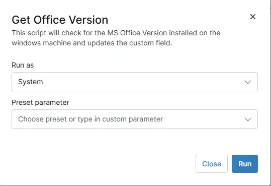

## Overview

This script will check for the MS Office Version installed on the windows machine and updates the custom fields.

## Sample Run

`Play Button` > `Run Automation` > `Script`  

## Dependencies

- [Solution - Get Office Version](/docs/19ca26a2-c4f1-4ce1-99a2-b8d37dccfa04) 
- [cPVAL Office Version](/docs/4216d707-95cc-414c-8fa5-73fa9606fa97) 

## Automation Setup/Import

[Automation Configuration](https://github.com/ProVal-Tech/ninjarmm/blob/main/scripts/get-office-version.ps1)

## Output

- Activity Details  
- Custom Field

## Changelog

## 2026-05-26

- Added two new custom fields: `cPVAL Office Install Type` and `cPVAL M365 Apps Installed`.

- Added `Resolve-InstallType` function to detect whether an Office installation is a
  Full suite, Language Pack only, Partial (individual apps e.g. Word, Excel), or a
  combination of Full + Language Pack by parsing the `ProductReleaseIds` registry value.

- Added `Check-M365AppsInstalled` function to detect Microsoft 365 Apps in mixed
  environments where an older MSI Office version and M365 Apps may both be present,
  checking both the C2R registry key and Windows uninstall registry entries.

- Script now updates five separate custom fields: Office Version, Office Edition,
  Office Bitness, Office Install Type, and M365 Apps Installed.

- Fixed variable scoping bug in functions where assignments were writing to local scope
  instead of the global script scope; all in-function assignments now use `$script:`.

### 2026-05-12

- Enhanced `Get Office Version` script to improve Click-to-Run (C2R) version identification using ProductReleaseIds and CDN channel mapping. 
- Added accurate detection for Microsoft 365 Apps, Office 2016, 2019, 2021, and 2024 along with improved Office bitness detection (32-bit / 64-bit). 
- Retained MSI fallback detection using ASSOC/FTYPE and updated Ninja custom field handling with undetermined fallback values for reliability. 
- Script now updates three separate custom fields for Office Version, Office Edition, and Office Bitness seperately.

### 2025-12-12

- Initial version of the document
