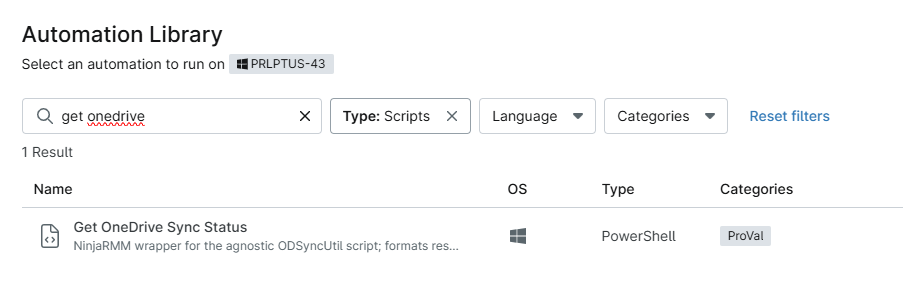
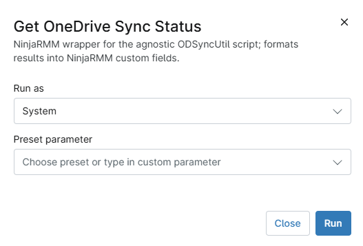
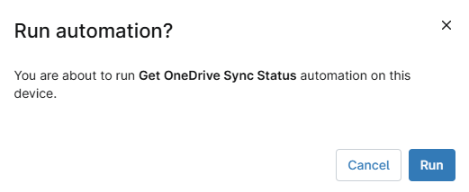

## Overview
NinjaRMM wrapper for the agnostic ODSyncUtil script; formats results into NinjaRMM custom fields.

## Sample Run

`Play Button` > `Run Automation` > `Script`  

Search and select `Get OneDrive Sync Status`

Set the required arguments and click the `Run` button to run the script.  
**Run As:** `System`  
**Preset Parameter:** `<Leave it Blank>`  

**Run Automation:** `Yes`  

## Dependencies

https://github.com/rodneyviana/ODSyncUtil/blob/master/ODSyncUtil/Get-ODStatus.ps1

## Automation Setup/Import

[Get OneDrive Sync Status](https://github.com/ProVal-Tech/ninjarmm/blob/main/scripts/get-onedrive-sync-status.ps1)

[cPVAL OneDrive Sync Status](https://github.com/ProVal-Tech/ninjarmm/blob/main/scripts/cpval-onedrive-sync-status.toml)

## Output

- Activity Details  
- Custom Field
