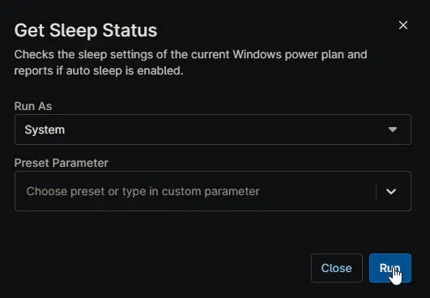

## Overview

Checks the sleep settings of the current Windows power plan and reports if auto sleep is enabled. This script is executed as detection script from [Disable Sleep Windows Workstation](/docs/01e513a0-0764-4d2d-ae60-871e42010526) and [Disable Sleep Windows Server](/docs/047f1fc9-f296-42c0-bad6-3498b9160609) compound conditions.

## Sample Run

## Dependencies

- [Agnostic Script - Get-PowerPlan](/docs/4d7993ab-1fa8-4b96-9f19-f503737ea015)
- [Custom Field - cPVAL Disable Sleep](/docs/b0c22386-feb6-427c-b1fd-e29a9c4863a3)
- [Solution - Disable Sleep](/docs/a34e3293-b46a-485d-ae72-c30d235a2531)
- [Solution - Device Standards](/docs/a0c383d4-699a-4bb8-af7f-c2a007747182)

## Automation Setup/Import

[Automation Configuration](https://github.com/ProVal-Tech/ninjarmm/blob/main/scripts/get-sleep-status.ps1)

## Output

- Activity Details
