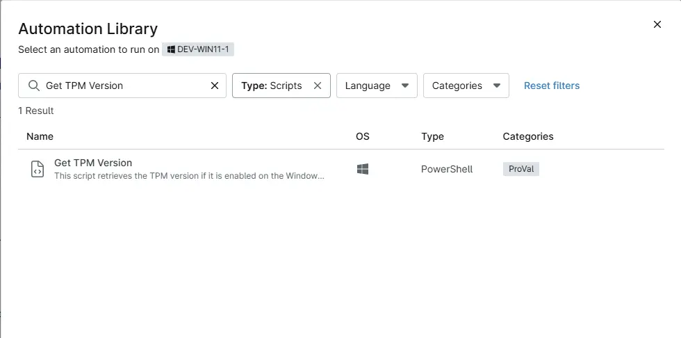

## Overview
This script retrieves the TPM version if it is enabled on the Windows device.

## Sample Run

`Play Button` > `Run Automation` > `Script`  

Search and select `Get TPM Version`

## Dependencies

- [Solution: TPM Version Audit](/docs/862f9638-4600-46c2-8894-af488273c1c7)

## Automation Setup/Import

[Automation Configuration](https://github.com/ProVal-Tech/ninjarmm/blob/main/scripts/get-tpm-version.ps1)

## Output

- Activity Details  
- Custom Field

## Changelog

### 2026-03-12

- Initial version of the document