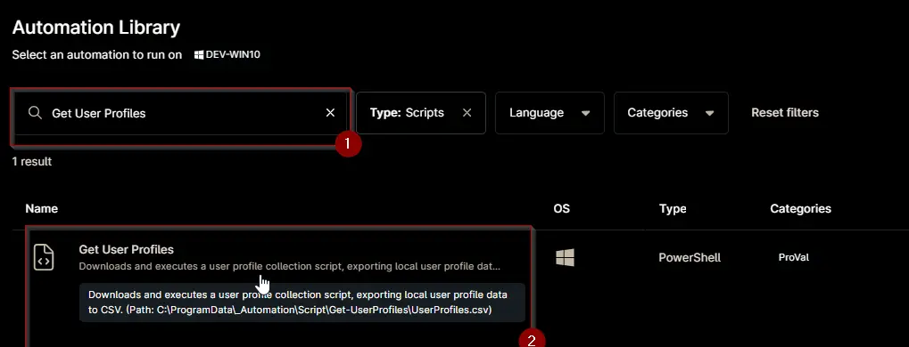
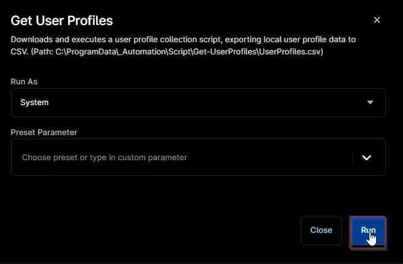
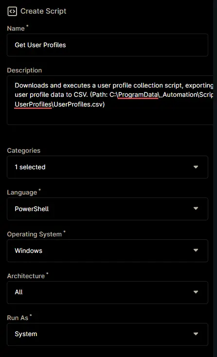
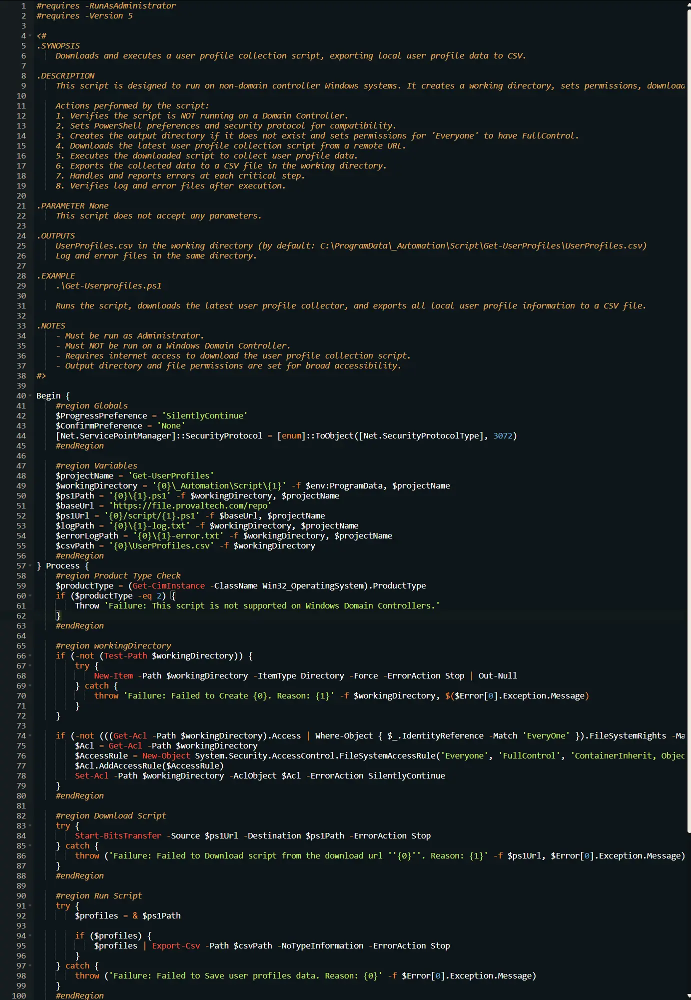
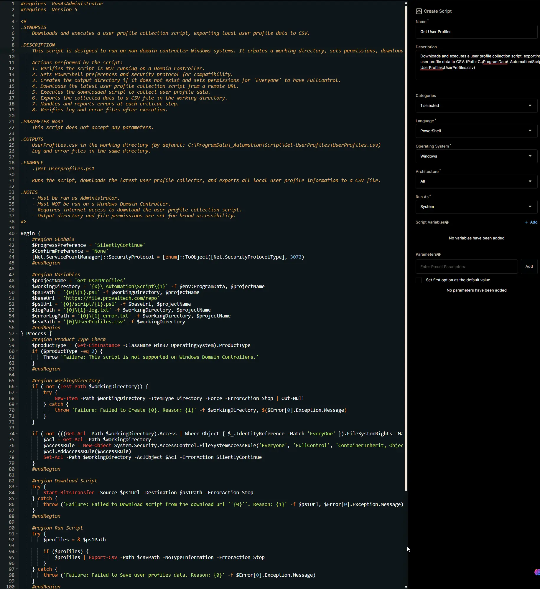

## Overview

Downloads and executes a user profile collection script, exporting local user profile data to CSV. (Path: `C:\ProgramData\_Automation\Script\Get-UserProfiles\UserProfiles.csv`)

**Note:** Domain Controllers are excluded.

## Sample Run

`Play Button` > `Run Automation` > `Script`  


Search and select `Get User Profiles`


Set the required arguments and click the `Run` button to run the script.  
**Run As:** `System`  
**Preset Parameter:** `<Leave it Blank>`  


**Run Automation:** `Yes`  


## Dependencies

[Get-UserProfiles](/docs/dee76265-9071-47bb-9262-d656dd8b5c6d)

## Automation Setup/Import

### Step 1

Navigate to `Administration` > `Library` > `Automation`  


### Step 2

Locate the `Add` button on the right-hand side of the screen, click on it and click the `New Script` button.  


The scripting window will open.  


### Step 3

Configure the `Create Script` section as follows:

- **Name:** `Get User Profiles`  
- **Description:** `Downloads and executes a user profile collection script, exporting local user profile data to CSV. (Path: C:\ProgramData\_Automation\Script\Get-UserProfiles\UserProfiles.csv)`  
- **Categories:** `ProVal`  
- **Language:** `PowerShell`  
- **Operating System:** `Windows`  
- **Architecture:** `All`  
- **Run As:** `System`



## Step 4

Paste the following powershell script in the scripting section:  

```PowerShell
#requires -RunAsAdministrator
#requires -Version 5

<#
.SYNOPSIS
    Downloads and executes a user profile collection script, exporting local user profile data to CSV.

.DESCRIPTION
    This script is designed to run on non-domain controller Windows systems. It creates a working directory, sets permissions, downloads the latest user profile collection script from a remote repository, and executes it. The collected user profile data is then exported to a CSV file for reporting or auditing. The script also logs its actions and errors for troubleshooting.

    Actions performed by the script:
    1. Verifies the script is NOT running on a Domain Controller.
    2. Sets PowerShell preferences and security protocol for compatibility.
    3. Creates the output directory if it does not exist and sets permissions for 'Everyone' to have FullControl.
    4. Downloads the latest user profile collection script from a remote URL.
    5. Executes the downloaded script to collect user profile data.
    6. Exports the collected data to a CSV file in the working directory.
    7. Handles and reports errors at each critical step.
    8. Verifies log and error files after execution.

.PARAMETER None
    This script does not accept any parameters.

.OUTPUTS
    UserProfiles.csv in the working directory (by default: C:\ProgramData\_Automation\Script\Get-UserProfiles\UserProfiles.csv)
    Log and error files in the same directory.

.EXAMPLE
    .\Get-Userprofiles.ps1

    Runs the script, downloads the latest user profile collector, and exports all local user profile information to a CSV file.

.NOTES
    - Must be run as Administrator.
    - Must NOT be run on a Windows Domain Controller.
    - Requires internet access to download the user profile collection script.
    - Output directory and file permissions are set for broad accessibility.
#>

Begin {
    #region Globals
    $ProgressPreference = 'SilentlyContinue'
    $ConfirmPreference = 'None'
    [Net.ServicePointManager]::SecurityProtocol = [enum]::ToObject([Net.SecurityProtocolType], 3072)
    #endRegion

    #region Variables
    $projectName = 'Get-UserProfiles'
    $workingDirectory = '{0}\_Automation\Script\{1}' -f $env:ProgramData, $projectName
    $ps1Path = '{0}\{1}.ps1' -f $workingDirectory, $projectName
    $baseUrl = 'https://file.provaltech.com/repo'
    $ps1Url = '{0}/script/{1}.ps1' -f $baseUrl, $projectName
    $logPath = '{0}\{1}-log.txt' -f $workingDirectory, $projectName
    $errorLogPath = '{0}\{1}-error.txt' -f $workingDirectory, $projectName
    $csvPath = '{0}\UserProfiles.csv' -f $workingDirectory
    #endRegion
} Process {
    #region Product Type Check
    $productType = (Get-CimInstance -ClassName Win32_OperatingSystem).ProductType
    if ($productType -eq 2) {
        Throw 'Failure: This script is not supported on Windows Domain Controllers.'
    }
    #endRegion

    #region workingDirectory
    if (-not (Test-Path $workingDirectory)) {
        try {
            New-Item -Path $workingDirectory -ItemType Directory -Force -ErrorAction Stop | Out-Null
        } catch {
            throw 'Failure: Failed to Create {0}. Reason: {1}' -f $workingDirectory, $($Error[0].Exception.Message)
        }
    }

    if (-not (((Get-Acl -Path $workingDirectory).Access | Where-Object { $_.IdentityReference -Match 'EveryOne' }).FileSystemRights -Match 'FullControl')) {
        $Acl = Get-Acl -Path $workingDirectory
        $AccessRule = New-Object System.Security.AccessControl.FileSystemAccessRule('Everyone', 'FullControl', 'ContainerInherit, ObjectInherit', 'none', 'Allow')
        $Acl.AddAccessRule($AccessRule)
        Set-Acl -Path $workingDirectory -AclObject $Acl -ErrorAction SilentlyContinue
    }
    #endRegion

    #region Download Script
    try {
        Start-BitsTransfer -Source $ps1Url -Destination $ps1Path -ErrorAction Stop
    } catch {
        throw ('Failure: Failed to Download script from the download url ''{0}''. Reason: {1}' -f $ps1Url, $Error[0].Exception.Message)
    }
    #endRegion

    #region Run Script
    try {
        $profiles = & $ps1Path

        if ($profiles) {
            $profiles | Export-Csv -Path $csvPath -NoTypeInformation -ErrorAction Stop
        }
    } catch {
        throw ('Failure: Failed to Save user profiles data. Reason: {0}' -f $Error[0].Exception.Message)
    }
    #endRegion
} End {
    #region log verification
    if ($productType -ne 2) {
        if (!(Test-Path -Path $logPath)) {
            throw 'Failure: PowerShell Failure. A Security application seems to have restricted the execution of the PowerShell Script.'
        }
        if ( Test-Path -Path $errorLogPath) {
            $errorContent = (Get-Content -Path $errorLogPath)
            throw ('Failure: {0}' -f ($ErrorContent | Out-String))
        }

        $content = Get-Content -Path $logPath
        $logContent = $content[ $($($content.IndexOf($($content -match "$($projectName)$")[-1])) + 1)..$($Content.length - 1) ]
        return ('Success: Log Content: {0}' -f ($logContent | Out-String))
        #endregion
    }
}
```



## Saving the Automation

Click the Save button in the top-right corner of the screen to save your automation.  


You will be prompted to enter your MFA code. Provide the code and press the Continue button to finalize the process.  


## Completed Automation



## Output

- Activity Details  
- C:\ProgramData\_Automation\Script\Get-UserProfiles\UserProfiles.csv
