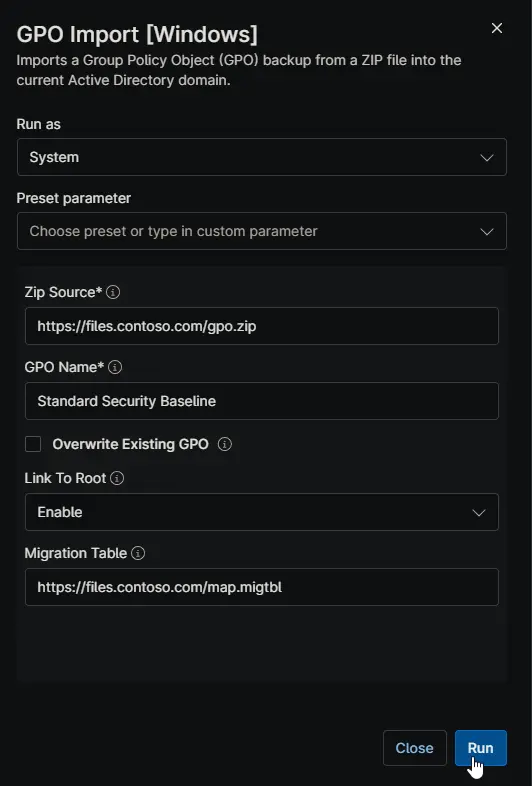

## Overview

This script imports a Group Policy Object (GPO) backup from a ZIP file into Active Directory domain. It downloads the ZIP, validates the backup, and imports the settings. Use it to standardize policies across domains, migrate GPOs, or restore policies from backup.

**Key Benefits:**

- **Safety first**: The script never deletes a GPO. If the target name already exists, it stops unless overwrite is explicitly enabled.
- **Automatic rollback**: Before any overwrite, a safety backup of the existing GPO is saved automatically.
- **Cross-domain support**: A migration table (`.migtbl`) translates domain-specific paths and security principals.

:::important

**Warning — Overwriting is destructive.** When **Overwrite Existing GPO** is checked, every setting in the existing GPO is replaced by the backup. Settings that exist only in the current GPO are removed. Only enable this when you are certain.

**Warning — WMI filters and domain root links.** An import does not transfer WMI filter links. A GPO that relied on a WMI filter for scoping applies far more broadly until the filter is reattached. Combined with **Link To Root**, this is the most common way an imported GPO causes an outage.

**Warning — Migration tables are not find-and-replace.** A `.migtbl` file translates only UNC paths and security principals inside settings that GPMC knows how to translate. Domain names embedded in registry values, drive maps, scripts, or item-level targeting are transferred verbatim and must be fixed manually.

**Note — Test first.** Always test imports in a lab or on a test Organizational Unit before deploying to production.  
:::

## Exporting a GPO (Source Domain)

### Export the backup

1. Open the Group Policy Management Console (GPMC) on a Domain Controller or a machine with RSAT installed.
2. Navigate to the **Group Policy Objects** container.
3. Right-click the GPO you want to export and select **Back Up**.
4. Choose an empty destination folder used for this GPO only, and click **Back Up**. One backup per folder removes ambiguity about which backup gets imported.
5. Open the destination folder and confirm it contains a GUID folder (for example `{12345678-1234-1234-1234-123456789012}`) and `manifest.xml`.

### Package and upload

1. Create a ZIP whose top level contains the GUID folder and `manifest.xml`. `manifest.xml` is mandatory; a ZIP without it cannot be imported.
2. Upload the ZIP to a web server, file share, or local path reachable by the target Domain Controller.
3. If the ZIP is hosted on SharePoint, OneDrive, or Google Drive, use a **direct download link**. Share links return an HTML page instead of the file, and the script rejects that as an invalid archive.

The ZIP file name does not matter. The imported GPO name is controlled entirely by the **GPO Name** variable.

**PowerShell alternative:**

```powershell
Backup-GPO -Name 'Enable Auditing' -Path 'C:\Temp\GpoBackups\EnableAuditing'

Add-Type -AssemblyName System.IO.Compression.FileSystem
[System.IO.Compression.ZipFile]::CreateFromDirectory('C:\Temp\GpoBackups\EnableAuditing', 'C:\Temp\EnableAuditing.zip')
```

`Compress-Archive` also works, but it silently omits empty directories and struggles with paths longer than 260 characters. `CreateFromDirectory` is the safer choice for GPO backups.

## Importing a GPO (Target Domain)

1. Run the script on a `Domain Controller`, or on a member server with the GroupPolicy module (RSAT) installed.
2. Confirm the account can create GPOs, edit settings on the target GPO, read the backup source, and (if **Link To Root** is enabled) manage Group Policy links on the domain object.
3. Configure the script variables listed in [Parameters](#parameters).
4. Execute the script via NinjaRMM.



### ZIP structure rules

- Recommended structure: the backup GUID folder and `manifest.xml` at the top level of the ZIP.
- A single wrapping parent folder is tolerated.
- A ZIP containing backups of more than one GPO is rejected. Create one ZIP per GPO.
- Several backups of the same GPO in one ZIP are accepted; the most recent one is imported.

## Parameters

| Name | Example | Accepted Values | Required | Default | Type | Description |
| ---- | ------- | --------------- | -------- | ------- | ---- | ----------- |
| Zip Source | `https://files.contoso.com/gpo.zip` | URL, UNC, or local path | Yes | N/A | String/Text | Path to the GPO backup ZIP file. |
| GPO Name | `Standard Security Baseline` | Any valid GPO name | Yes | N/A | String/Text | The display name for the GPO in the target domain. |
| Overwrite Existing GPO | Checked | Checked / unchecked | No | Unchecked | Checkbox | Destructive. Replaces the settings of an existing GPO of this name. The previous state is backed up first. |
| Link To Root | `Enable` | `Disable`, `Enable` | No | `Disable` | Dropdown | Links the imported GPO to the domain root. A root link applies to every user and computer in the domain, including Domain Controllers. |
| Migration Table | `https://files.contoso.com/map.migtbl` | URL, UNC, or local path | No | N/A | String/Text | Path to a `.migtbl` file for cross-domain imports. |

## What Is Not Imported

| Item | What to do after import |
| ---- | ----------------------- |
| GPO links | Links live on the OU, site, and domain objects, not inside the GPO. Link the GPO manually, or use **Link To Root** for a genuinely domain-wide policy. |
| Security filtering and delegation | A newly created GPO is scoped to Authenticated Users. Review the Scope and Delegation tabs and reapply your scoping. |
| WMI filter links | The filter object must already exist in the target domain, and the link must be reassigned (for example with `Set-GPWmiFilter`). A GPO that relied on a WMI filter for scoping applies far more broadly than intended until the filter is reattached. Combined with linkToRoot, this is the most common way an imported GPO causes an outage. |

## Overwriting and Rollbacks

By default, if a GPO with the target name already exists, nothing is changed and the script reports the conflict.

When **Overwrite Existing GPO** is checked:

- Settings are replaced in place. The GPO GUID, its existing links, its delegation, and its WMI filter link are all preserved.
- The previous state is backed up to `%ProgramData%\GPOImport\PreImportBackups\<timestamp>` before anything is changed. This folder is never deleted by the script.
- The script output reports the backup path and backup ID.

**To roll back:**

```powershell
Import-GPO -BackupId <id> -Path '<folder>' -TargetName '<gpo name>' -CreateIfNeeded
```

## Cross-Domain Imports

If the source and target domains use the same DNS and NetBIOS names, no migration table is usually needed. If they differ:

1. Create a `.migtbl` file with the Group Policy Migration Table Editor (`mtedit.exe`, installed with GPMC) or the GPMC Import Settings Wizard.
2. Map UNC paths and security principals, for example `\\old.contoso.com\SYSVOL\...` to `\\new.contoso.com\SYSVOL\...` and `OLD\GPO_Admins` to `NEW\GPO_Admins`.
3. Provide the file path in the **Migration Table** parameter.

Any entry that is not mapped in the table is transferred verbatim. A partially completed table silently leaves source-domain references behind, so review the imported GPO carefully.

## Post-Import Checklist

- If **Link To Root** is disabled, link the GPO to the desired Organizational Units in GPMC.
- Allow time for AD and SYSVOL replication before validating against other Domain Controllers.
- Compare source and target policy: `Get-GPOReport -Name '<name>' -ReportType Html -Path .\target.html`
- Reattach any WMI filter, and reapply security filtering and delegation.
- Manually review scripts, drive maps, printers, scheduled tasks, registry values, folder redirection, AppLocker, software installation, and item-level targeting for source-domain references.
- Test on a single machine with `gpupdate /force` and `gpresult /h` before widening the scope.

## Automation Setup/Import

[Automation Configuration](https://github.com/ProVal-Tech/ninjarmm/blob/main/scripts/gpo-import-windows.ps1)

## Output

- Activity Details

## Troubleshooting

| Problem | Solution |
| ------- | -------- |
| ZIP rejected as an invalid archive | Use a direct download link instead of a share link, and confirm the ZIP contains the GUID folder and `manifest.xml`. |
| Script stops with a GPO-already-exists conflict | Choose a different **GPO Name**, or enable **Overwrite Existing GPO** only if replacing the GPO is intended. |
| Import fails with a file-in-use error | Group Policy cmdlets target the PDC emulator by default. Retry, or add `-Server <other DC>` to the `Import-GPO` call in the script. |
| UNC download fails | Ensure the execution account has read access. On a member server, SYSTEM authenticates as the computer account, not as user. |

## Exit Codes

| Code | Meaning |
| ---- | ------- |
| 0 | Success. |
| 1 | Failure, including an unresolved GPO name conflict or a failed domain root link. |

## Changelog

### 2026-08-12

- Initial version of the document
