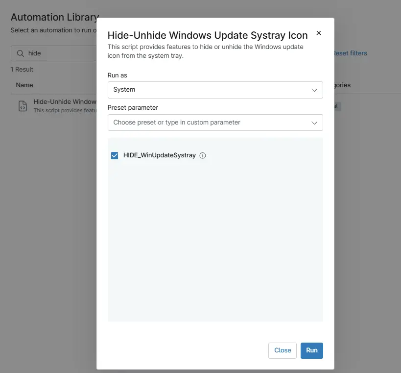

## Overview

This script provides features to hide or unhide the Windows update icon from the system tray.

Enable the variable `HIDE_WinUpdateSystray` to hide the Windows Update icon from the system tray and disable it to unhide it. By default this component will hide the Windows Update icon.

## Sample Run

`Play Button` > `Run Automation` > `Script`  

## Parameters

| parameter Name | Calculated Name | Type | Default | Description |
| -------------- | --------------- | ---- | ------- | ----------- |
| HIDE_WinUpdateSystray | hide_winupdatesystray | Checkbox | True | Set it to false to unhide the Windows Update icon display from the system tray. |

## Automation Setup/Import

[Automation Configuration](https://github.com/ProVal-Tech/ninjarmm/blob/main/scripts/hide-unhide-system-tray-icon-windows-update.ps1)

## Output

- Activity Details  

## Changelog

### 2026-03-30

- Initial version of the document.
